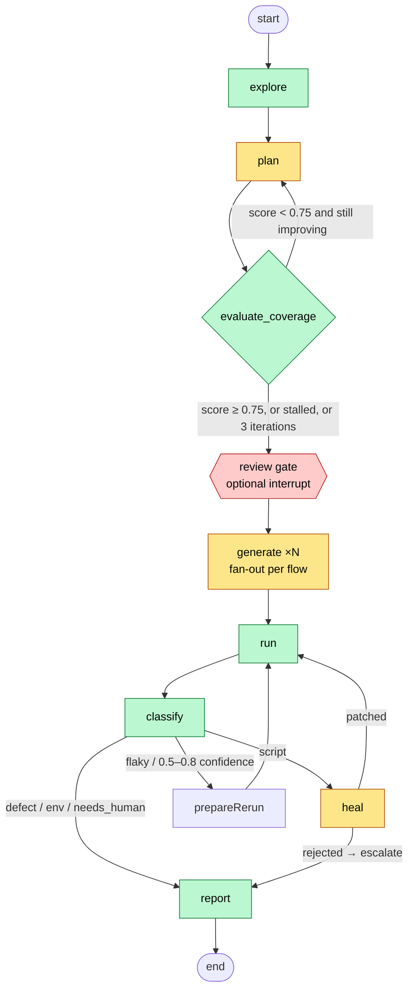

# The orchestration layer

How qa-pilot's meta-agent coordinates its sub-agents, where the intelligence
actually lives, and what to put in front of the judges. Every number here is
read from the source at the path given; nothing is aspirational.

**The thesis in one sentence:** the system is built so that a model can never
make a failing test pass by weakening what it proves, and can never report an
application defect that is not there. Everything below serves that.

---

## 1. The pipeline

`orchestrator/src/graph.ts` is a LangGraph state machine, checkpointed to
SQLite so a run can be interrupted, reviewed, and resumed.



Yellow nodes call a model. Green nodes are pure code. Every guarded node also
has an implicit budget-exceeded edge straight to `report`, so a run always
ends with a report even when it ends early.

**Three loops, each with a stopping rule that is not just a counter:**

| Loop | Re-enters | Stops when |
|---|---|---|
| Re-plan | `plan` | coverage ≥ `COVERAGE_THRESHOLD` (0.75), **or** `replanStalled` — the last iteration moved the score by ≤ `STALL_EPSILON` (0.01), **or** `MAX_PLAN_ITERATIONS` (3) |
| Rerun | `run` | a flaky or low-confidence result passes on retry, or `MAX_RERUNS` (2) |
| Heal | `run` | the patched test passes, or `MAX_HEAL_ATTEMPTS` (2), or the heal is rejected by a guard |

The stall rule is the one to point at. A converged planner reproduces the same
gaps; grinding to iteration 3 spends the pipeline's most expensive call
(`plan`, effort `high`) to learn nothing. The meta-agent notices its sub-agent
has stopped improving and carries the unclosed gaps into the report instead.

---

## 2. Where the intelligence lives

The system is not "an LLM per stage." It is deterministic wherever a rule can
answer the question, and it calls a model only where judgement is genuinely
required — and then bounds what that judgement can change.

| Node | Calls a model for | Pure code |
|---|---|---|
| `explore` | never | crawl, login-wall detection, form/button/link extraction |
| `plan` | `plan` (high); `plan-repair` (medium) only when a step fails to resolve live | dry-walk of every flow against the live app, retried once (`walkSafely`); `REPAIR_IMMUTABLE` guard |
| `evaluate_coverage` | `prd-requirements` / `prd-matrix` (medium), only with a PRD, only once | `scoreCoverage` — seven weighted dimensions, no model even when a PRD is present |
| `generate` | `expect-repair` (medium) when a planned assertion is false live; `self-repair` (medium) when a fresh test fails first run | codegen; every suggestion re-verified live before it is kept |
| `run` | never | Playwright, parallel workers, network/console/error capture |
| `classify` | `classify-rationale` (low) — writes the narrative, may nudge confidence by **at most ±0.1** | `scoreSignals` decides the class and base confidence |
| `heal` | `heal` (medium) — **step failures only**, choosing an index from a ranked candidate list | **assertion failures: zero model calls** (`pickAssertionTarget`) |
| `report` | never | markdown/HTML, suite bundling, untested-risk list |

Two of these deserve a sentence each to a judge:

- **Classification is rule-based with a bounded model.** `scoreSignals` in
  `nodes/classify.ts` weighs concrete evidence — a 5xx in the captured network
  log (+0.6 defect), a locator that matches more than one element (+0.8 script,
  never the app's fault), a pass on retry (+0.6 flaky), an environment error
  (+0.6 env). The model then writes the rationale and may adjust confidence by
  ±0.1. It cannot change the class. Confidence below 0.5 becomes `needs_human`
  rather than a guess.
- **Assertion healing makes no model call at all.** Once the similarity guard
  (below) is in place, every admissible candidate is a same-role element whose
  name is a near-copy of the original — there is no judgement left to
  delegate. Ranking answers the question, for free, and the untrusted page
  snapshot never reaches a model on that path.

---

## 3. The five guards — the differentiator

A self-healing test agent's canonical failure: an app loses its **"Log In"**
button in a deploy and keeps its **"Sign Up"** button; the healer finds the
similar control, re-targets, the suite goes green, and broken auth ships. Five
guards at five different layers make that impossible here. No single one
would suffice; each closes a hole the others cannot see.

| Layer | Guard | What it stops | Where |
|---|---|---|---|
| **Structural** | `guardExpects` reduces every `await expect(` line to a signature (role, matcher, negation, args) and rejects any patch that alters one | adding, deleting, negating, or re-matching an assertion | `nodes/heal.ts` |
| **Semantic** | `MIN_ASSERTION_NAME_SIMILARITY = 0.8` — an assertion may be re-targeted only across a cosmetic rename | `"Log In" → "Sign Up"` (similarity 0.0) — which passes `guardExpects`, because signatures strip the accessible name | `nodes/heal.ts` |
| **Role** | `findNearTwins` filters candidates by role before ranking | a heading assertion re-targeted onto a link that happens to share the name | `browser/snapshot.ts` |
| **Plan-stage** | `REPAIR_IMMUTABLE` — a plan repair contributes `steps` and nothing else; `driftedFields` logs what it tried to move | a repair that rewrites `expected` into an assertion the page never satisfies → a **fabricated** defect in the report | `nodes/plan.ts` |
| **Generation** | `self-repair` output is accepted only if its expect lines are byte-identical to the input's | a first-run fix that quietly deletes the assertion that failed | `nodes/generate.ts` |

Underneath all five: **every heal is verified live before it is accepted.** A
step heal must resolve, act, and then re-pass *every* original expectation. A
manipulated or hallucinated suggestion cannot satisfy that regardless of how
it was produced — which is why the design leans on verification rather than
on trying to detect bad model output.

The similarity guard has a worked example worth showing. `nameSimilarity`
(character bigrams + prefix bonus) on real pairs:

```
1.000  "Log In"      -> "Log in"          heals
1.000  "Add to cart" -> "Add to Cart"     heals
0.667  "Checkout"    -> "Check out"       escalates  (loud false alarm, chosen over silent false-heal)
0.400  "Place Order" -> "Cancel Order"    escalates
0.000  "Log In"      -> "Sign Up"         escalates  (the bug-hider)
```

The threshold was set to err toward a false alarm a human dismisses in seconds
rather than a regression the suite silently absorbs. That asymmetry is a
product decision and it is written into the code comment.

And the hallucination side: the step healer no longer returns free text. It is
handed a numbered list of up to `MAX_STEP_CANDIDATES` (30) real elements from
the live page and returns an index. An element that does not exist is
structurally impossible to name; an out-of-range index escalates as a defect
rather than throwing.

---

## 4. Telling a broken test from a broken app

This is the spec's bonus criterion and the run's core claim. The pipeline
produces one of five verdicts per failing test, each with the evidence that
earned it:

| Class | Typical evidence | Action |
|---|---|---|
| `script` | locator not found but a same-role near-twin exists; locator ambiguous | heal (≤2 attempts), then escalate |
| `defect` | 5xx in the network log; assertion fails with no script-side explanation; no alternative element at all | escalate — **never heal** |
| `flaky` | failed, then passed on rerun | rerun (≤2), then escalate |
| `env` | connection refused, DNS, target down | stop |
| `needs_human` | confidence < 0.5 | surface, do nothing |

The demo target's `breakCoupon` chaos toggle returns HTTP 500 from the coupon
endpoint. The correct outcome is a `defect` with the 500 in its evidence and no
heal attempted. A naive healer would look for another button.

---

## 5. The gap check (meta-agent)

`scoreCoverage` in `nodes/coverage.ts` is the meta-agent's evaluation of its
own planner. Seven dimensions, weights normalised over those present:

| Dimension | Weight | Question it asks |
|---|---|---|
| `routes` | 0.40 | does at least one flow visit every route worth testing — including the ones behind the login wall? |
| `forms` | 0.20 | happy + negative + empty-submit for every form |
| `prd` | 0.20 | every extracted PRD requirement maps to a flow (only with a PRD) |
| `authz` | 0.15 | every gated route has a logged-out redirect flow |
| `mix` | 0.15 | ≥40% of flows are negative / edge / error-state |
| `errors` | 0.15 | at least one flow drives a **failing request** |
| `intent` | 0.10 | every scoping word is touched by a flow's title, steps **or** assertions |

`errors` is separate from `mix` on purpose. A plan can satisfy the non-happy
ratio with validation-error flows alone and never ask what the app does when a
request fails — a validation error is the app working; a failed request is the
app under duress, and only the second reveals whether failure is surfaced or
swallowed.

`intent` reads a flow's steps and assertions, not only its title. Title-only
matching scored a flow named "Place order" as zero coverage for "focus on
checkout" even though every step ran through `/checkout`. Filler words
("cover", "just", "end") are excluded; near-misses ("orders" vs `/order`) are
credited by similarity.

Every gap carries a `suggest` string. On re-plan, the gaps are fed back to the
planner as `GAPS TO CLOSE`, so the loop is directed rather than a blind retry.
Routes no flow touches are also listed in the report as `untested_risk`.

---

## 6. Context and cost discipline

- Assertion healing and coverage scoring make **zero** model calls. Against a
  free-tier key capped near 20 requests/day, that is the difference between
  one run and two.
- `budgetSnapshot` caps every accessibility snapshot at
  `QA_PILOT_MAX_SNAPSHOT_CHARS` (default 12 000, `0` = uncapped), truncating on
  a line boundary and appending how many lines were dropped — a silently
  cut-off tree reads to a model as a missing element, i.e. a fabricated defect.
  Tunable because compaction helps flash-tier models and can hurt frontier
  ones.
- Every structured-output schema emits `reason` **before** the field it
  explains. Generation is left-to-right; the previous order made the reason a
  rationalisation of a token already committed. Enforced by a test on both
  transports (native `output_config` and the compat-mode schema rendered into
  the system prompt).
- The LLM client owns its retry policy: jittered exponential backoff honouring
  `retry-after`. Transport retries are not charged to the run's LLM budget;
  validation retries are. A model outage degrades the run to a partial report
  with exit code 0, not a crash.

---

## 7. What to show the judges

Mapped to the published weighting.

**End-to-end functionality (30%)** — one command, one URL, a report.
`npm run qa-pilot -- run <url> --intent "focus on checkout and applying a coupon code"`.
Show the report's four sections: scenarios covered, pass/fail, healer actions,
remaining gaps + untested risk.

**Orchestration intelligence / ambiguity & gaps (20%)** — three beats:
1. The coverage score and its gaps after iteration 1, then the re-plan closing
   them. Point at the `GAPS TO CLOSE` block in the plan prompt input.
2. A `decision` event where the loop stopped early because the score did not
   improve — the meta-agent reasoning about its own sub-agent.
3. Intent scoping: the same target with and without `--intent`, and the
   `intent_uncovered` gap when a scoping word has no flow.

**Code quality & healer depth (20%)** — this is the section above. The
one-line version for a slide: *five guards at five layers, verified live, and
the assertion path doesn't even ask the model.* Show `guardExpects` and
`MIN_ASSERTION_NAME_SIMILARITY` side by side and explain why one is not
enough. Then `./demo.sh rename` for a real step heal (button renamed, patched,
re-verified, assertions untouched) and `./demo.sh coupon` for a real defect
(500 → escalated, not healed).

**Demo / UX clarity (15%)** — the live UI streams every `decision` event with
its evidence. Every "why" the system had is on screen as it happens.

**Business impact (10%)** — the honest pitch is not "no more test writing." It
is: the expensive part of E2E automation is *maintenance*, and the expensive
part of maintenance is *trust* — knowing a green suite means the app works. A
self-healer without these guards makes suites greener and less trustworthy at
the same time. This one is built to fail loud.

**Presentation (5%)** — `qa-pilot/ARCHITECTURE.md` has the same diagram and
tables at greater depth; `docs/2026-09-05-llm-test-agent-research.md` is the
137-search deep-research report the guard design was drawn from, with the two
figures that could not be independently verified flagged in its header.

---

## 8. Honest limitations — say these before a judge asks

- The healer and defect-escalation paths are proven by **646 passing tests
  against a fake LLM client** and the real demo target; a full live run on
  the real model has been attempted but was cut short by provider-side 503s.
  The pipeline handled that correctly (partial report, exit 0), which is
  itself worth a sentence, but the end-to-end video should come from a
  completed live run.
- Firing the step healer honestly requires the app to change **after**
  generation. `./demo.sh rename` applied *before* a run is simply crawled as
  the new truth and nothing heals. The reliable demo is a mid-run toggle
  between generation and the suite run; there is no `--chaos-after-generate`
  hook yet.
- Cross-browser matrix, production-scale coverage, and CI integration are
  out of scope by the brief.
- The LLM provider is on a free tier capped near 20 requests/day.

---

## 9. Where everything is

| Thing | Path |
|---|---|
| State machine, loops, review gate | `qa-pilot/orchestrator/src/graph.ts` |
| Coverage dimensions, stall rule | `qa-pilot/orchestrator/src/nodes/coverage.ts` |
| Classifier signals, ±0.1 bound | `qa-pilot/orchestrator/src/nodes/classify.ts` |
| All five guards, candidate list | `qa-pilot/orchestrator/src/nodes/heal.ts`, `nodes/plan.ts`, `nodes/generate.ts` |
| Snapshot budget, timeouts, nav retry | `qa-pilot/orchestrator/src/browser/toolkit.ts` |
| Prompts (data, not code) | `qa-pilot/orchestrator/src/llm/prompts/*.md` |
| Invariants a maintainer must not break | repo-root `CLAUDE.md` |
| Chaos toggles for the demo | `qa-pilot/demo.sh` → `rename \| coupon \| cosmetic \| reset` |
| Tests that defend each guard | `qa-pilot/orchestrator/test/heal.test.ts`, `plan.test.ts`, `coverage.test.ts`, `llm-compat.test.ts` |
