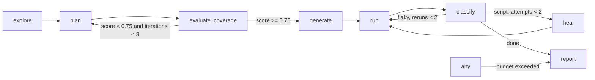

# qa-pilot Implementation Plan

> **For agentic workers:** REQUIRED SUB-SKILL: Use superpowers:subagent-driven-development (recommended) or superpowers:executing-plans to implement this plan task-by-task. Steps use checkbox (`- [ ]`) syntax for tracking.

**Goal:** From a single URL, autonomously explore a web app, plan and score test coverage, generate and run Playwright tests, heal script failures, escalate real defects, and stream every orchestrator decision to a live UI and a report.

**Architecture:** A LangGraph.js state machine (`explore -> plan -> evaluate_coverage -> generate -> run -> classify -> heal -> report`) in one TypeScript package. Deterministic code does crawling, codegen, running, and evidence gathering; Claude (structured outputs) does planning, coverage judgement, classification rationale, and heal element choice. A typed event bus feeds `decisions.jsonl` and an SSE endpoint consumed by a Next.js page. A purpose-built Express "mini-shop" is the demo target with chaos toggles.

**Tech Stack:** Node 22, TypeScript 5, npm workspaces, `@langchain/langgraph` 1.x, `@langchain/langgraph-checkpoint-sqlite`, `@anthropic-ai/sdk` 0.123+, `zod` 3.25.x, `playwright` + `@playwright/test` 1.62, `hono` + `@hono/node-server`, `vitest`, `tsx`, Express 5, Next.js 16 + Tailwind, `marked`.

**Spec:** `docs/superpowers/specs/2026-09-04-qa-pilot-design.md`

## Global Constraints

- Everything lives under `qa-pilot/`; run all commands from that directory.
- Default model `claude-opus-5`, overridable with `QA_PILOT_MODEL`. Every LLM call uses structured output validated by zod.
- API key comes from `qa-pilot/.env` (`ANTHROPIC_API_KEY`), loaded with `dotenv`. `.env` is gitignored; `.env.example` is committed.
- Output for a run is exactly `output/<run_id>/{plan.md, plan.json, coverage.json, tests/*.spec.ts, results.json, heal-log.json, defects.json, report.md, report.html, decisions.jsonl, events.jsonl, traces/}`.
- Headed Chromium by default; `QA_PILOT_HEADLESS=1` switches to headless (tests always set it).
- The Healer may change how a test gets to an expectation, never an `expect(` line. This is enforced in code, not by prompt.
- Crawler never clicks buttons named delete, remove, logout, log out, sign out, destroy, clear.
- Coverage threshold 0.75, max 3 plan iterations, max 2 heal attempts per test, max 2 reruns per flaky test, default `maxFlows` 12, default budget 200 LLM calls / 40 minutes.
- Markdown files: one sentence per line, no em dashes.
- Commit messages: no co-author trailer.

## File map

| Path | Responsibility |
|---|---|
| `qa-pilot/package.json` | workspaces root, shared scripts |
| `qa-pilot/orchestrator/src/state.ts` | zod schemas + LangGraph annotation |
| `qa-pilot/orchestrator/src/events.ts` | `EventBus`: jsonl + subscribers |
| `qa-pilot/orchestrator/src/budget.ts` | budget accounting |
| `qa-pilot/orchestrator/src/llm/client.ts` | `LlmClient` interface, Anthropic impl, `FakeLlmClient` |
| `qa-pilot/orchestrator/src/llm/prompts/*.md` | one system prompt per call |
| `qa-pilot/orchestrator/src/browser/snapshot.ts` | aria snapshot parsing |
| `qa-pilot/orchestrator/src/browser/locators.ts` | resolve `{role,name}` with preference chain, emit code |
| `qa-pilot/orchestrator/src/browser/toolkit.ts` | `BrowserToolkit`: launch, act, screenshot |
| `qa-pilot/orchestrator/src/nodes/*.ts` | one node per file |
| `qa-pilot/orchestrator/src/codegen/template.ts` | Flow -> spec.ts source |
| `qa-pilot/orchestrator/src/graph.ts` | graph wiring + edges |
| `qa-pilot/orchestrator/src/run.ts` | `startRun()` used by CLI and API |
| `qa-pilot/orchestrator/src/cli.ts` | CLI |
| `qa-pilot/orchestrator/src/api.ts` | Hono server |
| `qa-pilot/runner/playwright.config.ts`, `fixtures.ts` | Playwright Test config and fixtures |
| `qa-pilot/targets/mini-shop/src/server.ts` | demo app |
| `qa-pilot/ui/` | Next.js page |

---

### Task 1: Workspace scaffold and state schemas

**Files:**
- Create: `qa-pilot/package.json`, `qa-pilot/tsconfig.base.json`, `qa-pilot/.gitignore`, `qa-pilot/.env.example`
- Create: `qa-pilot/orchestrator/package.json`, `qa-pilot/orchestrator/tsconfig.json`, `qa-pilot/orchestrator/vitest.config.ts`
- Create: `qa-pilot/orchestrator/src/state.ts`
- Test: `qa-pilot/orchestrator/test/state.test.ts`

**Interfaces:**
- Produces: every schema and type below. Later tasks import from `../src/state.js`.

- [ ] **Step 1: Create the workspace root files**

`qa-pilot/package.json`:
```json
{
  "name": "qa-pilot",
  "private": true,
  "workspaces": ["orchestrator", "runner", "targets/mini-shop", "ui"],
  "scripts": {
    "test": "npm run test -w orchestrator -w targets/mini-shop",
    "typecheck": "npm run typecheck -w orchestrator -w runner -w targets/mini-shop",
    "shop": "npm run start -w targets/mini-shop",
    "api": "npm run api -w orchestrator",
    "ui": "npm run dev -w ui",
    "qa-pilot": "npm run cli -w orchestrator --"
  },
  "engines": { "node": ">=22" }
}
```

`qa-pilot/tsconfig.base.json`:
```json
{
  "compilerOptions": {
    "target": "ES2022",
    "module": "NodeNext",
    "moduleResolution": "NodeNext",
    "strict": true,
    "esModuleInterop": true,
    "skipLibCheck": true,
    "resolveJsonModule": true,
    "declaration": false,
    "sourceMap": true
  }
}
```

`qa-pilot/.gitignore`:
```
node_modules
output/
.env
dist/
test-results/
playwright-report/
.next/
```

`qa-pilot/.env.example`:
```
ANTHROPIC_API_KEY=sk-ant-...
QA_PILOT_MODEL=claude-opus-5
QA_PILOT_HEADLESS=0
QA_PILOT_API_PORT=4000
```

- [ ] **Step 2: Create the orchestrator package**

`qa-pilot/orchestrator/package.json`:
```json
{
  "name": "@qa-pilot/orchestrator",
  "version": "0.1.0",
  "private": true,
  "type": "module",
  "scripts": {
    "cli": "tsx src/cli.ts",
    "api": "tsx src/api.ts",
    "test": "vitest run",
    "typecheck": "tsc --noEmit"
  },
  "dependencies": {
    "@anthropic-ai/sdk": "^0.123.0",
    "@hono/node-server": "^2.1.1",
    "@langchain/langgraph": "^1.4.13",
    "@langchain/langgraph-checkpoint-sqlite": "^1.0.4",
    "dotenv": "^17.2.0",
    "hono": "^4.13.5",
    "marked": "^18.0.11",
    "playwright": "^1.62.1",
    "zod": "^3.25.76"
  },
  "devDependencies": {
    "@types/node": "^22.0.0",
    "tsx": "^4.23.13",
    "typescript": "^5.6.0",
    "vitest": "^5.0.0"
  }
}
```

`qa-pilot/orchestrator/tsconfig.json`:
```json
{
  "extends": "../tsconfig.base.json",
  "compilerOptions": { "rootDir": ".", "noEmit": true, "types": ["node"] },
  "include": ["src", "test"]
}
```

`qa-pilot/orchestrator/vitest.config.ts`:
```ts
import { defineConfig } from "vitest/config";

export default defineConfig({
  test: {
    include: ["test/**/*.test.ts"],
    testTimeout: 60_000,
    hookTimeout: 60_000,
    // QA_PILOT_FIXTURES lets generated specs written to a temp dir import the runner fixtures by absolute path.
    env: { QA_PILOT_HEADLESS: "1", QA_PILOT_FIXTURES: new URL("../runner/fixtures", import.meta.url).pathname },
  },
});
```

- [ ] **Step 3: Install and verify the empty workspace resolves**

Run:
```bash
cd qa-pilot && npm install && npx playwright install chromium
```
Expected: installs without error; `node_modules/@langchain/langgraph` exists.

- [ ] **Step 4: Write the failing state test**

`qa-pilot/orchestrator/test/state.test.ts`:
```ts
import { describe, it, expect } from "vitest";
import { FlowSchema, ClassificationSchema, initialState } from "../src/state.js";

describe("state schemas", () => {
  it("accepts the PRD example flow", () => {
    const flow = FlowSchema.parse({
      id: "auth-002",
      title: "Login with wrong password shows error",
      category: "negative",
      priority: "P1",
      preconditions: ["logged_out"],
      steps: [
        { action: "goto", target: "/login" },
        { action: "fill", role: "textbox", name: "Email", value: "user@test.com" },
        { action: "fill", role: "textbox", name: "Password", value: "wrong" },
        { action: "click", role: "button", name: "Sign in" },
      ],
      expected: [
        { type: "visible", role: "alert", text_contains: "Invalid" },
        { type: "url_stays", value: "/login" },
      ],
      source: "explored",
    });
    expect(flow.steps).toHaveLength(4);
  });

  it("rejects a flow with no expectations", () => {
    expect(() =>
      FlowSchema.parse({
        id: "x", title: "x", category: "happy", priority: "P2",
        preconditions: [], steps: [{ action: "goto", target: "/" }], expected: [], source: "explored",
      }),
    ).toThrow();
  });

  it("clamps classification confidence to [0,1]", () => {
    expect(() =>
      ClassificationSchema.parse({ test: "t", class: "defect", confidence: 1.4, evidence: [], action: "escalate" }),
    ).toThrow();
  });

  it("builds an initial state with defaults", () => {
    const s = initialState({ runId: "r1", url: "http://localhost:3005" });
    expect(s.maxFlows).toBe(12);
    expect(s.budget).toEqual({ maxLlmCalls: 200, maxMinutes: 40 });
    expect(s.planIterations).toBe(0);
    expect(s.partial).toBe(false);
  });
});
```

- [ ] **Step 5: Run test to verify it fails**

Run: `cd qa-pilot && npx vitest run -w orchestrator test/state.test.ts`
Expected: FAIL, cannot find module `../src/state.js`.

- [ ] **Step 6: Write state.ts**

`qa-pilot/orchestrator/src/state.ts`:
```ts
import { z } from "zod";
import { Annotation } from "@langchain/langgraph";

// ---------- Site map ----------
export const ElementRefSchema = z.object({ role: z.string(), name: z.string() });
export type ElementRef = z.infer<typeof ElementRefSchema>;

export const FormFieldSchema = z.object({
  role: z.string(),            // textbox | combobox | checkbox | radio
  name: z.string(),            // accessible name (label)
  type: z.string().default("text"),
  required: z.boolean().default(false),
});
export const FormInfoSchema = z.object({
  id: z.string(),              // "<path>#<index>"
  fields: z.array(FormFieldSchema),
  submit: ElementRefSchema.nullable(),
});
export type FormInfo = z.infer<typeof FormInfoSchema>;
export const PageInfoSchema = z.object({
  url: z.string(),
  path: z.string(),
  title: z.string(),
  forms: z.array(FormInfoSchema),
  buttons: z.array(ElementRefSchema),
  links: z.array(z.object({ href: z.string(), text: z.string() })),
  gated: z.boolean(),
  snapshot: z.string(),
});
export type PageInfo = z.infer<typeof PageInfoSchema>;

// ---------- Flow ----------
export const StepSchema = z.object({
  action: z.enum(["goto", "fill", "click", "select", "press", "check"]),
  target: z.string().optional(),   // goto: path
  role: z.string().optional(),
  name: z.string().optional(),
  value: z.string().optional(),    // fill/select/press value
  intent: z.string().optional(),   // human description, used by healer
});
export type Step = z.infer<typeof StepSchema>;

export const SiteMapSchema = z.object({
  origin: z.string(),
  loginPath: z.string().nullable(),
  loginSteps: z.array(StepSchema),
  pages: z.record(PageInfoSchema),
});
export type SiteMap = z.infer<typeof SiteMapSchema>;

export const ExpectationSchema = z.object({
  type: z.enum(["visible", "not_visible", "text_contains", "url_contains", "url_stays", "value_equals"]),
  role: z.string().optional(),
  name: z.string().optional(),
  text_contains: z.string().optional(),
  value: z.string().optional(),
});
export type Expectation = z.infer<typeof ExpectationSchema>;

export const FlowCategory = z.enum(["happy", "negative", "edge", "error_state", "authz"]);
export const FlowSchema = z.object({
  id: z.string().regex(/^[a-z0-9-]+$/),
  title: z.string().min(3),
  category: FlowCategory,
  priority: z.enum(["P0", "P1", "P2", "P3"]),
  preconditions: z.array(z.enum(["logged_out", "logged_in"])),
  steps: z.array(StepSchema).min(1),
  expected: z.array(ExpectationSchema).min(1),
  source: z.enum(["explored", "prd", "intent"]),
});
export type Flow = z.infer<typeof FlowSchema>;

// ---------- Coverage ----------
export const CoverageGapSchema = z.object({
  kind: z.enum(["missing_happy", "missing_negative", "missing_empty_submit", "missing_authz", "prd_uncovered", "intent_uncovered", "category_mix"]),
  target: z.string().optional(),
  requirement: z.string().optional(),
  suggest: z.string(),
});
export const CoverageVerdictSchema = z.object({
  score: z.number().min(0).max(1),
  gaps: z.array(CoverageGapSchema),
  untested_risk: z.array(z.object({ flow: z.string(), reason: z.string(), risk: z.enum(["low", "medium", "high"]) })),
  checks: z.record(z.number()),   // per-check pass rate
  prdRequirements: z.array(z.string()).default([]),
  prdMatrix: z.record(z.array(z.string())).default({}),  // requirement -> flow ids
});
export type CoverageVerdict = z.infer<typeof CoverageVerdictSchema>;

// ---------- Run results ----------
export const NetworkEntrySchema = z.object({ method: z.string(), url: z.string(), status: z.number(), at: z.number() });
export const TestResultSchema = z.object({
  id: z.string(),                       // flow id
  file: z.string(),
  title: z.string(),
  status: z.enum(["passed", "failed", "timedOut", "skipped", "interrupted"]),
  error: z.string().optional(),
  errorLine: z.number().optional(),
  failingStep: z.number().optional(),   // index into flow.steps, derived from errorLine
  network: z.array(NetworkEntrySchema).default([]),
  consoleErrors: z.array(z.string()).default([]),
  pageErrors: z.array(z.string()).default([]),
  tracePath: z.string().optional(),
  durationMs: z.number().default(0),
});
export type TestResult = z.infer<typeof TestResultSchema>;
export const RunResultsSchema = z.object({ tests: z.array(TestResultSchema), at: z.string() });
export type RunResults = z.infer<typeof RunResultsSchema>;

// ---------- Classification / defects / heals / decisions ----------
export const ClassificationSchema = z.object({
  test: z.string(),
  class: z.enum(["script", "defect", "flaky", "env", "needs_human"]),
  confidence: z.number().min(0).max(1),
  evidence: z.array(z.string()),
  action: z.enum(["heal", "escalate", "rerun", "needs_human", "stop"]),
  rationale: z.string().optional(),
});
export type Classification = z.infer<typeof ClassificationSchema>;

export const DefectSchema = z.object({
  id: z.string(),
  title: z.string(),
  severity: z.enum(["critical", "high", "medium", "low"]),
  flow: z.string(),
  repro_steps: z.array(z.string()),
  expected: z.string(),
  actual: z.string(),
  evidence: z.array(z.string()),
  attachments: z.array(z.string()),
});
export type Defect = z.infer<typeof DefectSchema>;

export const HealRecordSchema = z.object({
  test: z.string(),
  attempt: z.number(),
  step: z.number(),
  before: z.string(),
  after: z.string(),
  reason: z.string(),
  confidence: z.number(),
  accepted: z.boolean(),
});
export type HealRecord = z.infer<typeof HealRecordSchema>;

export const DecisionSchema = z.object({
  node: z.string(),
  reason: z.string(),
  evidence: z.array(z.string()),
  next: z.string(),
  at: z.string(),
});
export type Decision = z.infer<typeof DecisionSchema>;

export const CredentialsSchema = z.object({ username: z.string(), password: z.string() });
export type Credentials = z.infer<typeof CredentialsSchema>;

export const BudgetSchema = z.object({ maxLlmCalls: z.number().default(200), maxMinutes: z.number().default(40) });

// ---------- Run input ----------
export const RunInputSchema = z.object({
  runId: z.string(),
  url: z.string().url(),
  credentials: CredentialsSchema.optional(),
  intent: z.string().optional(),
  prdText: z.string().optional(),
  maxFlows: z.number().int().positive().default(12),
  budget: BudgetSchema.default({}),
});
export type RunInput = z.infer<typeof RunInputSchema>;

// ---------- Graph state ----------
const append = <T,>() => ({ reducer: (a: T[], b: T[]) => a.concat(b), default: () => [] as T[] });

export const RunStateAnnotation = Annotation.Root({
  runId: Annotation<string>(),
  url: Annotation<string>(),
  credentials: Annotation<Credentials | undefined>(),
  intent: Annotation<string | undefined>(),
  prdText: Annotation<string | undefined>(),
  maxFlows: Annotation<number>(),
  budget: Annotation<z.infer<typeof BudgetSchema>>(),
  startedAt: Annotation<string>(),
  siteMap: Annotation<SiteMap | undefined>(),
  plan: Annotation<Flow[]>({ reducer: (_a, b) => b, default: () => [] }),
  coverage: Annotation<CoverageVerdict | undefined>(),
  planIterations: Annotation<number>({ reducer: (_a, b) => b, default: () => 0 }),
  testFiles: Annotation<string[]>(append<string>()),
  unresolvedFlows: Annotation<string[]>(append<string>()),
  currentFlow: Annotation<Flow | undefined>(),           // Send() payload for generateFlow
  testsToRun: Annotation<string[] | undefined>(),         // undefined = all
  results: Annotation<RunResults | undefined>(),
  classifications: Annotation<Classification[]>({ reducer: (_a, b) => b, default: () => [] }),
  healAttempts: Annotation<Record<string, number>>({ reducer: (a, b) => ({ ...a, ...b }), default: () => ({}) }),
  rerunAttempts: Annotation<Record<string, number>>({ reducer: (a, b) => ({ ...a, ...b }), default: () => ({}) }),
  healLog: Annotation<HealRecord[]>(append<HealRecord>()),
  defects: Annotation<Defect[]>(append<Defect>()),
  decisions: Annotation<Decision[]>(append<Decision>()),
  llmCalls: Annotation<number>({ reducer: (_a, b) => b, default: () => 0 }),
  partial: Annotation<boolean>({ reducer: (_a, b) => b, default: () => false }),
});
export type RunState = typeof RunStateAnnotation.State;
export type RunUpdate = typeof RunStateAnnotation.Update;

export function initialState(input: { runId: string; url: string } & Partial<RunInput>): RunState {
  const parsed = RunInputSchema.parse(input);
  return {
    runId: parsed.runId,
    url: parsed.url.replace(/\/$/, ""),
    credentials: parsed.credentials,
    intent: parsed.intent,
    prdText: parsed.prdText,
    maxFlows: parsed.maxFlows,
    budget: parsed.budget,
    startedAt: new Date().toISOString(),
    siteMap: undefined,
    plan: [],
    coverage: undefined,
    planIterations: 0,
    testFiles: [],
    unresolvedFlows: [],
    currentFlow: undefined,
    testsToRun: undefined,
    results: undefined,
    classifications: [],
    healAttempts: {},
    rerunAttempts: {},
    healLog: [],
    defects: [],
    decisions: [],
    llmCalls: 0,
    partial: false,
  };
}

/** Resolved on every call so tests can point QA_PILOT_OUTPUT at a temp dir. Always ends with "/". */
export function outputDir(runId: string): string {
  const root = process.env.QA_PILOT_OUTPUT ?? new URL("../../output/", import.meta.url).pathname;
  return `${root.endsWith("/") ? root : root + "/"}${runId}/`;
}
```

- [ ] **Step 7: Run test to verify it passes**

Run: `cd qa-pilot && npx vitest run -w orchestrator test/state.test.ts && npm run typecheck -w orchestrator`
Expected: 4 tests pass, typecheck clean.

- [ ] **Step 8: Commit**

```bash
git add qa-pilot
git commit -m "qa-pilot: workspace scaffold and state schemas"
```

---

### Task 2: mini-shop demo target with chaos toggles

**Files:**
- Create: `qa-pilot/targets/mini-shop/package.json`, `tsconfig.json`, `src/server.ts`, `src/app.ts`, `src/views.ts`, `src/store.ts`, `src/chaos.ts`
- Test: `qa-pilot/targets/mini-shop/test/app.test.ts`

**Interfaces:**
- Produces: `createApp(): express.Express` in `src/app.ts`; `startServer(port): Promise<Server>` in `src/server.ts`; chaos state via `POST /__chaos` with body `{renameCheckoutButton?, breakCoupon?, cosmeticChange?}` and `GET /__chaos` returning current state; env `CHAOS_RENAME_CHECKOUT=1`, `CHAOS_BREAK_COUPON=1`, `CHAOS_COSMETIC=1` set initial state.
- Seeded user `demo@shop.test` / `demo1234`. Coupon `SAVE10` is valid; anything else is invalid.

- [ ] **Step 1: Create package files**

`qa-pilot/targets/mini-shop/package.json`:
```json
{
  "name": "@qa-pilot/mini-shop",
  "version": "0.1.0",
  "private": true,
  "type": "module",
  "scripts": {
    "start": "tsx src/server.ts",
    "test": "vitest run",
    "typecheck": "tsc --noEmit"
  },
  "dependencies": { "express": "^5.2.1", "cookie-parser": "^1.4.7" },
  "devDependencies": {
    "@types/cookie-parser": "^1.4.8",
    "@types/express": "^5.0.0",
    "@types/node": "^22.0.0",
    "tsx": "^4.23.13",
    "typescript": "^5.6.0",
    "vitest": "^5.0.0"
  }
}
```

`qa-pilot/targets/mini-shop/tsconfig.json`:
```json
{ "extends": "../../tsconfig.base.json", "compilerOptions": { "noEmit": true, "types": ["node"] }, "include": ["src", "test"] }
```

- [ ] **Step 2: Write the failing tests**

`qa-pilot/targets/mini-shop/test/app.test.ts`:
```ts
import { describe, it, expect, beforeAll, afterAll } from "vitest";
import { startServer } from "../src/server.js";
import type { Server } from "node:http";

let server: Server;
let base: string;

beforeAll(async () => {
  server = await startServer(0);
  const addr = server.address() as { port: number };
  base = `http://127.0.0.1:${addr.port}`;
});
afterAll(() => new Promise<void>((r) => server.close(() => r())));

async function login(): Promise<string> {
  const res = await fetch(`${base}/login`, {
    method: "POST",
    headers: { "content-type": "application/x-www-form-urlencoded" },
    body: "email=demo%40shop.test&password=demo1234",
    redirect: "manual",
  });
  expect(res.status).toBe(302);
  return res.headers.get("set-cookie")!.split(";")[0];
}

describe("mini-shop", () => {
  it("serves the product list with an accessible heading", async () => {
    const html = await (await fetch(`${base}/products`)).text();
    expect(html).toContain("<h1>Products</h1>");
  });

  it("wrong password shows an alert and stays on /login", async () => {
    const res = await fetch(`${base}/login`, {
      method: "POST",
      headers: { "content-type": "application/x-www-form-urlencoded" },
      body: "email=demo%40shop.test&password=nope",
    });
    expect(res.status).toBe(401);
    expect(await res.text()).toContain('role="alert"');
  });

  it("gates /orders behind login", async () => {
    const res = await fetch(`${base}/orders`, { redirect: "manual" });
    expect(res.status).toBe(302);
    expect(res.headers.get("location")).toBe("/login?next=%2Forders");
  });

  it("applies a valid coupon and rejects an invalid one", async () => {
    const cookie = await login();
    const ok = await fetch(`${base}/api/coupon`, { method: "POST", headers: { cookie, "content-type": "application/json" }, body: JSON.stringify({ code: "SAVE10" }) });
    expect(ok.status).toBe(200);
    const bad = await fetch(`${base}/api/coupon`, { method: "POST", headers: { cookie, "content-type": "application/json" }, body: JSON.stringify({ code: "NOPE" }) });
    expect(bad.status).toBe(400);
  });

  it("chaos: breakCoupon makes the coupon endpoint return 500", async () => {
    const cookie = await login();
    await fetch(`${base}/__chaos`, { method: "POST", headers: { "content-type": "application/json" }, body: JSON.stringify({ breakCoupon: true }) });
    const res = await fetch(`${base}/api/coupon`, { method: "POST", headers: { cookie, "content-type": "application/json" }, body: JSON.stringify({ code: "SAVE10" }) });
    expect(res.status).toBe(500);
    await fetch(`${base}/__chaos`, { method: "POST", headers: { "content-type": "application/json" }, body: JSON.stringify({ breakCoupon: false }) });
  });

  it("chaos: renameCheckoutButton changes the button label", async () => {
    const cookie = await login();
    const before = await (await fetch(`${base}/checkout`, { headers: { cookie } })).text();
    expect(before).toContain("Place order");
    await fetch(`${base}/__chaos`, { method: "POST", headers: { "content-type": "application/json" }, body: JSON.stringify({ renameCheckoutButton: true }) });
    const after = await (await fetch(`${base}/checkout`, { headers: { cookie } })).text();
    expect(after).toContain("Complete purchase");
    expect(after).not.toContain("Place order");
  });
});
```

- [ ] **Step 3: Run tests to verify they fail**

Run: `cd qa-pilot && npm install && npx vitest run -w targets/mini-shop`
Expected: FAIL, cannot find `../src/server.js`.

- [ ] **Step 4: Implement chaos and store**

`qa-pilot/targets/mini-shop/src/chaos.ts`:
```ts
export type ChaosState = { renameCheckoutButton: boolean; breakCoupon: boolean; cosmeticChange: boolean };

export const chaos: ChaosState = {
  renameCheckoutButton: process.env.CHAOS_RENAME_CHECKOUT === "1",
  breakCoupon: process.env.CHAOS_BREAK_COUPON === "1",
  cosmeticChange: process.env.CHAOS_COSMETIC === "1",
};

export function setChaos(patch: Partial<ChaosState>): ChaosState {
  for (const k of Object.keys(chaos) as (keyof ChaosState)[]) {
    if (typeof patch[k] === "boolean") chaos[k] = patch[k]!;
  }
  return { ...chaos };
}
```

`qa-pilot/targets/mini-shop/src/store.ts`:
```ts
export type Product = { id: string; name: string; price: number; description: string };
export type User = { email: string; password: string; name: string };
export type Session = { email: string; cart: Record<string, number>; coupon: string | null };
export type Order = { id: string; email: string; total: number; items: { id: string; qty: number }[] };

export const products: Product[] = [
  { id: "p1", name: "Blue Mug", price: 12, description: "Ceramic mug, 350ml." },
  { id: "p2", name: "Notebook", price: 8, description: "Dotted A5 notebook." },
  { id: "p3", name: "Desk Lamp", price: 35, description: "Warm LED desk lamp." },
];
export const users: User[] = [{ email: "demo@shop.test", password: "demo1234", name: "Demo User" }];
export const sessions = new Map<string, Session>();
export const orders: Order[] = [];

export function newSessionId(): string {
  return Math.random().toString(36).slice(2) + Date.now().toString(36);
}
export function cartTotal(s: Session): number {
  let total = 0;
  for (const [id, qty] of Object.entries(s.cart)) {
    const p = products.find((x) => x.id === id);
    if (p) total += p.price * qty;
  }
  if (s.coupon === "SAVE10") total = Math.round(total * 0.9 * 100) / 100;
  return total;
}
```

- [ ] **Step 5: Implement views**

`qa-pilot/targets/mini-shop/src/views.ts`:
```ts
import { chaos } from "./chaos.js";
import type { Product, Session, Order } from "./store.js";

const esc = (s: string) => s.replace(/[&<>"']/g, (c) => ({ "&": "&amp;", "<": "&lt;", ">": "&gt;", '"': "&quot;", "'": "&#39;" })[c]!);

export function layout(title: string, body: string, user: string | null): string {
  const accent = chaos.cosmeticChange ? "#0a7" : "#25f";
  return `<!doctype html><html lang="en"><head><meta charset="utf-8"><title>${esc(title)} - Mini Shop</title>
<style>body{font-family:system-ui;margin:2rem;max-width:720px}nav a{margin-right:1rem}button{background:${accent};color:#fff;border:0;padding:.5rem 1rem;border-radius:4px}
[role=alert]{background:#fee;color:#900;padding:.5rem;border:1px solid #c66}.ok{background:#efe;color:#060;padding:.5rem;border:1px solid #6c6}label{display:block;margin:.5rem 0}</style></head>
<body><nav><a href="/">Home</a><a href="/products">Products</a><a href="/cart">Cart</a><a href="/checkout">Checkout</a><a href="/orders">Orders</a><a href="/account">Account</a>
${user ? `<span>Signed in as ${esc(user)}</span> <a href="/logout">Log out</a>` : `<a href="/login">Log in</a> <a href="/register">Register</a>`}</nav>
<main>${body}</main></body></html>`;
}

export const homeView = () => `<h1>Welcome to Mini Shop</h1><p>Browse our <a href="/products">products</a>.</p>`;

export const loginView = (error: string | null, next: string) => `<h1>Log in</h1>
${error ? `<div role="alert">${esc(error)}</div>` : ""}
<form method="post" action="/login">
<input type="hidden" name="next" value="${esc(next)}">
<label>Email <input type="email" name="email" required></label>
<label>Password <input type="password" name="password" required></label>
<button type="submit">Sign in</button></form>`;

export const registerView = (error: string | null) => `<h1>Register</h1>
${error ? `<div role="alert">${esc(error)}</div>` : ""}
<form method="post" action="/register">
<label>Name <input type="text" name="name" required></label>
<label>Email <input type="email" name="email" required></label>
<label>Password <input type="password" name="password" required minlength="8"></label>
<button type="submit">Create account</button></form>`;

export const productsView = (products: Product[]) => `<h1>Products</h1><ul>${products
  .map((p) => `<li><a href="/products/${p.id}">${esc(p.name)}</a> - $${p.price}</li>`).join("")}</ul>`;

export const productView = (p: Product, added: boolean) => `<h1>${esc(p.name)}</h1><p>${esc(p.description)}</p><p>Price: $${p.price}</p>
${added ? `<div class="ok" role="status">Added to cart</div>` : ""}
<form method="post" action="/cart/add"><input type="hidden" name="id" value="${p.id}">
<label>Quantity <input type="number" name="qty" value="1" min="1" max="10"></label>
<button type="submit">Add to cart</button></form>`;

export const cartView = (s: Session | null, products: Product[], total: number) => {
  const items = s ? Object.entries(s.cart) : [];
  if (items.length === 0) return `<h1>Your cart</h1><p>Your cart is empty.</p>`;
  return `<h1>Your cart</h1><table><tr><th>Item</th><th>Qty</th></tr>${items
    .map(([id, qty]) => `<tr><td>${esc(products.find((p) => p.id === id)!.name)}</td><td>${qty}</td></tr>`).join("")}</table>
<p>Total: $${total}</p><a href="/checkout">Proceed to checkout</a>`;
};

export const checkoutView = (total: number, couponMsg: { ok: boolean; text: string } | null, error: string | null) => `<h1>Checkout</h1>
${error ? `<div role="alert">${esc(error)}</div>` : ""}
<section><h2>Coupon</h2>
<form id="coupon-form"><label>Coupon code <input type="text" name="code"></label><button type="submit">Apply coupon</button></form>
<div id="coupon-msg">${couponMsg ? (couponMsg.ok ? `<div class="ok" role="status">${esc(couponMsg.text)}</div>` : `<div role="alert">${esc(couponMsg.text)}</div>`) : ""}</div>
</section>
<p>Total: $<span id="total">${total}</span></p>
<form method="post" action="/checkout">
<label>Full name <input type="text" name="name" required></label>
<label>Address <input type="text" name="address" required></label>
<label>Card number <input type="text" name="card" required pattern="[0-9]{16}"></label>
<button type="submit">${chaos.renameCheckoutButton ? "Complete purchase" : "Place order"}</button></form>
<script>
document.getElementById('coupon-form').addEventListener('submit', async (e) => {
  e.preventDefault();
  const code = new FormData(e.target).get('code');
  const res = await fetch('/api/coupon', {method:'POST', headers:{'content-type':'application/json'}, body: JSON.stringify({code})});
  const box = document.getElementById('coupon-msg');
  if (res.ok) { const j = await res.json(); box.innerHTML = '<div class="ok" role="status">Coupon applied</div>'; document.getElementById('total').textContent = j.total; }
  else if (res.status === 400) { box.innerHTML = '<div role="alert">Invalid coupon code</div>'; }
  else { box.innerHTML = '<div role="alert">Something went wrong</div>'; }
});
</script>`;

export const orderDoneView = (o: Order) => `<h1>Order confirmed</h1><div class="ok" role="status">Thank you! Order ${esc(o.id)} placed. Total $${o.total}.</div><a href="/orders">View orders</a>`;
export const ordersView = (list: Order[]) => `<h1>Your orders</h1>${list.length === 0 ? "<p>No orders yet.</p>" : `<ul>${list.map((o) => `<li>${esc(o.id)} - $${o.total}</li>`).join("")}</ul>`}`;
export const accountView = (name: string, email: string) => `<h1>Account</h1><p>Name: ${esc(name)}</p><p>Email: ${esc(email)}</p>`;
```

- [ ] **Step 6: Implement the app and server**

`qa-pilot/targets/mini-shop/src/app.ts`:
```ts
import express from "express";
import cookieParser from "cookie-parser";
import { chaos, setChaos } from "./chaos.js";
import { products, users, sessions, orders, newSessionId, cartTotal, type Session } from "./store.js";
import * as v from "./views.js";

export function createApp() {
  const app = express();
  app.use(express.urlencoded({ extended: false }));
  app.use(express.json());
  app.use(cookieParser());

  const getSession = (req: express.Request): Session | null => {
    const sid = req.cookies?.sid as string | undefined;
    return sid ? sessions.get(sid) ?? null : null;
  };
  const requireLogin = (req: express.Request, res: express.Response, next: express.NextFunction) => {
    if (getSession(req)) return next();
    res.redirect(`/login?next=${encodeURIComponent(req.path)}`);
  };
  const userOf = (req: express.Request) => getSession(req)?.email ?? null;

  app.get("/", (req, res) => res.send(v.layout("Home", v.homeView(), userOf(req))));

  app.get("/login", (req, res) => res.send(v.layout("Log in", v.loginView(null, String(req.query.next ?? "/")), userOf(req))));
  app.post("/login", (req, res) => {
    const { email, password, next } = req.body as Record<string, string>;
    const u = users.find((x) => x.email === email && x.password === password);
    if (!u) return res.status(401).send(v.layout("Log in", v.loginView("Invalid email or password", next || "/"), null));
    const sid = newSessionId();
    sessions.set(sid, { email: u.email, cart: {}, coupon: null });
    res.cookie("sid", sid, { httpOnly: true });
    res.redirect(next && next.startsWith("/") ? next : "/products");
  });
  app.get("/logout", (req, res) => {
    const sid = req.cookies?.sid as string | undefined;
    if (sid) sessions.delete(sid);
    res.clearCookie("sid");
    res.redirect("/");
  });

  app.get("/register", (req, res) => res.send(v.layout("Register", v.registerView(null), userOf(req))));
  app.post("/register", (req, res) => {
    const { name, email, password } = req.body as Record<string, string>;
    if (!name || !email || !password) return res.status(400).send(v.layout("Register", v.registerView("All fields are required"), null));
    if (password.length < 8) return res.status(400).send(v.layout("Register", v.registerView("Password must be at least 8 characters"), null));
    if (users.some((u) => u.email === email)) return res.status(409).send(v.layout("Register", v.registerView("An account with this email already exists"), null));
    users.push({ name, email, password });
    res.redirect("/login");
  });

  app.get("/products", (req, res) => res.send(v.layout("Products", v.productsView(products), userOf(req))));
  app.get("/products/:id", (req, res) => {
    const p = products.find((x) => x.id === req.params.id);
    if (!p) return res.status(404).send(v.layout("Not found", "<h1>Product not found</h1>", userOf(req)));
    res.send(v.layout(p.name, v.productView(p, req.query.added === "1"), userOf(req)));
  });
  app.post("/cart/add", requireLogin, (req, res) => {
    const s = getSession(req)!;
    const { id, qty } = req.body as Record<string, string>;
    const n = Math.max(1, Math.min(10, Number(qty) || 1));
    if (!products.some((p) => p.id === id)) return res.status(400).send("bad product");
    s.cart[id] = (s.cart[id] ?? 0) + n;
    res.redirect(`/products/${id}?added=1`);
  });
  app.get("/cart", (req, res) => {
    const s = getSession(req);
    res.send(v.layout("Cart", v.cartView(s, products, s ? cartTotal(s) : 0), userOf(req)));
  });

  app.get("/checkout", requireLogin, (req, res) => {
    const s = getSession(req)!;
    res.send(v.layout("Checkout", v.checkoutView(cartTotal(s), null, null), userOf(req)));
  });
  app.post("/api/coupon", requireLogin, (req, res) => {
    if (chaos.breakCoupon) return res.status(500).json({ error: "internal error" });
    const s = getSession(req)!;
    const code = String((req.body as { code?: string }).code ?? "").trim().toUpperCase();
    if (code !== "SAVE10") return res.status(400).json({ error: "invalid coupon" });
    s.coupon = code;
    res.json({ ok: true, total: cartTotal(s) });
  });
  app.post("/checkout", requireLogin, (req, res) => {
    const s = getSession(req)!;
    const { name, address, card } = req.body as Record<string, string>;
    if (!name || !address || !card) return res.status(400).send(v.layout("Checkout", v.checkoutView(cartTotal(s), null, "All fields are required"), userOf(req)));
    if (!/^[0-9]{16}$/.test(card)) return res.status(400).send(v.layout("Checkout", v.checkoutView(cartTotal(s), null, "Card number must be 16 digits"), userOf(req)));
    if (Object.keys(s.cart).length === 0) return res.status(400).send(v.layout("Checkout", v.checkoutView(0, null, "Your cart is empty"), userOf(req)));
    const order = { id: `ORD-${orders.length + 1}`, email: s.email, total: cartTotal(s), items: Object.entries(s.cart).map(([id, qty]) => ({ id, qty })) };
    orders.push(order);
    s.cart = {};
    s.coupon = null;
    res.send(v.layout("Order confirmed", v.orderDoneView(order), userOf(req)));
  });

  app.get("/orders", requireLogin, (req, res) => {
    const s = getSession(req)!;
    res.send(v.layout("Orders", v.ordersView(orders.filter((o) => o.email === s.email)), userOf(req)));
  });
  app.get("/account", requireLogin, (req, res) => {
    const s = getSession(req)!;
    const u = users.find((x) => x.email === s.email)!;
    res.send(v.layout("Account", v.accountView(u.name, u.email), userOf(req)));
  });

  app.get("/__chaos", (_req, res) => res.json(chaos));
  app.post("/__chaos", (req, res) => res.json(setChaos(req.body ?? {})));

  return app;
}
```

`qa-pilot/targets/mini-shop/src/server.ts`:
```ts
import type { Server } from "node:http";
import { createApp } from "./app.js";

export function startServer(port = Number(process.env.PORT ?? 3005)): Promise<Server> {
  return new Promise((resolve) => {
    const server = createApp().listen(port, () => resolve(server));
  });
}

if (process.argv[1] && process.argv[1].endsWith("server.ts")) {
  startServer().then((s) => {
    const addr = s.address() as { port: number };
    console.log(`mini-shop listening on http://localhost:${addr.port}`);
  });
}
```

- [ ] **Step 7: Run tests**

Run: `cd qa-pilot && npx vitest run -w targets/mini-shop && npm run typecheck -w targets/mini-shop`
Expected: 6 tests pass.

- [ ] **Step 8: Smoke it in a browser**

Run: `cd qa-pilot && npm run shop` then open http://localhost:3005 and click through login, product, cart, checkout with coupon `SAVE10`. Confirm "Order confirmed" appears. Stop the server.

- [ ] **Step 9: Commit**

```bash
git add qa-pilot/targets
git commit -m "qa-pilot: mini-shop demo target with chaos toggles"
```

---

### Task 3: Event bus and budget

**Files:**
- Create: `qa-pilot/orchestrator/src/events.ts`, `qa-pilot/orchestrator/src/budget.ts`
- Test: `qa-pilot/orchestrator/test/events.test.ts`, `qa-pilot/orchestrator/test/budget.test.ts`

**Interfaces:**
- Produces:
  - `type RunEvent = { type: "node_start"|"node_end"|"decision"|"agent_log"|"screenshot"|"test_result"|"error"|"done"; runId: string; at: string; node?: string; agent?: string; message?: string; data?: unknown }`
  - `class EventBus { constructor(runId: string, dir: string); emit(e: Omit<RunEvent,"runId"|"at">): RunEvent; subscribe(fn): () => void; replay(): RunEvent[]; log(agent, message, data?); decision(d: Decision); }`
  - `getBus(runId): EventBus` registry (creates on demand, dir from `outputDir(runId)`).
  - `budgetExceeded(state: RunState): string | null` returns a reason string or null.

- [ ] **Step 1: Write failing tests**

`qa-pilot/orchestrator/test/events.test.ts`:
```ts
import { describe, it, expect } from "vitest";
import { mkdtempSync, readFileSync } from "node:fs";
import { tmpdir } from "node:os";
import { join } from "node:path";
import { EventBus } from "../src/events.js";

describe("EventBus", () => {
  it("writes events.jsonl, decisions.jsonl and fans out to subscribers", () => {
    const dir = mkdtempSync(join(tmpdir(), "qa-bus-")) + "/";
    const bus = new EventBus("r1", dir);
    const seen: string[] = [];
    const unsub = bus.subscribe((e) => seen.push(e.type));
    bus.log("planner", "hello");
    bus.decision({ node: "evaluate_coverage", reason: "score 0.6 < 0.75", evidence: ["gap: x"], next: "plan", at: new Date().toISOString() });
    unsub();
    bus.log("planner", "not seen");
    expect(seen).toEqual(["agent_log", "decision"]);
    const events = readFileSync(dir + "events.jsonl", "utf8").trim().split("\n");
    expect(events).toHaveLength(3);
    const decisions = readFileSync(dir + "decisions.jsonl", "utf8").trim().split("\n");
    expect(decisions).toHaveLength(1);
    expect(JSON.parse(decisions[0]).next).toBe("plan");
    expect(bus.replay()).toHaveLength(3);
  });
});
```

`qa-pilot/orchestrator/test/budget.test.ts`:
```ts
import { describe, it, expect } from "vitest";
import { budgetExceeded } from "../src/budget.js";
import { initialState } from "../src/state.js";

describe("budgetExceeded", () => {
  it("returns null within budget", () => {
    const s = initialState({ runId: "r", url: "http://x" });
    expect(budgetExceeded(s)).toBeNull();
  });
  it("flags llm call overrun", () => {
    const s = { ...initialState({ runId: "r", url: "http://x" }), llmCalls: 201 };
    expect(budgetExceeded(s)).toMatch(/llm calls/);
  });
  it("flags time overrun", () => {
    const s = { ...initialState({ runId: "r", url: "http://x" }), startedAt: new Date(Date.now() - 41 * 60_000).toISOString() };
    expect(budgetExceeded(s)).toMatch(/minutes/);
  });
});
```

- [ ] **Step 2: Run to verify failure**

Run: `cd qa-pilot && npx vitest run -w orchestrator test/events.test.ts test/budget.test.ts`
Expected: FAIL, modules not found.

- [ ] **Step 3: Implement**

`qa-pilot/orchestrator/src/events.ts`:
```ts
import { appendFileSync, existsSync, mkdirSync, readFileSync } from "node:fs";
import type { Decision } from "./state.js";
import { outputDir } from "./state.js";

export type RunEventType = "node_start" | "node_end" | "decision" | "agent_log" | "screenshot" | "test_result" | "error" | "done";
export type RunEvent = {
  type: RunEventType;
  runId: string;
  at: string;
  node?: string;
  agent?: string;
  message?: string;
  data?: unknown;
};
type Listener = (e: RunEvent) => void;

export class EventBus {
  private listeners = new Set<Listener>();
  private events: RunEvent[] = [];
  constructor(public readonly runId: string, public readonly dir: string) {
    mkdirSync(dir, { recursive: true });
    if (existsSync(dir + "events.jsonl")) {
      this.events = readFileSync(dir + "events.jsonl", "utf8").split("\n").filter(Boolean).map((l) => JSON.parse(l));
    }
  }
  emit(e: Omit<RunEvent, "runId" | "at">): RunEvent {
    const full: RunEvent = { ...e, runId: this.runId, at: new Date().toISOString() };
    this.events.push(full);
    appendFileSync(this.dir + "events.jsonl", JSON.stringify(full) + "\n");
    if (full.type === "decision") appendFileSync(this.dir + "decisions.jsonl", JSON.stringify(full.data) + "\n");
    for (const l of this.listeners) l(full);
    return full;
  }
  log(agent: string, message: string, data?: unknown): void {
    this.emit({ type: "agent_log", agent, message, data });
  }
  decision(d: Decision): void {
    this.emit({ type: "decision", node: d.node, message: `${d.reason} -> ${d.next}`, data: d });
  }
  subscribe(fn: Listener): () => void {
    this.listeners.add(fn);
    return () => this.listeners.delete(fn);
  }
  replay(): RunEvent[] {
    return [...this.events];
  }
}

const registry = new Map<string, EventBus>();
export function getBus(runId: string): EventBus {
  let bus = registry.get(runId);
  if (!bus) {
    bus = new EventBus(runId, outputDir(runId));
    registry.set(runId, bus);
  }
  return bus;
}
```

`qa-pilot/orchestrator/src/budget.ts`:
```ts
import type { RunState } from "./state.js";

export function budgetExceeded(state: RunState): string | null {
  if (state.llmCalls > state.budget.maxLlmCalls) return `llm calls ${state.llmCalls} > ${state.budget.maxLlmCalls}`;
  const minutes = (Date.now() - Date.parse(state.startedAt)) / 60_000;
  if (minutes > state.budget.maxMinutes) return `minutes ${minutes.toFixed(1)} > ${state.budget.maxMinutes}`;
  return null;
}
```

- [ ] **Step 4: Run tests**

Run: `cd qa-pilot && npx vitest run -w orchestrator test/events.test.ts test/budget.test.ts`
Expected: 4 pass.

- [ ] **Step 5: Commit**

```bash
git add qa-pilot/orchestrator
git commit -m "qa-pilot: event bus and budget accounting"
```

---

### Task 4: LLM client with structured output and a fake

**Files:**
- Create: `qa-pilot/orchestrator/src/llm/client.ts`, `qa-pilot/orchestrator/src/llm/prompts.ts`
- Create: `qa-pilot/orchestrator/src/llm/prompts/_smoke.md`
- Test: `qa-pilot/orchestrator/test/llm.test.ts`

**Interfaces:**
- Produces:
  - `interface LlmClient { complete<T>(req: LlmRequest<T>): Promise<T>; calls: number }`
  - `type LlmRequest<T> = { prompt: string; input: string; schema: z.ZodType<T>; effort?: "low"|"medium"|"high"|"xhigh"; maxTokens?: number }` where `prompt` is the file stem under `src/llm/prompts/`.
  - `class AnthropicLlmClient implements LlmClient` (constructor takes `{ model?: string; bus?: EventBus }`).
  - `class FakeLlmClient implements LlmClient` (constructor takes `Record<promptName, unknown | ((input: string) => unknown)>`; throws if a prompt has no canned answer).
  - `loadPrompt(name): string` reads the markdown file.
  - `makeLlmClient(bus?): LlmClient` returns the fake when `QA_PILOT_FAKE_LLM=1`, else Anthropic.

- [ ] **Step 1: Write failing tests**

`qa-pilot/orchestrator/test/llm.test.ts`:
```ts
import { describe, it, expect } from "vitest";
import { z } from "zod";
import { FakeLlmClient } from "../src/llm/client.js";
import { loadPrompt } from "../src/llm/prompts.js";

describe("FakeLlmClient", () => {
  it("returns canned, schema-validated output and counts calls", async () => {
    const fake = new FakeLlmClient({ _smoke: { answer: 42 } });
    const out = await fake.complete({ prompt: "_smoke", input: "x", schema: z.object({ answer: z.number() }) });
    expect(out.answer).toBe(42);
    expect(fake.calls).toBe(1);
  });
  it("supports function answers keyed by input", async () => {
    const fake = new FakeLlmClient({ _smoke: (input: string) => ({ answer: input.length }) });
    const out = await fake.complete({ prompt: "_smoke", input: "abc", schema: z.object({ answer: z.number() }) });
    expect(out.answer).toBe(3);
  });
  it("throws on unknown prompt", async () => {
    const fake = new FakeLlmClient({});
    await expect(fake.complete({ prompt: "nope", input: "", schema: z.any() })).rejects.toThrow(/no canned/);
  });
});

describe("loadPrompt", () => {
  it("loads a prompt file", () => {
    expect(loadPrompt("_smoke")).toContain("smoke");
  });
});
```

- [ ] **Step 2: Run to verify failure**

Run: `cd qa-pilot && npx vitest run -w orchestrator test/llm.test.ts`
Expected: FAIL, module not found.

- [ ] **Step 3: Implement prompts loader and smoke prompt**

`qa-pilot/orchestrator/src/llm/prompts/_smoke.md`:
```
You are a smoke test. Return the answer.
```

`qa-pilot/orchestrator/src/llm/prompts.ts`:
```ts
import { readFileSync } from "node:fs";

export function loadPrompt(name: string): string {
  const url = new URL(`./prompts/${name}.md`, import.meta.url);
  return readFileSync(url, "utf8");
}
```

- [ ] **Step 4: Implement the client**

`qa-pilot/orchestrator/src/llm/client.ts`:
```ts
import Anthropic from "@anthropic-ai/sdk";
import { zodOutputFormat } from "@anthropic-ai/sdk/helpers/zod";
import type { z } from "zod";
import { loadPrompt } from "./prompts.js";
import type { EventBus } from "../events.js";

export type Effort = "low" | "medium" | "high" | "xhigh";
export type LlmRequest<T> = {
  prompt: string;
  input: string;
  schema: z.ZodType<T>;
  effort?: Effort;
  maxTokens?: number;
};

export interface LlmClient {
  complete<T>(req: LlmRequest<T>): Promise<T>;
  calls: number;
}

export class AnthropicLlmClient implements LlmClient {
  calls = 0;
  private client = new Anthropic();
  private model: string;
  constructor(private opts: { model?: string; bus?: EventBus } = {}) {
    this.model = opts.model ?? process.env.QA_PILOT_MODEL ?? "claude-opus-5";
  }
  async complete<T>(req: LlmRequest<T>): Promise<T> {
    const system = loadPrompt(req.prompt);
    let lastError = "";
    for (let attempt = 0; attempt < 2; attempt++) {
      this.calls++;
      const input = lastError ? `${req.input}\n\nYour previous answer failed validation: ${lastError}. Fix it.` : req.input;
      this.opts.bus?.log("llm", `call ${req.prompt} (attempt ${attempt + 1})`, { chars: input.length });
      const response = await this.client.messages.parse({
        model: this.model,
        max_tokens: req.maxTokens ?? 16000,
        system,
        thinking: { type: "adaptive" },
        output_config: { effort: req.effort ?? "high", format: zodOutputFormat(req.schema) },
        messages: [{ role: "user", content: input }],
      });
      if (response.stop_reason === "refusal") throw new Error(`LLM refused prompt ${req.prompt}`);
      if (response.parsed_output != null) return response.parsed_output as T;
      const text = response.content.find((b) => b.type === "text");
      lastError = `unparseable output: ${text && "text" in text ? text.text.slice(0, 300) : "no text"}`;
    }
    throw new Error(`LLM output for ${req.prompt} failed validation twice: ${lastError}`);
  }
}

type Canned = unknown | ((input: string) => unknown);
export class FakeLlmClient implements LlmClient {
  calls = 0;
  constructor(private answers: Record<string, Canned>) {}
  async complete<T>(req: LlmRequest<T>): Promise<T> {
    this.calls++;
    if (!(req.prompt in this.answers)) throw new Error(`FakeLlmClient: no canned answer for prompt "${req.prompt}"`);
    const a = this.answers[req.prompt];
    const value = typeof a === "function" ? (a as (i: string) => unknown)(req.input) : a;
    return req.schema.parse(value);
  }
}

export function makeLlmClient(bus?: EventBus, fake?: FakeLlmClient): LlmClient {
  if (fake) return fake;
  if (process.env.QA_PILOT_FAKE_LLM === "1") return new FakeLlmClient({});
  return new AnthropicLlmClient({ bus });
}
```

If `zodOutputFormat` rejects zod 3.25 schemas at typecheck, import from `zod/v4` in schemas that go to the LLM; the SDK helper accepts zod v4 shapes. Note in the commit which import worked.

- [ ] **Step 5: Run tests and typecheck**

Run: `cd qa-pilot && npx vitest run -w orchestrator test/llm.test.ts && npm run typecheck -w orchestrator`
Expected: 4 pass, clean typecheck.

- [ ] **Step 6: Live smoke (only if `.env` has a key)**

Create `qa-pilot/orchestrator/scripts/llm-smoke.ts`:
```ts
import "dotenv/config";
import { z } from "zod";
import { AnthropicLlmClient } from "../src/llm/client.js";
const c = new AnthropicLlmClient();
console.log(await c.complete({ prompt: "_smoke", input: "What is 6 times 7? Put it in answer.", schema: z.object({ answer: z.number() }), effort: "low" }));
```
Run: `cd qa-pilot/orchestrator && npx tsx scripts/llm-smoke.ts`
Expected: `{ answer: 42 }`. Skip if no key; record that in the commit message.

- [ ] **Step 7: Commit**

```bash
git add qa-pilot/orchestrator
git commit -m "qa-pilot: LLM client with structured output and fake"
```

---

### Task 5: Browser toolkit, snapshot parsing, and locator resolution

**Files:**
- Create: `qa-pilot/orchestrator/src/browser/snapshot.ts`, `locators.ts`, `toolkit.ts`
- Test: `qa-pilot/orchestrator/test/snapshot.test.ts`, `qa-pilot/orchestrator/test/toolkit.test.ts`
- Test helper: `qa-pilot/orchestrator/test/helpers/shop.ts`

**Interfaces:**
- Produces:
  - `parseSnapshot(yaml: string): SnapshotNode[]` where `SnapshotNode = { role: string; name: string; depth: number; line: string }`.
  - `findNearTwins(nodes, ref: ElementRef): { node: SnapshotNode; similarity: number }[]` sorted desc, similarity in [0,1] (token Jaccard on lowercase names, same role required).
  - `resolveLocator(page, step: {role?, name?, css?}): Promise<ResolvedLocator | null>` where `ResolvedLocator = { locator: Locator; code: string; strategy: "role"|"label"|"text"|"testid"|"css" }`. `code` is the exact TypeScript expression to emit, e.g. `page.getByRole('button', { name: 'Sign in' })`.
  - `class BrowserToolkit { static launch(opts: {headless?: boolean; baseUrl: string; bus?: EventBus; agent?: string}): Promise<BrowserToolkit>; newPage(): Promise<Page>; snapshot(page): Promise<string>; act(page, step: Step): Promise<ResolvedLocator | null>; checkExpectation(page, exp: Expectation, startUrl: string): Promise<{ok: boolean; actual: string; code: string}>; screenshot(page, label): Promise<string>; close(): Promise<void> }`
  - `expectationCode(exp: Expectation): string` returns the `expect(...)` line to emit.
  - Test helper: `withShop(fn: (base: string) => Promise<void>)` starts mini-shop on a random port.

- [ ] **Step 1: Write the test helper**

`qa-pilot/orchestrator/test/helpers/shop.ts`:
```ts
import { startServer } from "../../../targets/mini-shop/src/server.js";
import type { Server } from "node:http";

export async function startShop(): Promise<{ base: string; stop: () => Promise<void> }> {
  const server: Server = await startServer(0);
  const port = (server.address() as { port: number }).port;
  return {
    base: `http://127.0.0.1:${port}`,
    stop: () => new Promise<void>((r) => server.close(() => r())),
  };
}
```

- [ ] **Step 2: Write failing snapshot tests**

`qa-pilot/orchestrator/test/snapshot.test.ts`:
```ts
import { describe, it, expect } from "vitest";
import { parseSnapshot, findNearTwins } from "../src/browser/snapshot.js";

const yaml = `- navigation:
  - link "Home"
  - link "Products"
- main:
  - heading "Checkout" [level=1]
  - textbox "Coupon code"
  - button "Apply coupon"
  - button "Complete purchase"`;

describe("parseSnapshot", () => {
  it("extracts role, name and depth", () => {
    const nodes = parseSnapshot(yaml);
    expect(nodes.find((n) => n.role === "button" && n.name === "Complete purchase")).toBeTruthy();
    expect(nodes.find((n) => n.role === "heading")!.depth).toBe(1);
    expect(nodes.filter((n) => n.role === "link")).toHaveLength(2);
  });
});

describe("findNearTwins", () => {
  it("ranks same-role elements by name similarity", () => {
    const nodes = parseSnapshot(yaml);
    const twins = findNearTwins(nodes, { role: "button", name: "Place order" });
    expect(twins[0].node.name).toBe("Complete purchase");
    expect(twins.every((t) => t.node.role === "button")).toBe(true);
  });
  it("returns high similarity for a near-identical name", () => {
    const nodes = parseSnapshot(`- button "Apply coupon code"`);
    const [t] = findNearTwins(nodes, { role: "button", name: "Apply coupon" });
    expect(t.similarity).toBeGreaterThanOrEqual(0.6);
  });
});
```

- [ ] **Step 3: Write failing toolkit tests**

`qa-pilot/orchestrator/test/toolkit.test.ts`:
```ts
import { describe, it, expect, beforeAll, afterAll } from "vitest";
import { startShop } from "./helpers/shop.js";
import { BrowserToolkit, expectationCode } from "../src/browser/toolkit.js";
import { resolveLocator } from "../src/browser/locators.js";

let shop: Awaited<ReturnType<typeof startShop>>;
let kit: BrowserToolkit;
beforeAll(async () => {
  shop = await startShop();
  kit = await BrowserToolkit.launch({ headless: true, baseUrl: shop.base });
});
afterAll(async () => {
  await kit.close();
  await shop.stop();
});

describe("resolveLocator", () => {
  it("prefers getByRole and emits matching code", async () => {
    const page = await kit.newPage();
    await page.goto(shop.base + "/login");
    const r = await resolveLocator(page, { role: "button", name: "Sign in" });
    expect(r?.strategy).toBe("role");
    expect(r?.code).toBe("page.getByRole('button', { name: 'Sign in' })");
    await page.close();
  });
  it("falls back to getByLabel for a textbox whose role lookup is ambiguous", async () => {
    const page = await kit.newPage();
    await page.goto(shop.base + "/login");
    const r = await resolveLocator(page, { role: "textbox", name: "Email" });
    expect(["role", "label"]).toContain(r?.strategy);
    await page.close();
  });
  it("returns null when nothing matches", async () => {
    const page = await kit.newPage();
    await page.goto(shop.base + "/login");
    expect(await resolveLocator(page, { role: "button", name: "Launch rocket" })).toBeNull();
    await page.close();
  });
});

describe("BrowserToolkit.act and checkExpectation", () => {
  it("runs the wrong-password flow live", async () => {
    const page = await kit.newPage();
    await kit.act(page, { action: "goto", target: "/login" });
    await kit.act(page, { action: "fill", role: "textbox", name: "Email", value: "demo@shop.test" });
    await kit.act(page, { action: "fill", role: "textbox", name: "Password", value: "wrong" });
    const start = page.url();
    await kit.act(page, { action: "click", role: "button", name: "Sign in" });
    const alert = await kit.checkExpectation(page, { type: "visible", role: "alert", text_contains: "Invalid" }, start);
    expect(alert.ok).toBe(true);
    const url = await kit.checkExpectation(page, { type: "url_stays", value: "/login" }, start);
    expect(url.ok).toBe(true);
    await page.close();
  });
  it("returns null from act when the element is missing", async () => {
    const page = await kit.newPage();
    await kit.act(page, { action: "goto", target: "/login" });
    expect(await kit.act(page, { action: "click", role: "button", name: "Nope" })).toBeNull();
    await page.close();
  });
});

describe("expectationCode", () => {
  it("emits expect lines", () => {
    expect(expectationCode({ type: "visible", role: "alert", text_contains: "Invalid" })).toBe("await expect(page.getByRole('alert')).toContainText('Invalid');");
    expect(expectationCode({ type: "url_stays", value: "/login" })).toBe("await expect(page).toHaveURL(/\\/login/);");
    expect(expectationCode({ type: "url_contains", value: "/products" })).toBe("await expect(page).toHaveURL(/\\/products/);");
    expect(expectationCode({ type: "visible", role: "heading", name: "Products" })).toBe("await expect(page.getByRole('heading', { name: 'Products' })).toBeVisible();");
  });
});
```

- [ ] **Step 4: Run to verify failure**

Run: `cd qa-pilot && npx vitest run -w orchestrator test/snapshot.test.ts test/toolkit.test.ts`
Expected: FAIL, modules not found.

- [ ] **Step 5: Implement snapshot.ts**

`qa-pilot/orchestrator/src/browser/snapshot.ts`:
```ts
import type { ElementRef } from "../state.js";

export type SnapshotNode = { role: string; name: string; depth: number; line: string };

const LINE = /^(\s*)- ([a-z]+)(?: "((?:[^"\\]|\\.)*)")?(?: \[[^\]]*\])?:?/;

export function parseSnapshot(yaml: string): SnapshotNode[] {
  const out: SnapshotNode[] = [];
  for (const raw of yaml.split("\n")) {
    const m = LINE.exec(raw);
    if (!m) continue;
    out.push({ role: m[2], name: (m[3] ?? "").replace(/\\"/g, '"'), depth: m[1].length / 2, line: raw.trim() });
  }
  return out;
}

const tokens = (s: string) => new Set(s.toLowerCase().replace(/[^a-z0-9 ]/g, " ").split(/\s+/).filter(Boolean));

export function nameSimilarity(a: string, b: string): number {
  const ta = tokens(a), tb = tokens(b);
  if (ta.size === 0 && tb.size === 0) return 1;
  let inter = 0;
  for (const t of ta) if (tb.has(t)) inter++;
  const union = ta.size + tb.size - inter;
  const jaccard = union === 0 ? 0 : inter / union;
  const prefix = a.toLowerCase().startsWith(b.toLowerCase()) || b.toLowerCase().startsWith(a.toLowerCase()) ? 0.3 : 0;
  return Math.min(1, jaccard + prefix);
}

export function findNearTwins(nodes: SnapshotNode[], ref: ElementRef): { node: SnapshotNode; similarity: number }[] {
  return nodes
    .filter((n) => n.role === ref.role && n.name)
    .map((node) => ({ node, similarity: nameSimilarity(node.name, ref.name) }))
    .sort((a, b) => b.similarity - a.similarity);
}
```

- [ ] **Step 6: Implement locators.ts**

`qa-pilot/orchestrator/src/browser/locators.ts`:
```ts
import type { Locator, Page } from "playwright";

export type Strategy = "role" | "label" | "text" | "testid" | "css";
export type ResolvedLocator = { locator: Locator; code: string; strategy: Strategy };
export type LocatorTarget = { role?: string; name?: string; css?: string };

const q = (s: string) => `'${s.replace(/\\/g, "\\\\").replace(/'/g, "\\'")}'`;

async function single(locator: Locator): Promise<boolean> {
  try {
    return (await locator.count()) === 1;
  } catch {
    return false;
  }
}
async function first(locator: Locator): Promise<boolean> {
  try {
    return (await locator.count()) >= 1;
  } catch {
    return false;
  }
}

export async function resolveLocator(page: Page, t: LocatorTarget): Promise<ResolvedLocator | null> {
  const candidates: (() => Promise<ResolvedLocator | null>)[] = [];
  if (t.role && t.name) {
    const role = t.role as Parameters<Page["getByRole"]>[0];
    candidates.push(async () => {
      const exact = page.getByRole(role, { name: t.name, exact: true });
      if (await single(exact)) return { locator: exact, code: `page.getByRole(${q(t.role!)}, { name: ${q(t.name!)}, exact: true })`, strategy: "role" };
      const loose = page.getByRole(role, { name: t.name });
      if (await single(loose)) return { locator: loose, code: `page.getByRole(${q(t.role!)}, { name: ${q(t.name!)} })`, strategy: "role" };
      return null;
    });
  } else if (t.role && !t.name) {
    candidates.push(async () => {
      const l = page.getByRole(t.role as Parameters<Page["getByRole"]>[0]);
      return (await first(l)) ? { locator: l.first(), code: `page.getByRole(${q(t.role!)}).first()`, strategy: "role" } : null;
    });
  }
  if (t.name) {
    candidates.push(async () => {
      const l = page.getByLabel(t.name!, { exact: true });
      return (await single(l)) ? { locator: l, code: `page.getByLabel(${q(t.name!)}, { exact: true })`, strategy: "label" } : null;
    });
    candidates.push(async () => {
      const l = page.getByText(t.name!, { exact: true });
      return (await single(l)) ? { locator: l, code: `page.getByText(${q(t.name!)}, { exact: true })`, strategy: "text" } : null;
    });
    candidates.push(async () => {
      const l = page.getByTestId(t.name!);
      return (await single(l)) ? { locator: l, code: `page.getByTestId(${q(t.name!)})`, strategy: "testid" } : null;
    });
  }
  if (t.css) {
    candidates.push(async () => {
      const l = page.locator(t.css!);
      return (await first(l)) ? { locator: l.first(), code: `page.locator(${q(t.css!)}).first()`, strategy: "css" } : null;
    });
  }
  for (const c of candidates) {
    const r = await c();
    if (r) return r;
  }
  return null;
}
```

- [ ] **Step 7: Implement toolkit.ts**

`qa-pilot/orchestrator/src/browser/toolkit.ts`:
```ts
import { chromium, type Browser, type BrowserContext, type Page } from "playwright";
import { mkdirSync } from "node:fs";
import type { Step, Expectation } from "../state.js";
import type { EventBus } from "../events.js";
import { resolveLocator, type ResolvedLocator } from "./locators.js";

const q = (s: string) => `'${s.replace(/\\/g, "\\\\").replace(/'/g, "\\'")}'`;
const re = (s: string) => `/${s.replace(/[.*+?^${}()|[\]\\\/]/g, "\\$&")}/`;

export function expectationCode(exp: Expectation): string {
  const target = exp.role && exp.name ? `page.getByRole(${q(exp.role)}, { name: ${q(exp.name)} })` : exp.role ? `page.getByRole(${q(exp.role)})` : "page.locator('body')";
  switch (exp.type) {
    case "visible":
      return exp.text_contains ? `await expect(${target}).toContainText(${q(exp.text_contains)});` : `await expect(${target}).toBeVisible();`;
    case "not_visible":
      return `await expect(${target}).not.toBeVisible();`;
    case "text_contains":
      return `await expect(${target}).toContainText(${q(exp.text_contains ?? "")});`;
    case "url_contains":
    case "url_stays":
      return `await expect(page).toHaveURL(${re(exp.value ?? "/")});`;
    case "value_equals":
      return `await expect(${target}).toHaveValue(${q(exp.value ?? "")});`;
  }
}

export class BrowserToolkit {
  private constructor(
    private browser: Browser,
    private context: BrowserContext,
    public readonly baseUrl: string,
    private bus?: EventBus,
    private agent = "browser",
    private shotDir?: string,
  ) {}

  static async launch(opts: { headless?: boolean; baseUrl: string; bus?: EventBus; agent?: string; screenshotDir?: string }): Promise<BrowserToolkit> {
    const headless = opts.headless ?? process.env.QA_PILOT_HEADLESS === "1";
    const browser = await chromium.launch({ headless });
    const context = await browser.newContext({ viewport: { width: 1200, height: 800 } });
    context.setDefaultTimeout(5000);
    if (opts.screenshotDir) mkdirSync(opts.screenshotDir, { recursive: true });
    return new BrowserToolkit(browser, context, opts.baseUrl.replace(/\/$/, ""), opts.bus, opts.agent, opts.screenshotDir);
  }

  async newContext(): Promise<BrowserContext> {
    const ctx = await this.browser.newContext({ viewport: { width: 1200, height: 800 } });
    ctx.setDefaultTimeout(5000);
    return ctx;
  }
  async newPage(): Promise<Page> {
    return this.context.newPage();
  }
  async snapshot(page: Page): Promise<string> {
    return page.locator("body").ariaSnapshot();
  }

  private lastShot = 0;
  async screenshot(page: Page, label: string): Promise<string> {
    if (!this.shotDir) return "";
    const now = Date.now();
    if (now - this.lastShot < 500) return "";
    this.lastShot = now;
    const file = `${this.shotDir}/${now}-${label.replace(/[^a-z0-9]+/gi, "-").slice(0, 40)}.png`;
    await page.screenshot({ path: file });
    this.bus?.emit({ type: "screenshot", agent: this.agent, message: label, data: { path: file } });
    return file;
  }

  /** Executes one step. Returns the resolved locator (null for goto) or null when unresolvable. */
  async act(page: Page, step: Step): Promise<ResolvedLocator | null> {
    this.bus?.log(this.agent, `${step.action} ${step.role ?? ""} ${step.name ?? step.target ?? ""}`.trim());
    if (step.action === "goto") {
      const url = step.target?.startsWith("http") ? step.target : this.baseUrl + (step.target ?? "/");
      await page.goto(url, { waitUntil: "domcontentloaded" });
      await this.screenshot(page, `goto ${step.target}`);
      return { locator: page.locator("body"), code: "", strategy: "css" };
    }
    const r = await resolveLocator(page, { role: step.role, name: step.name });
    if (!r) {
      this.bus?.log(this.agent, `unresolved: ${step.role} "${step.name}"`);
      return null;
    }
    try {
      switch (step.action) {
        case "fill": await r.locator.fill(step.value ?? ""); break;
        case "click": await r.locator.click(); break;
        case "select": await r.locator.selectOption(step.value ?? ""); break;
        case "press": await r.locator.press(step.value ?? "Enter"); break;
        case "check": await r.locator.check(); break;
      }
      await page.waitForLoadState("domcontentloaded").catch(() => {});
      await this.screenshot(page, `${step.action} ${step.name}`);
      return r;
    } catch (e) {
      this.bus?.log(this.agent, `action failed: ${(e as Error).message.split("\n")[0]}`);
      return null;
    }
  }

  async checkExpectation(page: Page, exp: Expectation, startUrl: string): Promise<{ ok: boolean; actual: string; code: string }> {
    const code = expectationCode(exp);
    const target = exp.role && exp.name ? page.getByRole(exp.role as never, { name: exp.name }) : exp.role ? page.getByRole(exp.role as never).first() : page.locator("body");
    try {
      switch (exp.type) {
        case "visible": {
          await target.waitFor({ state: "visible", timeout: 3000 });
          const text = (await target.innerText()).trim();
          const ok = exp.text_contains ? text.toLowerCase().includes(exp.text_contains.toLowerCase()) : true;
          return { ok, actual: text, code };
        }
        case "not_visible": {
          const ok = (await target.count()) === 0 || !(await target.first().isVisible());
          return { ok, actual: ok ? "hidden" : "visible", code };
        }
        case "text_contains": {
          const text = (await target.innerText()).trim();
          return { ok: text.toLowerCase().includes((exp.text_contains ?? "").toLowerCase()), actual: text, code };
        }
        case "url_contains":
        case "url_stays": {
          await page.waitForLoadState("domcontentloaded").catch(() => {});
          const url = page.url();
          const ok = url.includes(exp.value ?? "");
          return { ok, actual: url, code };
        }
        case "value_equals": {
          const v = await target.inputValue();
          return { ok: v === (exp.value ?? ""), actual: v, code };
        }
      }
    } catch (e) {
      return { ok: false, actual: (e as Error).message.split("\n")[0], code };
    }
  }

  async close(): Promise<void> {
    await this.browser.close();
  }
}
```

- [ ] **Step 8: Run tests**

Run: `cd qa-pilot && npx vitest run -w orchestrator test/snapshot.test.ts test/toolkit.test.ts && npm run typecheck -w orchestrator`
Expected: all pass. If `getByRole` typing complains about `string`, keep the `as never` cast pattern shown above.

- [ ] **Step 9: Commit**

```bash
git add qa-pilot/orchestrator
git commit -m "qa-pilot: browser toolkit, snapshot parser, locator resolution"
```

---

### Task 6: explore node

**Files:**
- Create: `qa-pilot/orchestrator/src/nodes/explore.ts`
- Test: `qa-pilot/orchestrator/test/explore.test.ts`

**Interfaces:**
- Consumes: `BrowserToolkit`, `parseSnapshot`, `SiteMap` schema, `EventBus`.
- Produces: `exploreNode(state: RunState, deps: NodeDeps): Promise<RunUpdate>` returning `{ siteMap }`. `NodeDeps = { bus: EventBus; llm: LlmClient; headless?: boolean }` defined in `src/nodes/deps.ts`.
- Also exports `crawl(kit, opts: { credentials?, maxPages: 30, maxDepth: 3, bus? }): Promise<SiteMap>` for reuse in tests.

- [ ] **Step 1: Write deps.ts**

`qa-pilot/orchestrator/src/nodes/deps.ts`:
```ts
import type { EventBus } from "../events.js";
import type { LlmClient } from "../llm/client.js";

export type NodeDeps = { bus: EventBus; llm: LlmClient; headless?: boolean };
export const BLOCKLIST = /\b(delete|remove|log ?out|sign ?out|destroy|clear)\b/i;
export const now = () => new Date().toISOString();
```

- [ ] **Step 2: Write failing test**

`qa-pilot/orchestrator/test/explore.test.ts`:
```ts
import { describe, it, expect, beforeAll, afterAll } from "vitest";
import { mkdtempSync } from "node:fs";
import { tmpdir } from "node:os";
import { join } from "node:path";
import { startShop } from "./helpers/shop.js";
import { exploreNode } from "../src/nodes/explore.js";
import { initialState } from "../src/state.js";
import { EventBus } from "../src/events.js";
import { FakeLlmClient } from "../src/llm/client.js";

let shop: Awaited<ReturnType<typeof startShop>>;
beforeAll(async () => { shop = await startShop(); });
afterAll(async () => { await shop.stop(); });

describe("exploreNode", () => {
  it("crawls mini-shop, records forms, and detects gated routes", async () => {
    const dir = mkdtempSync(join(tmpdir(), "qa-explore-")) + "/";
    const bus = new EventBus("r", dir);
    const state = initialState({ runId: "r", url: shop.base, credentials: { username: "demo@shop.test", password: "demo1234" } });
    const update = await exploreNode(state, { bus, llm: new FakeLlmClient({}), headless: true });
    const map = update.siteMap!;
    expect(Object.keys(map.pages)).toEqual(expect.arrayContaining(["/", "/login", "/register", "/products", "/cart", "/orders", "/account", "/checkout"]));
    expect(map.pages["/orders"].gated).toBe(true);
    expect(map.pages["/products"].gated).toBe(false);
    expect(map.pages["/login"].forms[0].fields.map((f) => f.name)).toEqual(["Email", "Password"]);
    expect(map.pages["/login"].forms[0].submit).toEqual({ role: "button", name: "Sign in" });
    expect(map.loginPath).toBe("/login");
    expect(map.loginSteps.length).toBeGreaterThanOrEqual(3);
    expect(Object.keys(map.pages).length).toBeLessThanOrEqual(30);
  });
});
```

- [ ] **Step 3: Run to verify failure**

Run: `cd qa-pilot && npx vitest run -w orchestrator test/explore.test.ts`
Expected: FAIL, module not found.

- [ ] **Step 4: Implement explore.ts**

`qa-pilot/orchestrator/src/nodes/explore.ts`:
```ts
import type { Page } from "playwright";
import { BrowserToolkit } from "../browser/toolkit.js";
import { parseSnapshot } from "../browser/snapshot.js";
import { outputDir, type Credentials, type FormInfo, type PageInfo, type RunState, type RunUpdate, type SiteMap, type Step } from "../state.js";
import { BLOCKLIST, now, type NodeDeps } from "./deps.js";

async function extractForms(page: Page, path: string): Promise<FormInfo[]> {
  const raw = await page.locator("form").evaluateAll((forms) =>
    forms.map((form) => {
      const fields = Array.from(form.querySelectorAll("input, select, textarea"))
        .filter((el) => !["hidden", "submit", "button"].includes((el as HTMLInputElement).type))
        .map((el) => {
          const input = el as HTMLInputElement;
          const label = input.labels?.[0]?.textContent?.replace(input.value ?? "", "").trim() || input.getAttribute("aria-label") || input.placeholder || input.name;
          const tag = el.tagName.toLowerCase();
          const role = tag === "select" ? "combobox" : input.type === "checkbox" ? "checkbox" : input.type === "radio" ? "radio" : input.type === "number" ? "spinbutton" : "textbox";
          return { role, name: label, type: input.type || tag, required: input.required };
        });
      const submit = form.querySelector("button[type=submit], input[type=submit], button:not([type])");
      return { fields, submit: submit ? { role: "button", name: (submit.textContent || (submit as HTMLInputElement).value || "").trim() } : null };
    }),
  );
  return raw.map((f, i) => ({ id: `${path}#${i}`, ...f }));
}

async function pageInfo(kit: BrowserToolkit, page: Page, origin: string): Promise<PageInfo> {
  const url = page.url();
  const path = new URL(url).pathname;
  const snapshot = await kit.snapshot(page);
  const nodes = parseSnapshot(snapshot);
  const links = await page.locator("a[href]").evaluateAll((as) => as.map((a) => ({ href: (a as HTMLAnchorElement).href, text: (a.textContent ?? "").trim() })));
  return {
    url,
    path,
    title: await page.title(),
    forms: await extractForms(page, path),
    buttons: nodes.filter((n) => n.role === "button").map((n) => ({ role: "button", name: n.name })),
    links: links.filter((l) => l.href.startsWith(origin)),
    gated: false,
    snapshot,
  };
}

/** Finds the first form with a password field, fills it, submits, and returns the steps taken. */
async function tryLogin(kit: BrowserToolkit, page: Page, loginPath: string, creds: Credentials): Promise<Step[] | null> {
  await kit.act(page, { action: "goto", target: loginPath });
  const forms = await extractForms(page, loginPath);
  const form = forms.find((f) => f.fields.some((x) => x.type === "password"));
  if (!form) return null;
  const pw = form.fields.find((x) => x.type === "password")!;
  const user = form.fields.find((x) => x !== pw && x.role === "textbox");
  if (!user || !form.submit) return null;
  const steps: Step[] = [
    { action: "goto", target: loginPath, intent: "open login page" },
    { action: "fill", role: "textbox", name: user.name, value: creds.username, intent: "enter username" },
    { action: "fill", role: "textbox", name: pw.name, value: creds.password, intent: "enter password" },
    { action: "click", role: "button", name: form.submit.name, value: undefined, intent: "submit login form" },
  ];
  for (const s of steps.slice(1)) if (!(await kit.act(page, s))) return null;
  await page.waitForLoadState("networkidle").catch(() => {});
  return new URL(page.url()).pathname === loginPath ? null : steps;
}

export async function crawl(kit: BrowserToolkit, opts: { credentials?: Credentials; maxPages?: number; maxDepth?: number; bus?: NodeDeps["bus"] }): Promise<SiteMap> {
  const maxPages = opts.maxPages ?? 30;
  const maxDepth = opts.maxDepth ?? 3;
  const origin = new URL(kit.baseUrl).origin;
  const page = await kit.newPage();
  const pages: Record<string, PageInfo> = {};
  let loginPath: string | null = null;
  let loginSteps: Step[] = [];

  // Discover a login page first so we can log in before the crawl.
  await kit.act(page, { action: "goto", target: "/" });
  const homeLinks = await page.locator("a[href]").evaluateAll((as) => as.map((a) => (a as HTMLAnchorElement).href));
  const candidate = homeLinks.map((h) => new URL(h).pathname).find((p) => /log-?in|sign-?in/i.test(p));
  if (candidate) loginPath = candidate;
  if (loginPath && opts.credentials) {
    const steps = await tryLogin(kit, page, loginPath, opts.credentials);
    if (steps) {
      loginSteps = steps;
      opts.bus?.log("explorer", `logged in via ${loginPath}`);
    } else opts.bus?.log("explorer", `login attempt at ${loginPath} did not leave the page`);
  }

  const queue: { path: string; depth: number }[] = [{ path: "/", depth: 0 }];
  if (loginPath) queue.push({ path: loginPath, depth: 1 });
  const seen = new Set<string>();
  while (queue.length && Object.keys(pages).length < maxPages) {
    const { path, depth } = queue.shift()!;
    if (seen.has(path) || depth > maxDepth) continue;
    seen.add(path);
    try {
      await kit.act(page, { action: "goto", target: path });
    } catch {
      continue;
    }
    const finalPath = new URL(page.url()).pathname;
    const info = await pageInfo(kit, page, origin);
    pages[finalPath] = info;
    if (finalPath !== path) pages[path] = { ...info, path, url: origin + path };
    opts.bus?.log("explorer", `visited ${finalPath} (${info.forms.length} forms, ${info.buttons.length} buttons)`);
    for (const l of info.links) {
      const p = new URL(l.href).pathname;
      if (!seen.has(p) && !BLOCKLIST.test(l.text) && !/logout|signout/i.test(p)) queue.push({ path: p, depth: depth + 1 });
    }
  }
  await page.close();

  // Gating: revisit each path unauthenticated.
  const anon = await kit.newContext();
  const anonPage = await anon.newPage();
  for (const path of Object.keys(pages)) {
    try {
      await anonPage.goto(origin + path, { waitUntil: "domcontentloaded" });
      const landed = new URL(anonPage.url()).pathname;
      pages[path].gated = landed !== path && loginPath !== null && landed === loginPath;
    } catch {
      /* unreachable page: leave gated=false */
    }
  }
  await anon.close();
  return { origin, loginPath, loginSteps, pages };
}

export async function exploreNode(state: RunState, deps: NodeDeps): Promise<RunUpdate> {
  deps.bus.emit({ type: "node_start", node: "explore" });
  const kit = await BrowserToolkit.launch({ headless: deps.headless, baseUrl: state.url, bus: deps.bus, agent: "explorer", screenshotDir: outputDir(state.runId) + "traces/explore" });
  try {
    const siteMap = await crawl(kit, { credentials: state.credentials, bus: deps.bus });
    deps.bus.decision({ node: "explore", reason: `discovered ${Object.keys(siteMap.pages).length} pages, ${Object.values(siteMap.pages).filter((p) => p.gated).length} gated`, evidence: Object.keys(siteMap.pages), next: "plan", at: now() });
    deps.bus.emit({ type: "node_end", node: "explore" });
    return { siteMap };
  } finally {
    await kit.close();
  }
}
```

- [ ] **Step 5: Run test**

Run: `cd qa-pilot && npx vitest run -w orchestrator test/explore.test.ts && npm run typecheck -w orchestrator`
Expected: pass. If the label for Email comes back as `Email` with trailing whitespace, trim in `extractForms` (already done via `.trim()`).

- [ ] **Step 6: Commit**

```bash
git add qa-pilot/orchestrator
git commit -m "qa-pilot: explore node with BFS crawl and gating detection"
```

---

### Task 7: plan node (LLM flows + dry walk)

**Files:**
- Create: `qa-pilot/orchestrator/src/nodes/plan.ts`, `qa-pilot/orchestrator/src/llm/prompts/plan.md`, `qa-pilot/orchestrator/src/llm/prompts/plan-repair.md`
- Create: `qa-pilot/orchestrator/src/output.ts`
- Test: `qa-pilot/orchestrator/test/plan.test.ts`

**Interfaces:**
- Consumes: `BrowserToolkit`, `LlmClient`, `SiteMap`, `CoverageVerdict`.
- Produces:
  - `planNode(state, deps): Promise<RunUpdate>` returning `{ plan, planIterations, llmCalls, unresolvedFlows }` and writing `plan.json` + `plan.md`.
  - `PlanOutputSchema = z.object({ flows: z.array(FlowSchema) })` (LLM output).
  - `dryWalk(kit, flow, siteMap): Promise<{ ok: true } | { ok: false; step: number; snapshot: string }>`.
  - `renderPlanMd(flows: Flow[]): string`.
  - `writeOutput(runId, name, content: string | object): string` and `readOutput(runId, name): string | null` in `output.ts`.

- [ ] **Step 1: Write prompts**

`qa-pilot/orchestrator/src/llm/prompts/plan.md`:
```
You are the Planner in an autonomous web-app testing pipeline.
You receive a site map (pages, forms, buttons, links, gated routes), an optional tester intent, an optional PRD, an optional list of coverage gaps from a previous plan, and a maximum number of flows.
Produce a structured test plan as a list of flows.

Rules:
- Every step must reference an element that appears in the site map for that page (role and accessible name exactly as listed). Never invent pages or elements.
- Use action "goto" with a path for navigation, "fill" for textboxes, "click" for buttons and links, "select" for comboboxes, "check" for checkboxes.
- For each form produce at least one happy flow, one negative flow (wrong or invalid input), and one empty-submit flow whose title contains the word "empty".
- For each gated route produce one authz flow: visit it logged out and expect the URL to contain the login path.
- Include at least one edge or error_state flow (boundary values, invalid formats, missing items).
- Every flow needs at least one expectation that verifies an outcome (visible alert or status text, heading, URL change or URL staying). Never rely on "no crash".
- Flows that need a session start with precondition "logged_in"; the login is done by a fixture, so do not repeat login steps in those flows.
- Flows that test login itself use precondition "logged_out".
- Set "intent" on every step to a short description of what the step accomplishes (used later for self-healing).
- Prefer the tester's intent and PRD requirements when choosing what to cover. Mark source as "intent", "prd", or "explored".
- Ids are kebab-case like "auth-001", "checkout-003". Titles are one sentence.
- Return no more than the maximum number of flows. If gaps are listed, close them first.
- Valid test credentials, when provided in the input, are the only credentials that work. Use them for happy paths and change one thing for negative paths.
```

`qa-pilot/orchestrator/src/llm/prompts/plan-repair.md`:
```
You are repairing one test flow whose step could not be found on the live page.
You receive the flow, the index of the failing step, and the accessibility snapshot of the page at that moment.
Return the same flow with the minimal change so every step references elements present in the snapshot.
You may change a step's role or name, insert a navigation step, or delete the step if it is redundant.
Do not change the expectations.
If the flow cannot be made valid, return it with an empty steps array.
```

- [ ] **Step 2: Write failing test**

`qa-pilot/orchestrator/test/plan.test.ts`:
```ts
import { describe, it, expect, beforeAll, afterAll } from "vitest";
import { mkdtempSync, existsSync, readFileSync } from "node:fs";
import { tmpdir } from "node:os";
import { join } from "node:path";
import { startShop } from "./helpers/shop.js";
import { crawl } from "../src/nodes/explore.js";
import { planNode, renderPlanMd } from "../src/nodes/plan.js";
import { BrowserToolkit } from "../src/browser/toolkit.js";
import { initialState, type Flow, type SiteMap } from "../src/state.js";
import { EventBus } from "../src/events.js";
import { FakeLlmClient } from "../src/llm/client.js";

let shop: Awaited<ReturnType<typeof startShop>>;
let siteMap: SiteMap;
beforeAll(async () => {
  shop = await startShop();
  const kit = await BrowserToolkit.launch({ headless: true, baseUrl: shop.base });
  siteMap = await crawl(kit, { credentials: { username: "demo@shop.test", password: "demo1234" } });
  await kit.close();
});
afterAll(async () => { await shop.stop(); });

const good: Flow = {
  id: "auth-002", title: "Login with wrong password shows error", category: "negative", priority: "P1",
  preconditions: ["logged_out"], source: "explored",
  steps: [
    { action: "goto", target: "/login", intent: "open login" },
    { action: "fill", role: "textbox", name: "Email", value: "demo@shop.test", intent: "enter email" },
    { action: "fill", role: "textbox", name: "Password", value: "wrong", intent: "enter password" },
    { action: "click", role: "button", name: "Sign in", intent: "submit" },
  ],
  expected: [{ type: "visible", role: "alert", text_contains: "Invalid" }, { type: "url_stays", value: "/login" }],
};
const hallucinated: Flow = { ...good, id: "auth-999", title: "Uses a button that does not exist", steps: [{ action: "goto", target: "/login" }, { action: "click", role: "button", name: "Teleport" }] };

describe("planNode", () => {
  it("keeps flows that dry-walk, drops hallucinated ones after one repair, writes plan files", async () => {
    process.env.QA_PILOT_OUTPUT = mkdtempSync(join(tmpdir(), "qa-plan-")) + "/";
    const bus = new EventBus("r", process.env.QA_PILOT_OUTPUT + "r/");
    const llm = new FakeLlmClient({
      plan: { flows: [good, hallucinated] },
      "plan-repair": (input: string) => ({ ...JSON.parse(input.split("FLOW:\n")[1].split("\nFAILING_STEP")[0]), steps: [] }),
    });
    const state = { ...initialState({ runId: "r", url: shop.base }), siteMap };
    const update = await planNode(state, { bus, llm, headless: true });
    expect(update.plan!.map((f) => f.id)).toEqual(["auth-002"]);
    expect(update.unresolvedFlows).toEqual(["auth-999"]);
    expect(update.planIterations).toBe(1);
    expect(update.llmCalls).toBe(2);
    expect(existsSync(process.env.QA_PILOT_OUTPUT + "r/plan.json")).toBe(true);
    expect(readFileSync(process.env.QA_PILOT_OUTPUT + "r/plan.md", "utf8")).toContain("auth-002");
  });
});

describe("renderPlanMd", () => {
  it("groups by category", () => {
    const md = renderPlanMd([good]);
    expect(md).toContain("## negative");
    expect(md).toContain("Login with wrong password shows error");
  });
});
```

- [ ] **Step 3: Run to verify failure**

Run: `cd qa-pilot && npx vitest run -w orchestrator test/plan.test.ts`
Expected: FAIL, module not found.

- [ ] **Step 4: Implement output.ts**

`qa-pilot/orchestrator/src/output.ts`:
```ts
import { mkdirSync, writeFileSync, readFileSync, existsSync } from "node:fs";
import { outputDir } from "./state.js";

export function writeOutput(runId: string, name: string, content: string | object): string {
  const path = outputDir(runId) + name;
  mkdirSync(path.slice(0, path.lastIndexOf("/")), { recursive: true });
  writeFileSync(path, typeof content === "string" ? content : JSON.stringify(content, null, 2));
  return path;
}
export function readOutput(runId: string, name: string): string | null {
  const path = outputDir(runId) + name;
  return existsSync(path) ? readFileSync(path, "utf8") : null;
}
```

- [ ] **Step 5: Implement plan.ts**

`qa-pilot/orchestrator/src/nodes/plan.ts`:
```ts
import { z } from "zod";
import { BrowserToolkit } from "../browser/toolkit.js";
import { FlowSchema, StepSchema, outputDir, type Flow, type RunState, type RunUpdate, type SiteMap } from "../state.js";
import { writeOutput } from "../output.js";
import { now, type NodeDeps } from "./deps.js";

export const PlanOutputSchema = z.object({ flows: z.array(FlowSchema) });
/** Same as FlowSchema but allows an empty steps array, which means "could not be repaired". */
export const RepairedFlowSchema = FlowSchema.extend({ steps: z.array(StepSchema) });

function siteMapSummary(map: SiteMap): string {
  const lines: string[] = [`origin: ${map.origin}`, `loginPath: ${map.loginPath ?? "none"}`];
  for (const p of Object.values(map.pages)) {
    lines.push(`\n## ${p.path} (${p.title})${p.gated ? " [GATED: requires login]" : ""}`);
    for (const f of p.forms) lines.push(`form ${f.id}: fields ${f.fields.map((x) => `${x.role} "${x.name}"${x.required ? " required" : ""} type=${x.type}`).join(", ")}; submit ${f.submit ? `button "${f.submit.name}"` : "none"}`);
    if (p.buttons.length) lines.push(`buttons: ${p.buttons.map((b) => `"${b.name}"`).join(", ")}`);
    if (p.links.length) lines.push(`links: ${p.links.map((l) => `"${l.text}" -> ${new URL(l.href).pathname}`).join(", ")}`);
  }
  return lines.join("\n");
}

export function buildPlanInput(state: RunState): string {
  const parts = [
    `MAX_FLOWS: ${state.maxFlows}`,
    state.intent ? `INTENT: ${state.intent}` : "INTENT: none",
    state.credentials ? `CREDENTIALS: username "${state.credentials.username}" password "${state.credentials.password}"` : "CREDENTIALS: none",
    state.coverage?.gaps.length ? `GAPS TO CLOSE:\n${state.coverage.gaps.map((g) => `- ${g.kind} ${g.target ?? g.requirement ?? ""}: ${g.suggest}`).join("\n")}` : "",
    state.plan.length ? `EXISTING FLOWS (keep the ones that are still valid, add new ones for the gaps):\n${JSON.stringify(state.plan)}` : "",
    state.prdText ? `PRD:\n${state.prdText}` : "",
    `SITE MAP:\n${siteMapSummary(state.siteMap!)}`,
  ];
  return parts.filter(Boolean).join("\n\n");
}

export async function dryWalk(kit: BrowserToolkit, flow: Flow, siteMap: SiteMap): Promise<{ ok: true } | { ok: false; step: number; snapshot: string }> {
  const page = await kit.newPage();
  try {
    if (flow.preconditions.includes("logged_in")) {
      for (const s of siteMap.loginSteps) if (!(await kit.act(page, s))) return { ok: false, step: -1, snapshot: await kit.snapshot(page) };
    }
    for (let i = 0; i < flow.steps.length; i++) {
      if (!(await kit.act(page, flow.steps[i]))) return { ok: false, step: i, snapshot: await kit.snapshot(page) };
    }
    return { ok: true };
  } finally {
    await page.close();
  }
}

export function renderPlanMd(flows: Flow[]): string {
  const byCat = new Map<string, Flow[]>();
  for (const f of flows) byCat.set(f.category, [...(byCat.get(f.category) ?? []), f]);
  const out = ["# Test plan", "", `${flows.length} flows.`, ""];
  for (const [cat, list] of byCat) {
    out.push(`## ${cat}`, "");
    for (const f of list) {
      out.push(`### ${f.id}: ${f.title}`, "", `Priority ${f.priority}. Source ${f.source}. Preconditions: ${f.preconditions.join(", ") || "none"}.`, "");
      f.steps.forEach((s, i) => out.push(`${i + 1}. ${s.action} ${s.target ?? `${s.role} "${s.name}"`}${s.value ? ` = "${s.value}"` : ""}`));
      out.push("", "Expected:", "");
      for (const e of f.expected) out.push(`- ${e.type} ${e.role ?? ""} ${e.name ?? ""} ${e.text_contains ?? e.value ?? ""}`.replace(/\s+/g, " ").trim());
      out.push("");
    }
  }
  return out.join("\n");
}

export async function planNode(state: RunState, deps: NodeDeps): Promise<RunUpdate> {
  deps.bus.emit({ type: "node_start", node: "plan" });
  let llmCalls = state.llmCalls;
  const out = await deps.llm.complete({ prompt: "plan", input: buildPlanInput(state), schema: PlanOutputSchema, effort: "high" });
  llmCalls++;
  const flows = out.flows.slice(0, state.maxFlows);
  deps.bus.log("planner", `LLM proposed ${flows.length} flows`, { ids: flows.map((f) => f.id) });

  const kit = await BrowserToolkit.launch({ headless: deps.headless, baseUrl: state.url, bus: deps.bus, agent: "planner", screenshotDir: outputDir(state.runId) + "traces/plan" });
  const kept: Flow[] = [];
  const unresolved: string[] = [];
  try {
    for (const flow of flows) {
      let result = await dryWalk(kit, flow, state.siteMap!);
      let current = flow;
      if (!result.ok && result.step >= 0) {
        deps.bus.log("planner", `flow ${flow.id} step ${result.step} unresolved, asking for repair`);
        const repaired = await deps.llm.complete({
          prompt: "plan-repair",
          input: `FLOW:\n${JSON.stringify(flow)}\nFAILING_STEP: ${result.step}\nSNAPSHOT:\n${result.snapshot}`,
          schema: RepairedFlowSchema,
          effort: "medium",
        });
        llmCalls++;
        if (repaired.steps.length > 0) {
          current = repaired as Flow;
          result = await dryWalk(kit, current, state.siteMap!);
        }
      }
      if (result.ok) kept.push(current);
      else {
        unresolved.push(flow.id);
        deps.bus.decision({ node: "plan", reason: `dropped flow ${flow.id}: step could not be resolved on the live page`, evidence: [flow.title], next: "continue", at: now() });
      }
    }
  } finally {
    await kit.close();
  }
  writeOutput(state.runId, "plan.json", kept);
  writeOutput(state.runId, "plan.md", renderPlanMd(kept));
  deps.bus.emit({ type: "node_end", node: "plan", data: { flows: kept.length, dropped: unresolved.length } });
  return { plan: kept, planIterations: state.planIterations + 1, llmCalls, unresolvedFlows: unresolved };
}
```

- [ ] **Step 6: Run test**

Run: `cd qa-pilot && npx vitest run -w orchestrator test/plan.test.ts && npm run typecheck -w orchestrator`
Expected: pass.

- [ ] **Step 7: Commit**

```bash
git add qa-pilot/orchestrator
git commit -m "qa-pilot: plan node with LLM flows and live dry walk"
```

---

### Task 8: evaluate_coverage node

**Files:**
- Create: `qa-pilot/orchestrator/src/nodes/coverage.ts`, `qa-pilot/orchestrator/src/llm/prompts/prd-requirements.md`, `qa-pilot/orchestrator/src/llm/prompts/prd-matrix.md`
- Test: `qa-pilot/orchestrator/test/coverage.test.ts`

**Interfaces:**
- Consumes: `SiteMap`, `Flow[]`, `LlmClient`.
- Produces:
  - `scoreCoverage(siteMap, flows, opts: { intent?; prdRequirements?: string[]; prdMatrix?: Record<string,string[]> }): CoverageVerdict` (pure).
  - `coverageNode(state, deps): Promise<RunUpdate>` returning `{ coverage, llmCalls }` and writing `coverage.json` (an array with one verdict per iteration).
  - `afterCoverage(state, deps): "generate" | "plan"` edge function that records the decision.
  - `COVERAGE_THRESHOLD = 0.75`, `MAX_PLAN_ITERATIONS = 3`.

- [ ] **Step 1: Write prompts**

`qa-pilot/orchestrator/src/llm/prompts/prd-requirements.md`:
```
Extract the testable functional requirements from this product requirements document.
Return each as one short sentence starting with an identifier like "R1", "R2".
Only include requirements that could be verified through the web UI.
```

`qa-pilot/orchestrator/src/llm/prompts/prd-matrix.md`:
```
You receive a list of requirements and a list of test flows (id, title and steps).
For each requirement, list the ids of the flows that verify it. Use an empty list when nothing covers it.
Be strict: a flow covers a requirement only if its expectations check that requirement's behaviour.
```

- [ ] **Step 2: Write failing test**

`qa-pilot/orchestrator/test/coverage.test.ts`:
```ts
import { describe, it, expect } from "vitest";
import { scoreCoverage } from "../src/nodes/coverage.js";
import type { Flow, SiteMap } from "../src/state.js";

const siteMap: SiteMap = {
  origin: "http://x", loginPath: "/login", loginSteps: [],
  pages: {
    "/login": { url: "http://x/login", path: "/login", title: "Log in", gated: false, snapshot: "", buttons: [], links: [],
      forms: [{ id: "/login#0", submit: { role: "button", name: "Sign in" }, fields: [{ role: "textbox", name: "Email", type: "email", required: true }, { role: "textbox", name: "Password", type: "password", required: true }] }] },
    "/orders": { url: "http://x/orders", path: "/orders", title: "Orders", gated: true, snapshot: "", buttons: [], links: [], forms: [] },
  },
};
const mk = (id: string, category: Flow["category"], title: string, path = "/login"): Flow => ({
  id, title, category, priority: "P1", preconditions: ["logged_out"], source: "explored",
  steps: [{ action: "goto", target: path }], expected: [{ type: "url_stays", value: path }],
});

describe("scoreCoverage", () => {
  it("scores a plan with only a happy flow low and lists the gaps", () => {
    const v = scoreCoverage(siteMap, [mk("a1", "happy", "Login works")], {});
    expect(v.score).toBeLessThan(0.75);
    expect(v.gaps.map((g) => g.kind)).toEqual(expect.arrayContaining(["missing_negative", "missing_empty_submit", "missing_authz", "category_mix"]));
  });
  it("scores a complete plan above threshold", () => {
    const flows = [
      mk("a1", "happy", "Login works"),
      mk("a2", "negative", "Login wrong password"),
      mk("a3", "negative", "Login empty submit shows validation"),
      mk("o1", "authz", "Orders redirects when logged out", "/orders"),
      mk("e1", "edge", "Login with very long email"),
    ];
    const v = scoreCoverage(siteMap, flows, { intent: "login and orders" });
    expect(v.score).toBeGreaterThanOrEqual(0.75);
    expect(v.gaps).toHaveLength(0);
  });
  it("counts PRD coverage from the matrix", () => {
    const flows = [mk("a1", "happy", "Login works")];
    const v = scoreCoverage(siteMap, flows, { prdRequirements: ["R1 login", "R2 reset password"], prdMatrix: { "R1 login": ["a1"], "R2 reset password": [] } });
    expect(v.checks.prd).toBe(0.5);
    expect(v.gaps.find((g) => g.kind === "prd_uncovered")?.requirement).toBe("R2 reset password");
  });
});
```

- [ ] **Step 3: Run to verify failure**

Run: `cd qa-pilot && npx vitest run -w orchestrator test/coverage.test.ts`
Expected: FAIL.

- [ ] **Step 4: Implement coverage.ts**

`qa-pilot/orchestrator/src/nodes/coverage.ts`:
```ts
import { z } from "zod";
import type { CoverageVerdict, Flow, RunState, RunUpdate, SiteMap } from "../state.js";
import { readOutput, writeOutput } from "../output.js";
import { now, type NodeDeps } from "./deps.js";

export const PrdRequirementsSchema = z.object({ requirements: z.array(z.string()) });
export const PrdMatrixSchema = z.object({ matrix: z.array(z.object({ requirement: z.string(), flow_ids: z.array(z.string()) })) });

export const COVERAGE_THRESHOLD = 0.75;
export const MAX_PLAN_ITERATIONS = 3;

type Gap = CoverageVerdict["gaps"][number];

const touches = (f: Flow, path: string) => f.steps.some((s) => s.action === "goto" && s.target === path) || f.title.toLowerCase().includes(path.replace(/^\//, "").toLowerCase());
const isEmptySubmit = (f: Flow) => /empty|blank|required|without|no input|missing/i.test(f.title);

export function scoreCoverage(siteMap: SiteMap, flows: Flow[], opts: { intent?: string; prdRequirements?: string[]; prdMatrix?: Record<string, string[]> }): CoverageVerdict {
  const gaps: Gap[] = [];
  const checks: Record<string, number> = {};
  const weights: Record<string, number> = {};

  // 1. forms: happy + negative + empty submit
  const forms = Object.values(siteMap.pages).flatMap((p) => p.forms.map((f) => ({ path: p.path, id: f.id })));
  if (forms.length) {
    let pass = 0;
    for (const form of forms) {
      const on = flows.filter((f) => touches(f, form.path));
      const happy = on.some((f) => f.category === "happy");
      const negative = on.some((f) => f.category === "negative" && !isEmptySubmit(f));
      const empty = on.some((f) => isEmptySubmit(f));
      if (!happy) gaps.push({ kind: "missing_happy", target: `form:${form.path}`, suggest: `submit ${form.path} form with valid data and verify success` });
      if (!negative) gaps.push({ kind: "missing_negative", target: `form:${form.path}`, suggest: `submit ${form.path} form with invalid data and verify the error` });
      if (!empty) gaps.push({ kind: "missing_empty_submit", target: `form:${form.path}`, suggest: `submit ${form.path} form empty and verify validation` });
      pass += [happy, negative, empty].filter(Boolean).length / 3;
    }
    checks.forms = pass / forms.length;
    weights.forms = 0.3;
  }

  // 2. gated routes have an authz flow
  const gated = Object.values(siteMap.pages).filter((p) => p.gated);
  if (gated.length) {
    let pass = 0;
    for (const p of gated) {
      const ok = flows.some((f) => f.category === "authz" && touches(f, p.path));
      if (ok) pass++;
      else gaps.push({ kind: "missing_authz", target: p.path, suggest: `visit ${p.path} logged out and expect redirect to ${siteMap.loginPath ?? "login"}` });
    }
    checks.authz = pass / gated.length;
    weights.authz = 0.2;
  }

  // 3. PRD requirements
  if (opts.prdRequirements?.length) {
    let pass = 0;
    for (const r of opts.prdRequirements) {
      const covered = (opts.prdMatrix?.[r] ?? []).some((id) => flows.some((f) => f.id === id));
      if (covered) pass++;
      else gaps.push({ kind: "prd_uncovered", requirement: r, suggest: `add a flow verifying "${r}"` });
    }
    checks.prd = pass / opts.prdRequirements.length;
    weights.prd = 0.2;
  }

  // 4. intent keywords
  if (opts.intent) {
    const words = opts.intent.toLowerCase().split(/[^a-z0-9]+/).filter((w) => w.length > 3 && !["focus", "with", "and", "the", "on"].includes(w));
    if (words.length) {
      const hit = words.filter((w) => flows.some((f) => f.title.toLowerCase().includes(w)));
      checks.intent = hit.length / words.length;
      weights.intent = 0.1;
      for (const w of words) if (!hit.includes(w)) gaps.push({ kind: "intent_uncovered", target: w, suggest: `add a flow whose title covers "${w}"` });
    }
  }

  // 5. category mix
  const nonHappy = flows.filter((f) => ["negative", "edge", "error_state"].includes(f.category)).length;
  const mix = flows.length ? nonHappy / flows.length : 0;
  checks.mix = Math.min(1, mix / 0.4);
  weights.mix = 0.2;
  if (mix < 0.4) gaps.push({ kind: "category_mix", suggest: `only ${(mix * 100).toFixed(0)}% of flows are negative/edge/error_state; add more` });

  const totalWeight = Object.values(weights).reduce((a, b) => a + b, 0);
  const score = Object.entries(checks).reduce((acc, [k, v]) => acc + v * weights[k], 0) / totalWeight;

  const untested_risk = Object.values(siteMap.pages)
    .filter((p) => p.forms.length && !flows.some((f) => touches(f, p.path)))
    .map((p) => ({ flow: p.path, reason: "form discovered but no flow touches it", risk: "medium" as const }));

  return { score: Math.round(score * 100) / 100, gaps, untested_risk, checks, prdRequirements: opts.prdRequirements ?? [], prdMatrix: opts.prdMatrix ?? {} };
}

export async function coverageNode(state: RunState, deps: NodeDeps): Promise<RunUpdate> {
  deps.bus.emit({ type: "node_start", node: "evaluate_coverage" });
  let llmCalls = state.llmCalls;
  let prdRequirements = state.coverage?.prdRequirements ?? [];
  const prdMatrix: Record<string, string[]> = {};
  if (state.prdText) {
    if (prdRequirements.length === 0) {
      const r = await deps.llm.complete({ prompt: "prd-requirements", input: state.prdText, schema: PrdRequirementsSchema, effort: "medium" });
      llmCalls++;
      prdRequirements = r.requirements;
    }
    if (prdRequirements.length) {
      const m = await deps.llm.complete({
        prompt: "prd-matrix",
        input: `REQUIREMENTS:\n${prdRequirements.map((r) => `- ${r}`).join("\n")}\n\nFLOWS:\n${state.plan.map((f) => `- ${f.id}: ${f.title} | steps: ${f.steps.map((s) => `${s.action} ${s.name ?? s.target ?? ""}`).join(", ")}`).join("\n")}`,
        schema: PrdMatrixSchema,
        effort: "medium",
      });
      llmCalls++;
      for (const row of m.matrix) prdMatrix[row.requirement] = row.flow_ids;
    }
  }
  const coverage = scoreCoverage(state.siteMap!, state.plan, { intent: state.intent, prdRequirements, prdMatrix });
  const history = JSON.parse(readOutput(state.runId, "coverage.json") ?? "[]") as unknown[];
  history.push({ iteration: state.planIterations, ...coverage });
  writeOutput(state.runId, "coverage.json", history);
  deps.bus.log("evaluator", `coverage score ${coverage.score} with ${coverage.gaps.length} gaps`, coverage.checks);
  deps.bus.emit({ type: "node_end", node: "evaluate_coverage", data: { score: coverage.score, gaps: coverage.gaps.length } });
  return { coverage, llmCalls };
}

export function afterCoverage(state: RunState, deps: NodeDeps): "generate" | "plan" {
  const score = state.coverage!.score;
  const gaps = state.coverage!.gaps.map((g) => `${g.kind} ${g.target ?? g.requirement ?? ""}`.trim());
  if (score >= COVERAGE_THRESHOLD || state.planIterations >= MAX_PLAN_ITERATIONS) {
    deps.bus.decision({ node: "evaluate_coverage", reason: score >= COVERAGE_THRESHOLD ? `coverage ${score} >= ${COVERAGE_THRESHOLD}` : `coverage ${score} < ${COVERAGE_THRESHOLD} but ${state.planIterations} iterations reached`, evidence: gaps, next: "generate", at: now() });
    return "generate";
  }
  deps.bus.decision({ node: "evaluate_coverage", reason: `coverage ${score} < ${COVERAGE_THRESHOLD}; re-planning`, evidence: gaps, next: "plan", at: now() });
  return "plan";
}
```

- [ ] **Step 5: Run tests**

Run: `cd qa-pilot && npx vitest run -w orchestrator test/coverage.test.ts && npm run typecheck -w orchestrator`
Expected: pass.

- [ ] **Step 6: Commit**

```bash
git add qa-pilot/orchestrator
git commit -m "qa-pilot: coverage evaluator with rule-based scoring and PRD matrix"
```

---

### Task 9: runner package (config + fixtures) and run node

**Files:**
- Create: `qa-pilot/runner/package.json`, `qa-pilot/runner/tsconfig.json`, `qa-pilot/runner/playwright.config.ts`, `qa-pilot/runner/fixtures.ts`
- Create: `qa-pilot/orchestrator/src/nodes/run.ts`
- Test: `qa-pilot/orchestrator/test/run.test.ts`

**Interfaces:**
- Consumes: login steps via env `QA_PILOT_LOGIN_STEPS` (JSON `Step[]`), base URL via `QA_PILOT_BASE_URL`, test dir via `QA_PILOT_TEST_DIR`, trace dir via `QA_PILOT_RESULTS_DIR`, report path via `QA_PILOT_JSON_REPORT`.
- Produces:
  - `runner/fixtures.ts` exports `test` and `expect`; `test` has fixtures `page` (with capture) and `login: () => Promise<void>`. Annotations named `network`, `console`, `pageerror` are pushed to `testInfo.annotations` as JSON strings.
  - `runPlaywright(opts: { runId; baseUrl; loginSteps: Step[]; files?: string[]; bus? }): Promise<RunResults>` in `run.ts`.
  - `runNode(state, deps): Promise<RunUpdate>` returning `{ results, testsToRun: undefined }` and writing `results.json`. Partial reruns are merged into previous results by test id.
  - `parseJsonReport(report: unknown, testDir: string, traceDir: string): TestResult[]`.
  - Generated specs import fixtures with `import { test, expect } from '../../../runner/fixtures';` (path relative to `output/<run_id>/tests/`).

- [ ] **Step 1: Create runner package**

`qa-pilot/runner/package.json`:
```json
{
  "name": "@qa-pilot/runner",
  "version": "0.1.0",
  "private": true,
  "type": "module",
  "scripts": { "typecheck": "tsc --noEmit" },
  "dependencies": { "@playwright/test": "^1.62.1" },
  "devDependencies": { "@types/node": "^22.0.0", "typescript": "^5.6.0" }
}
```

`qa-pilot/runner/tsconfig.json`:
```json
{ "extends": "../tsconfig.base.json", "compilerOptions": { "noEmit": true, "types": ["node"] }, "include": ["*.ts"] }
```

`qa-pilot/runner/playwright.config.ts`:
```ts
import { defineConfig } from "@playwright/test";

export default defineConfig({
  testDir: process.env.QA_PILOT_TEST_DIR ?? "./tests",
  outputDir: process.env.QA_PILOT_RESULTS_DIR ?? "./test-results",
  fullyParallel: true,
  workers: Number(process.env.QA_PILOT_WORKERS ?? 4),
  retries: 0,
  timeout: 30_000,
  expect: { timeout: 5_000 },
  reporter: [["json", { outputFile: process.env.QA_PILOT_JSON_REPORT ?? "./results.json" }]],
  use: {
    baseURL: process.env.QA_PILOT_BASE_URL ?? "http://localhost:3005",
    trace: "retain-on-failure",
    screenshot: "only-on-failure",
    headless: true,
  },
});
```

`qa-pilot/runner/fixtures.ts`:
```ts
import { test as base, expect, type Page } from "@playwright/test";

type Step = { action: "goto" | "fill" | "click" | "select" | "press" | "check"; target?: string; role?: string; name?: string; value?: string };

const loginSteps: Step[] = JSON.parse(process.env.QA_PILOT_LOGIN_STEPS ?? "[]");

async function runStep(page: Page, s: Step): Promise<void> {
  if (s.action === "goto") {
    await page.goto(s.target ?? "/");
    return;
  }
  const loc = page.getByRole(s.role as never, { name: s.name });
  switch (s.action) {
    case "fill": await loc.fill(s.value ?? ""); break;
    case "click": await loc.click(); break;
    case "select": await loc.selectOption(s.value ?? ""); break;
    case "press": await loc.press(s.value ?? "Enter"); break;
    case "check": await loc.check(); break;
  }
}

export const test = base.extend<{ login: () => Promise<void> }>({
  page: async ({ page }, use, testInfo) => {
    const network: { method: string; url: string; status: number; at: number }[] = [];
    const consoleErrors: string[] = [];
    const pageErrors: string[] = [];
    page.on("response", (r) => {
      if (r.status() >= 400) network.push({ method: r.request().method(), url: r.url(), status: r.status(), at: Date.now() });
    });
    page.on("console", (m) => {
      if (m.type() === "error") consoleErrors.push(m.text());
    });
    page.on("pageerror", (e) => pageErrors.push(e.message));
    await use(page);
    testInfo.annotations.push({ type: "network", description: JSON.stringify(network) });
    testInfo.annotations.push({ type: "console", description: JSON.stringify(consoleErrors) });
    testInfo.annotations.push({ type: "pageerror", description: JSON.stringify(pageErrors) });
  },
  login: async ({ page }, use) => {
    await use(async () => {
      for (const s of loginSteps) await runStep(page, s);
      await page.waitForLoadState("networkidle").catch(() => {});
    });
  },
});
export { expect };
```

- [ ] **Step 2: Write failing test**

`qa-pilot/orchestrator/test/run.test.ts`:
```ts
import { describe, it, expect, beforeAll, afterAll } from "vitest";
import { mkdtempSync, mkdirSync, writeFileSync } from "node:fs";
import { tmpdir } from "node:os";
import { join } from "node:path";
import { startShop } from "./helpers/shop.js";
import { runPlaywright, parseJsonReport } from "../src/nodes/run.js";

let shop: Awaited<ReturnType<typeof startShop>>;
beforeAll(async () => { shop = await startShop(); });
afterAll(async () => { await shop.stop(); });

const FIXTURES = new URL("../../runner/fixtures", import.meta.url).pathname;

const passing = `import { test, expect } from '${FIXTURES}';
// flow: auth-002 | category: negative | source: explored
test('Login with wrong password shows error', async ({ page }) => {
  // step 0
  await page.goto('/login');
  // step 1
  await page.getByRole('textbox', { name: 'Email' }).fill('demo@shop.test');
  // step 2
  await page.getByRole('textbox', { name: 'Password' }).fill('wrong');
  // step 3
  await page.getByRole('button', { name: 'Sign in' }).click();
  await expect(page.getByRole('alert')).toContainText('Invalid');
  await expect(page).toHaveURL(/\\/login/);
});
`;
const failing = `import { test, expect } from '${FIXTURES}';
// flow: checkout-001 | category: happy | source: explored
test('Coupon returns 500', async ({ page, login }) => {
  await login();
  // step 0
  await page.goto('/checkout');
  // step 1
  await page.getByRole('textbox', { name: 'Coupon code' }).fill('SAVE10');
  // step 2
  await page.getByRole('button', { name: 'Apply coupon' }).click();
  await expect(page.getByRole('status')).toContainText('Coupon applied');
});
`;

describe("runPlaywright", () => {
  it("runs generated specs, parses status, failing step and network evidence", async () => {
    process.env.QA_PILOT_OUTPUT = mkdtempSync(join(tmpdir(), "qa-run-")) + "/";
    mkdirSync(process.env.QA_PILOT_OUTPUT + "r/tests", { recursive: true });
    writeFileSync(process.env.QA_PILOT_OUTPUT + "r/tests/auth-002.spec.ts", passing);
    writeFileSync(process.env.QA_PILOT_OUTPUT + "r/tests/checkout-001.spec.ts", failing);
    await fetch(shop.base + "/__chaos", { method: "POST", headers: { "content-type": "application/json" }, body: JSON.stringify({ breakCoupon: true }) });
    const loginSteps = [
      { action: "goto", target: "/login" },
      { action: "fill", role: "textbox", name: "Email", value: "demo@shop.test" },
      { action: "fill", role: "textbox", name: "Password", value: "demo1234" },
      { action: "click", role: "button", name: "Sign in" },
    ] as const;
    const results = await runPlaywright({ runId: "r", baseUrl: shop.base, loginSteps: [...loginSteps] });
    await fetch(shop.base + "/__chaos", { method: "POST", headers: { "content-type": "application/json" }, body: JSON.stringify({ breakCoupon: false }) });
    const byId = Object.fromEntries(results.tests.map((t) => [t.id, t]));
    expect(byId["auth-002"].status).toBe("passed");
    expect(byId["checkout-001"].status).toBe("failed");
    expect(byId["checkout-001"].network.some((n) => n.url.endsWith("/api/coupon") && n.status === 500)).toBe(true);
    expect(byId["checkout-001"].error).toMatch(/Coupon applied|toContainText/);
    expect(byId["checkout-001"].tracePath).toMatch(/trace\.zip$/);
  }, 120_000);
});

describe("parseJsonReport", () => {
  it("maps failing line to step index using step comments", () => {
    const report = {
      suites: [{ title: "checkout-001.spec.ts", file: "checkout-001.spec.ts", specs: [{ title: "T", file: "checkout-001.spec.ts", id: "x", ok: false, tests: [{ status: "unexpected", annotations: [], results: [{ status: "failed", duration: 5, error: { message: "boom" }, errorLocation: { file: "checkout-001.spec.ts", line: 8, column: 3 }, attachments: [], errors: [] }] }] }] }],
    };
    const dir = mkdtempSync(join(tmpdir(), "qa-parse-")) + "/";
    writeFileSync(dir + "checkout-001.spec.ts", failing);
    const [t] = parseJsonReport(report, dir, dir);
    expect(t.id).toBe("checkout-001");
    expect(t.failingStep).toBe(1);
  });
});
```

The tests use an absolute fixtures path so they work from a temp output dir. Real runs use the relative import from Task 10.

- [ ] **Step 3: Run to verify failure**

Run: `cd qa-pilot && npm install && npx vitest run -w orchestrator test/run.test.ts`
Expected: FAIL, module not found.

- [ ] **Step 4: Implement run.ts**

`qa-pilot/orchestrator/src/nodes/run.ts`:
```ts
import { spawn } from "node:child_process";
import { existsSync, readFileSync, readdirSync, statSync } from "node:fs";
import { join, resolve } from "node:path";
import { outputDir, type RunResults, type RunState, type RunUpdate, type Step, type TestResult } from "../state.js";
import { writeOutput } from "../output.js";
import { now, type NodeDeps } from "./deps.js";

const RUNNER_DIR = resolve(new URL("../../../runner/", import.meta.url).pathname);

type JsonResult = { status: string; duration: number; error?: { message?: string }; errors?: { message?: string }[]; errorLocation?: { file: string; line: number }; attachments?: { name: string; path?: string }[]; annotations?: { type: string; description?: string }[] };
type JsonTest = { status: string; annotations?: { type: string; description?: string }[]; results: JsonResult[] };
type JsonSpec = { title: string; file: string; ok: boolean; tests: JsonTest[] };
type JsonSuite = { title: string; file: string; specs: JsonSpec[]; suites?: JsonSuite[] };
type JsonReport = { suites: JsonSuite[]; errors?: { message?: string }[] };

function flatSpecs(suites: JsonSuite[]): { spec: JsonSpec; file: string }[] {
  return suites.flatMap((s) => [...s.specs.map((spec) => ({ spec, file: s.file })), ...flatSpecs(s.suites ?? [])]);
}
function stripAnsi(s: string): string {
  return s.replace(/\x1b\[[0-9;]*m/g, "");
}
/** Walks up from the failing line to the nearest `// step N` comment. Returns undefined when the failure is in an expect line. */
function stepAtLine(source: string, line: number): number | undefined {
  const lines = source.split("\n");
  const failing = lines[line - 1] ?? "";
  if (/^\s*await expect\(/.test(failing)) return undefined;
  for (let i = Math.min(line, lines.length) - 1; i >= 0; i--) {
    const m = /^\s*\/\/ step (\d+)/.exec(lines[i]);
    if (m) return Number(m[1]);
  }
  return undefined;
}
function findTrace(dir: string, id: string): string | undefined {
  if (!existsSync(dir)) return undefined;
  for (const entry of readdirSync(dir)) {
    const p = join(dir, entry);
    if (statSync(p).isDirectory() && entry.includes(id)) {
      const trace = join(p, "trace.zip");
      if (existsSync(trace)) return trace;
    }
  }
  return undefined;
}
function parseAnnotation<T>(list: { type: string; description?: string }[] | undefined, type: string, fallback: T): T {
  const a = list?.find((x) => x.type === type);
  if (!a?.description) return fallback;
  try { return JSON.parse(a.description) as T; } catch { return fallback; }
}

export function parseJsonReport(report: unknown, testDir: string, traceDir: string): TestResult[] {
  const r = report as JsonReport;
  const out: TestResult[] = [];
  for (const { spec, file } of flatSpecs(r.suites ?? [])) {
    const id = file.replace(/\.spec\.ts$/, "").split("/").pop()!;
    const test = spec.tests[0];
    const last = test?.results[test.results.length - 1];
    const annotations = [...(test?.annotations ?? []), ...(last?.annotations ?? [])];
    const status = (last?.status ?? "skipped") as TestResult["status"];
    const errorRaw = last?.error?.message ?? last?.errors?.[0]?.message;
    const error = errorRaw ? stripAnsi(errorRaw).split("\n").slice(0, 6).join("\n") : undefined;
    const sourcePath = join(testDir, file);
    const source = existsSync(sourcePath) ? readFileSync(sourcePath, "utf8") : "";
    const errorLine = last?.errorLocation?.line;
    out.push({
      id,
      file: sourcePath,
      title: spec.title,
      status,
      error,
      errorLine,
      failingStep: errorLine && source ? stepAtLine(source, errorLine) : undefined,
      network: parseAnnotation(annotations, "network", []),
      consoleErrors: parseAnnotation(annotations, "console", []),
      pageErrors: parseAnnotation(annotations, "pageerror", []),
      tracePath: last?.attachments?.find((a) => a.name === "trace")?.path ?? findTrace(traceDir, id),
      durationMs: last?.duration ?? 0,
    });
  }
  return out;
}

export async function runPlaywright(opts: { runId: string; baseUrl: string; loginSteps: Step[]; files?: string[]; bus?: NodeDeps["bus"] }): Promise<RunResults> {
  const dir = outputDir(opts.runId);
  const testDir = dir + "tests";
  const traceDir = dir + "traces/playwright";
  const jsonReport = dir + "results.raw.json";
  const args = ["playwright", "test", "--config", join(RUNNER_DIR, "playwright.config.ts"), ...(opts.files ?? []).map((f) => resolve(f))];
  opts.bus?.log("runner", `npx ${args.join(" ")}`);
  await new Promise<void>((resolveRun) => {
    const child = spawn("npx", args, {
      cwd: RUNNER_DIR,
      env: {
        ...process.env,
        QA_PILOT_TEST_DIR: testDir,
        QA_PILOT_RESULTS_DIR: traceDir,
        QA_PILOT_JSON_REPORT: jsonReport,
        QA_PILOT_BASE_URL: opts.baseUrl,
        QA_PILOT_LOGIN_STEPS: JSON.stringify(opts.loginSteps),
      },
      stdio: ["ignore", "pipe", "pipe"],
    });
    child.stdout.on("data", (d) => opts.bus?.log("runner", String(d).trim()));
    child.stderr.on("data", (d) => opts.bus?.log("runner", String(d).trim()));
    child.on("close", () => resolveRun());
  });
  const report = existsSync(jsonReport) ? JSON.parse(readFileSync(jsonReport, "utf8")) : { suites: [] };
  const tests = parseJsonReport(report, testDir, traceDir);
  for (const t of tests) opts.bus?.emit({ type: "test_result", message: `${t.id} ${t.status}`, data: t });
  return { tests, at: now() };
}

export async function runNode(state: RunState, deps: NodeDeps): Promise<RunUpdate> {
  deps.bus.emit({ type: "node_start", node: "run", data: { only: state.testsToRun } });
  const files = state.testsToRun?.map((id) => `${outputDir(state.runId)}tests/${id}.spec.ts`);
  const fresh = await runPlaywright({ runId: state.runId, baseUrl: state.url, loginSteps: state.siteMap?.loginSteps ?? [], files, bus: deps.bus });
  const merged = new Map((state.results?.tests ?? []).map((t) => [t.id, t]));
  for (const t of fresh.tests) merged.set(t.id, t);
  const results: RunResults = { tests: [...merged.values()], at: fresh.at };
  writeOutput(state.runId, "results.json", results);
  const passed = results.tests.filter((t) => t.status === "passed").length;
  deps.bus.emit({ type: "node_end", node: "run", data: { passed, total: results.tests.length } });
  return { results, testsToRun: undefined };
}
```

- [ ] **Step 5: Run tests**

Run: `cd qa-pilot && npx vitest run -w orchestrator test/run.test.ts && npm run typecheck -w orchestrator -w runner`
Expected: pass. If the `trace` attachment name differs, `findTrace` falls back to scanning the trace directory.

- [ ] **Step 6: Commit**

```bash
git add qa-pilot/runner qa-pilot/orchestrator
git commit -m "qa-pilot: playwright runner package and run node"
```

---

### Task 10: generate node (templated codegen with live validation)

**Files:**
- Create: `qa-pilot/orchestrator/src/codegen/template.ts`, `qa-pilot/orchestrator/src/nodes/generate.ts`, `qa-pilot/orchestrator/src/llm/prompts/self-repair.md`
- Test: `qa-pilot/orchestrator/test/template.test.ts`, `qa-pilot/orchestrator/test/generate.test.ts`

**Interfaces:**
- Consumes: `BrowserToolkit.act/checkExpectation`, `expectationCode`, `runPlaywright`.
- Produces:
  - `renderSpec(flow: Flow, stepCodes: string[], expectCodes: string[]): string` (pure). Step i is emitted as `// step i` followed by the action line. Login precondition emits `await login();` before step 0.
  - `expectLines(source: string): string[]` returns every line starting with `await expect(` (used by the self-repair and the healer guards).
  - `actionCode(step, locatorCode): string`.
  - `generateFlowNode(state, deps): Promise<RunUpdate>` for one `state.currentFlow`; returns `{ testFiles: [path], llmCalls }` or `{ unresolvedFlows: [id] }`.
  - `fanOutGenerate(state): Send[]` used by the graph.
  - `SelfRepairSchema = z.object({ source: z.string(), reason: z.string() })`.

- [ ] **Step 1: Write failing template test**

`qa-pilot/orchestrator/test/template.test.ts`:
```ts
import { describe, it, expect } from "vitest";
import { renderSpec, actionCode, expectLines } from "../src/codegen/template.js";
import type { Flow } from "../src/state.js";

const flow: Flow = {
  id: "auth-002", title: "Login with wrong password shows error", category: "negative", priority: "P1",
  preconditions: ["logged_out"], source: "explored",
  steps: [{ action: "goto", target: "/login" }, { action: "fill", role: "textbox", name: "Email", value: "user@test.com" }, { action: "click", role: "button", name: "Sign in" }],
  expected: [{ type: "visible", role: "alert", text_contains: "Invalid" }],
};

describe("renderSpec", () => {
  it("matches the PRD output template", () => {
    const src = renderSpec(flow, ["await page.goto('/login');", "await page.getByRole('textbox', { name: 'Email' }).fill('user@test.com');", "await page.getByRole('button', { name: 'Sign in' }).click();"], ["await expect(page.getByRole('alert')).toContainText('Invalid');"]);
    expect(src).toContain("import { test, expect } from '../../../runner/fixtures';");
    expect(src).toContain("// flow: auth-002 | category: negative | source: explored");
    expect(src).toContain("test('Login with wrong password shows error', async ({ page }) => {");
    expect(src).toContain("  // step 1\n  await page.getByRole('textbox', { name: 'Email' }).fill('user@test.com');");
    expect(src).toContain("  await expect(page.getByRole('alert')).toContainText('Invalid');");
    expect(expectLines(src)).toHaveLength(1);
  });
  it("adds the login fixture for logged_in flows", () => {
    const src = renderSpec({ ...flow, preconditions: ["logged_in"] }, ["await page.goto('/orders');"], ["await expect(page).toHaveURL(/\\/orders/);"]);
    expect(src).toContain("async ({ page, login }) => {");
    expect(src).toContain("  await login();\n  // step 0");
  });
});

describe("actionCode", () => {
  it("renders each action", () => {
    const loc = "page.getByRole('button', { name: 'Go' })";
    expect(actionCode({ action: "click" }, loc)).toBe(`await ${loc}.click();`);
    expect(actionCode({ action: "fill", value: "a'b" }, loc)).toBe(`await ${loc}.fill('a\\'b');`);
    expect(actionCode({ action: "select", value: "x" }, loc)).toBe(`await ${loc}.selectOption('x');`);
    expect(actionCode({ action: "press", value: "Enter" }, loc)).toBe(`await ${loc}.press('Enter');`);
    expect(actionCode({ action: "check" }, loc)).toBe(`await ${loc}.check();`);
    expect(actionCode({ action: "goto", target: "/x" }, "")).toBe("await page.goto('/x');");
  });
});
```

- [ ] **Step 2: Write failing generate test**

`qa-pilot/orchestrator/test/generate.test.ts`:
```ts
import { describe, it, expect, beforeAll, afterAll } from "vitest";
import { mkdtempSync, readFileSync } from "node:fs";
import { tmpdir } from "node:os";
import { join } from "node:path";
import { startShop } from "./helpers/shop.js";
import { crawl } from "../src/nodes/explore.js";
import { generateFlowNode } from "../src/nodes/generate.js";
import { BrowserToolkit } from "../src/browser/toolkit.js";
import { initialState, type Flow, type SiteMap } from "../src/state.js";
import { EventBus } from "../src/events.js";
import { FakeLlmClient } from "../src/llm/client.js";

let shop: Awaited<ReturnType<typeof startShop>>;
let siteMap: SiteMap;
beforeAll(async () => {
  shop = await startShop();
  const kit = await BrowserToolkit.launch({ headless: true, baseUrl: shop.base });
  siteMap = await crawl(kit, { credentials: { username: "demo@shop.test", password: "demo1234" } });
  await kit.close();
});
afterAll(async () => { await shop.stop(); });

const flow: Flow = {
  id: "orders-authz-001", title: "Orders page redirects to login when logged out", category: "authz", priority: "P1",
  preconditions: ["logged_out"], source: "explored",
  steps: [{ action: "goto", target: "/orders", intent: "open orders while logged out" }],
  expected: [{ type: "url_contains", value: "/login" }, { type: "visible", role: "heading", name: "Log in" }],
};
const loggedIn: Flow = {
  id: "checkout-empty-001", title: "Checkout with a short card number stays on checkout", category: "negative", priority: "P1",
  preconditions: ["logged_in"], source: "explored",
  steps: [
    { action: "goto", target: "/checkout", intent: "open checkout" },
    { action: "fill", role: "textbox", name: "Full name", value: "A", intent: "enter name" },
    { action: "fill", role: "textbox", name: "Address", value: "B", intent: "enter address" },
    { action: "fill", role: "textbox", name: "Card number", value: "123", intent: "enter short card" },
    { action: "click", role: "button", name: "Place order", intent: "submit order" },
  ],
  expected: [{ type: "url_stays", value: "/checkout" }],
};

describe("generateFlowNode", () => {
  it("writes a passing spec for a logged-out flow", async () => {
    process.env.QA_PILOT_OUTPUT = mkdtempSync(join(tmpdir(), "qa-gen-")) + "/";
    const bus = new EventBus("r", process.env.QA_PILOT_OUTPUT + "r/");
    const state = { ...initialState({ runId: "r", url: shop.base }), siteMap, currentFlow: flow };
    const update = await generateFlowNode(state, { bus, llm: new FakeLlmClient({}), headless: true });
    expect(update.testFiles).toHaveLength(1);
    const src = readFileSync(update.testFiles![0], "utf8");
    expect(src).toContain("await expect(page).toHaveURL(/\\/login/);");
    expect(src).toContain("page.getByRole('heading', { name: 'Log in' })");
  }, 120_000);

  it("handles logged_in preconditions", async () => {
    process.env.QA_PILOT_OUTPUT = mkdtempSync(join(tmpdir(), "qa-gen2-")) + "/";
    const bus = new EventBus("r", process.env.QA_PILOT_OUTPUT + "r/");
    const state = { ...initialState({ runId: "r", url: shop.base }), siteMap, currentFlow: loggedIn };
    const update = await generateFlowNode(state, { bus, llm: new FakeLlmClient({}), headless: true });
    expect(update.testFiles).toHaveLength(1);
    expect(readFileSync(update.testFiles![0], "utf8")).toContain("await login();");
  }, 120_000);

  it("reports unresolved when a step element is missing", async () => {
    process.env.QA_PILOT_OUTPUT = mkdtempSync(join(tmpdir(), "qa-gen3-")) + "/";
    const bus = new EventBus("r", process.env.QA_PILOT_OUTPUT + "r/");
    const bad: Flow = { ...flow, id: "bad-001", steps: [{ action: "goto", target: "/login" }, { action: "click", role: "button", name: "Teleport" }] };
    const state = { ...initialState({ runId: "r", url: shop.base }), siteMap, currentFlow: bad };
    const update = await generateFlowNode(state, { bus, llm: new FakeLlmClient({}), headless: true });
    expect(update.unresolvedFlows).toEqual(["bad-001"]);
  });
});
```

The generated spec in these tests imports the runner fixtures relative to a temp dir, which does not exist there. `renderSpec` therefore takes an optional `fixturesImport` argument (default `'../../../runner/fixtures'`) and `generateFlowNode` passes `process.env.QA_PILOT_FIXTURES ?? default`; the vitest config from Task 1 sets that env to the absolute fixtures path.

- [ ] **Step 3: Run to verify failure**

Run: `cd qa-pilot && npx vitest run -w orchestrator test/template.test.ts test/generate.test.ts`
Expected: FAIL.

- [ ] **Step 4: Implement template.ts**

`qa-pilot/orchestrator/src/codegen/template.ts`:
```ts
import type { Flow, Step } from "../state.js";

const q = (s: string) => `'${s.replace(/\\/g, "\\\\").replace(/'/g, "\\'")}'`;

export const DEFAULT_FIXTURES_IMPORT = "../../../runner/fixtures";

export function actionCode(step: Pick<Step, "action" | "target" | "value">, locatorCode: string): string {
  switch (step.action) {
    case "goto": return `await page.goto(${q(step.target ?? "/")});`;
    case "fill": return `await ${locatorCode}.fill(${q(step.value ?? "")});`;
    case "click": return `await ${locatorCode}.click();`;
    case "select": return `await ${locatorCode}.selectOption(${q(step.value ?? "")});`;
    case "press": return `await ${locatorCode}.press(${q(step.value ?? "Enter")});`;
    case "check": return `await ${locatorCode}.check();`;
  }
}

export function renderSpec(flow: Flow, stepCodes: string[], expectCodes: string[], fixturesImport = DEFAULT_FIXTURES_IMPORT): string {
  const needsLogin = flow.preconditions.includes("logged_in");
  const lines = [
    `import { test, expect } from ${q(fixturesImport)};`,
    `// flow: ${flow.id} | category: ${flow.category} | source: ${flow.source}`,
    `test(${q(flow.title)}, async ({ page${needsLogin ? ", login" : ""} }) => {`,
  ];
  if (needsLogin) lines.push("  await login();");
  stepCodes.forEach((code, i) => lines.push(`  // step ${i}`, `  ${code}`));
  for (const e of expectCodes) lines.push(`  ${e}`);
  lines.push("});", "");
  return lines.join("\n");
}

/** Lines that the healer and self-repair must never change. */
export function expectLines(source: string): string[] {
  return source.split("\n").filter((l) => /^\s*await expect\(/.test(l)).map((l) => l.trim());
}
```

- [ ] **Step 5: Write the self-repair prompt**

`qa-pilot/orchestrator/src/llm/prompts/self-repair.md`:
```
You are fixing a freshly generated Playwright test that failed on its first run.
You receive the test source, the failure message, and the accessibility snapshot of the page at the failing step.
Return the corrected full source in "source" and a one-sentence "reason".
You may only change lines that perform actions (page.goto, .fill, .click, .selectOption, .press, .check) or add a wait such as `await page.waitForLoadState('networkidle');`.
You must not add, delete, or modify any line that starts with `await expect(`.
Keep the `// step N` comments in place.
```

- [ ] **Step 6: Implement generate.ts**

`qa-pilot/orchestrator/src/nodes/generate.ts`:
```ts
import { z } from "zod";
import { Send } from "@langchain/langgraph";
import { BrowserToolkit } from "../browser/toolkit.js";
import { outputDir, type Flow, type RunState, type RunUpdate } from "../state.js";
import { actionCode, expectLines, renderSpec, DEFAULT_FIXTURES_IMPORT } from "../codegen/template.js";
import { writeOutput } from "../output.js";
import { runPlaywright } from "./run.js";
import { now, type NodeDeps } from "./deps.js";

export const SelfRepairSchema = z.object({ source: z.string(), reason: z.string() });

export function fanOutGenerate(state: RunState): Send[] {
  return state.plan.map((flow) => new Send("generateFlow", { ...state, currentFlow: flow }));
}

export async function generateFlowNode(state: RunState, deps: NodeDeps): Promise<RunUpdate> {
  const flow = state.currentFlow!;
  const agent = `generator:${flow.id}`;
  deps.bus.emit({ type: "node_start", node: "generate", message: flow.id });
  const kit = await BrowserToolkit.launch({ headless: deps.headless, baseUrl: state.url, bus: deps.bus, agent, screenshotDir: outputDir(state.runId) + "traces/generate" });
  try {
    const page = await kit.newPage();
    const stepCodes: string[] = [];
    const expectCodes: string[] = [];
    try {
      if (flow.preconditions.includes("logged_in")) {
        for (const s of state.siteMap?.loginSteps ?? []) if (!(await kit.act(page, s))) return unresolved(deps, flow, "login fixture failed");
      }
      for (let i = 0; i < flow.steps.length; i++) {
        const step = flow.steps[i];
        const r = await kit.act(page, step);
        if (!r) return unresolved(deps, flow, `step ${i} (${step.role} "${step.name}") not found`);
        stepCodes.push(actionCode(step, r.code));
      }
      const startUrl = page.url();
      for (const exp of flow.expected) {
        const check = await kit.checkExpectation(page, exp, startUrl);
        if (!check.ok) deps.bus.log(agent, `expectation ${exp.type} not true live (actual: ${check.actual.slice(0, 80)}); emitting for the runner to judge`);
        expectCodes.push(check.code);
      }
    } finally {
      await page.close();
    }

    let source = renderSpec(flow, stepCodes, expectCodes, process.env.QA_PILOT_FIXTURES ?? DEFAULT_FIXTURES_IMPORT);
    const file = writeOutput(state.runId, `tests/${flow.id}.spec.ts`, source);
    const loginSteps = state.siteMap?.loginSteps ?? [];
    let results = await runPlaywright({ runId: state.runId, baseUrl: state.url, loginSteps, files: [file], bus: deps.bus });
    let result = results.tests.find((t) => t.id === flow.id);
    let llmCalls = 0;

    if (result && result.status !== "passed" && result.failingStep !== undefined) {
      const snapPage = await kit.newPage();
      let snapshot = "";
      try {
        if (flow.preconditions.includes("logged_in")) for (const s of loginSteps) await kit.act(snapPage, s);
        for (let i = 0; i < result.failingStep; i++) await kit.act(snapPage, flow.steps[i]);
        snapshot = await kit.snapshot(snapPage);
      } finally {
        await snapPage.close();
      }
      const before = expectLines(source);
      const repaired = await deps.llm.complete({ prompt: "self-repair", input: `SOURCE:\n${source}\n\nERROR:\n${result.error}\n\nSNAPSHOT AT STEP ${result.failingStep}:\n${snapshot}`, schema: SelfRepairSchema, effort: "medium" });
      llmCalls = 1;
      if (JSON.stringify(expectLines(repaired.source)) === JSON.stringify(before)) {
        source = repaired.source;
        writeOutput(state.runId, `tests/${flow.id}.spec.ts`, source);
        deps.bus.log(agent, `self-repair applied: ${repaired.reason}`);
        results = await runPlaywright({ runId: state.runId, baseUrl: state.url, loginSteps, files: [file], bus: deps.bus });
        result = results.tests.find((t) => t.id === flow.id);
      } else {
        deps.bus.log(agent, "self-repair rejected: it changed an expect line");
      }
    }
    deps.bus.emit({ type: "node_end", node: "generate", message: flow.id, data: { status: result?.status } });
    return { testFiles: [file], llmCalls: state.llmCalls + llmCalls };
  } finally {
    await kit.close();
  }
}

function unresolved(deps: NodeDeps, flow: Flow, why: string): RunUpdate {
  deps.bus.decision({ node: "generate", reason: `flow ${flow.id} skipped: ${why}`, evidence: [flow.title], next: "continue", at: now() });
  deps.bus.emit({ type: "node_end", node: "generate", message: flow.id, data: { status: "unresolved" } });
  return { unresolvedFlows: [flow.id] };
}
```

`llmCalls` uses a replace reducer, so parallel `generateFlow` nodes may under-count by a few calls. The event log has the exact count; this is acceptable for budget purposes.

- [ ] **Step 7: Run tests**

Run: `cd qa-pilot && npx vitest run -w orchestrator test/template.test.ts test/generate.test.ts && npm run typecheck -w orchestrator`
Expected: pass.

- [ ] **Step 8: Commit**

```bash
git add qa-pilot/orchestrator
git commit -m "qa-pilot: generate node with templated codegen and live validation"
```

---

### Task 11: classify node

**Files:**
- Create: `qa-pilot/orchestrator/src/nodes/classify.ts`, `qa-pilot/orchestrator/src/nodes/defects.ts`, `qa-pilot/orchestrator/src/llm/prompts/classify-rationale.md`
- Test: `qa-pilot/orchestrator/test/classify.test.ts`

**Interfaces:**
- Consumes: `TestResult`, `Flow`, `findNearTwins`, `parseSnapshot`, `BrowserToolkit`.
- Produces:
  - `type Evidence = { test: TestResult; flow: Flow; snapshotAtFailure: string; controlPassed: boolean | null; sameLocatorFailures: number; previousStatus?: TestResult["status"] }`.
  - `scoreSignals(e: Evidence): { weights: Record<"script"|"defect"|"flaky"|"env", number>; evidence: string[] }` (pure, PRD 8.5 table).
  - `classifyOne(e: Evidence, healAttempts: number, rerunAttempts: number): Classification` (pure, applies thresholds).
  - `classifyNode(state, deps): Promise<RunUpdate>` returning `{ classifications, defects, llmCalls }`. A defect ticket is created for every classification with `class: "defect"` and `action: "escalate"` that has no ticket yet.
  - `makeDefect(state, testId, actual, evidence): Defect` in `defects.ts` (pure; also used by the healer).
  - `afterClassify(state, deps): "heal" | "rerun" | "report"` edge; Task 14 maps `"rerun"` to a `prepareRerun` node that sets `testsToRun`.
  - Signal weights deviate from the PRD table in two places, both documented in ARCHITECTURE.md: a 5xx during the failing step is +0.6 (4xx +0.3) because a server error is strong evidence on its own, and a test that still fails after a rerun gets defect +0.2.
  - `RationaleSchema = z.object({ rationale: z.string(), confidence_adjustment: z.number().min(-0.1).max(0.1) })`.

- [ ] **Step 1: Write the prompt**

`qa-pilot/orchestrator/src/llm/prompts/classify-rationale.md`:
```
You are the failure classifier's reviewer.
You receive a failed Playwright test, the rule-based class and confidence, and the evidence list (error text, network responses, console errors, page errors, whether the control test passed, near-twin elements found in the page snapshot).
Write a two-sentence rationale explaining why the class is right, citing the evidence.
You may adjust the confidence by at most 0.1 in either direction if the evidence clearly warrants it. Otherwise return 0.
Never change the class.
```

- [ ] **Step 2: Write failing test**

`qa-pilot/orchestrator/test/classify.test.ts`:
```ts
import { describe, it, expect } from "vitest";
import { scoreSignals, classifyOne, type Evidence } from "../src/nodes/classify.js";
import type { Flow, TestResult } from "../src/state.js";

const flow: Flow = {
  id: "checkout-002", title: "Place order", category: "happy", priority: "P1", preconditions: ["logged_in"], source: "explored",
  steps: [{ action: "goto", target: "/checkout" }, { action: "click", role: "button", name: "Place order", intent: "submit the order" }],
  expected: [{ type: "visible", role: "status", text_contains: "Order confirmed" }],
};
const base: TestResult = { id: "checkout-002", file: "x", title: "Place order", status: "failed", network: [], consoleErrors: [], pageErrors: [], durationMs: 1 };

describe("scoreSignals", () => {
  it("renamed button: near twin exists, no network error -> script", () => {
    const e: Evidence = { test: { ...base, failingStep: 1, error: "Timeout waiting for getByRole('button', { name: 'Place order' })" }, flow, snapshotAtFailure: `- button "Complete purchase"`, controlPassed: null, sameLocatorFailures: 0 };
    const { weights } = scoreSignals(e);
    expect(weights.script).toBeGreaterThan(weights.defect);
  });
  it("500 during failing step and control fails -> defect", () => {
    const e: Evidence = { test: { ...base, failingStep: 1, error: "expect(locator).toContainText failed", network: [{ method: "POST", url: "http://x/api/coupon", status: 500, at: 1 }] }, flow, snapshotAtFailure: `- button "Place order"`, controlPassed: false, sameLocatorFailures: 0 };
    const { weights, evidence } = scoreSignals(e);
    expect(weights.defect).toBeGreaterThanOrEqual(0.7);
    expect(evidence.join(" ")).toMatch(/500/);
  });
  it("goto timeout -> env", () => {
    const e: Evidence = { test: { ...base, failingStep: 0, error: "page.goto: net::ERR_CONNECTION_REFUSED" }, flow, snapshotAtFailure: "", controlPassed: null, sameLocatorFailures: 0 };
    expect(scoreSignals(e).weights.env).toBeGreaterThanOrEqual(0.6);
  });
  it("still failing after a rerun adds defect weight", () => {
    const e: Evidence = { test: { ...base, failingStep: 1, error: "expect(locator).toContainText failed", network: [{ method: "POST", url: "http://x/api/coupon", status: 500, at: 1 }] }, flow, snapshotAtFailure: "", controlPassed: null, sameLocatorFailures: 0, previousStatus: "failed" };
    expect(scoreSignals(e).weights.defect).toBeGreaterThanOrEqual(0.8);
  });
  it("passes on rerun -> flaky", () => {
    const e: Evidence = { test: { ...base, status: "passed" }, flow, snapshotAtFailure: "", controlPassed: null, sameLocatorFailures: 0, previousStatus: "failed" };
    expect(scoreSignals(e).weights.flaky).toBeGreaterThanOrEqual(0.6);
  });
});

describe("classifyOne", () => {
  it("acts when confidence >= 0.8", () => {
    const e: Evidence = { test: { ...base, failingStep: 1, error: "Timeout waiting for getByRole('button', { name: 'Place order' })" }, flow, snapshotAtFailure: `- button "Complete purchase"`, controlPassed: true, sameLocatorFailures: 2 };
    const c = classifyOne(e, 0, 0);
    expect(c.class).toBe("script");
    expect(c.action).toBe("heal");
    expect(c.confidence).toBeGreaterThanOrEqual(0.8);
  });
  it("asks for a rerun in the 0.5-0.8 band when reruns remain", () => {
    const e: Evidence = { test: { ...base, failingStep: 1, error: "expect(locator).toContainText failed\nExpected: Order confirmed\nReceived: Order placed" }, flow, snapshotAtFailure: `- button "Place order"`, controlPassed: true, sameLocatorFailures: 0 };
    const c = classifyOne(e, 0, 0);
    expect(c.confidence).toBeGreaterThanOrEqual(0.5);
    expect(c.confidence).toBeLessThan(0.8);
    expect(c.action).toBe("rerun");
  });
  it("marks needs_human below 0.5", () => {
    const e: Evidence = { test: { ...base, error: "something odd" }, flow, snapshotAtFailure: "", controlPassed: null, sameLocatorFailures: 0 };
    const c = classifyOne(e, 2, 2);
    expect(c.class).toBe("needs_human");
    expect(c.action).toBe("needs_human");
  });
  it("does not heal past 2 attempts", () => {
    const e: Evidence = { test: { ...base, failingStep: 1, error: "Timeout waiting for getByRole('button', { name: 'Place order' })" }, flow, snapshotAtFailure: `- button "Complete purchase"`, controlPassed: true, sameLocatorFailures: 2 };
    expect(classifyOne(e, 2, 0).action).toBe("escalate");
  });
});
```

- [ ] **Step 3: Run to verify failure**

Run: `cd qa-pilot && npx vitest run -w orchestrator test/classify.test.ts`
Expected: FAIL.

- [ ] **Step 4: Implement classify.ts**

`qa-pilot/orchestrator/src/nodes/classify.ts`:
```ts
import { z } from "zod";
import { BrowserToolkit } from "../browser/toolkit.js";
import { findNearTwins, parseSnapshot } from "../browser/snapshot.js";
import { outputDir, type Classification, type Defect, type Flow, type RunState, type RunUpdate, type TestResult } from "../state.js";
import { makeDefect } from "./defects.js";
import { now, type NodeDeps } from "./deps.js";

export const RationaleSchema = z.object({ rationale: z.string(), confidence_adjustment: z.number().min(-0.1).max(0.1) });
export const MAX_HEAL_ATTEMPTS = 2;
export const MAX_RERUNS = 2;

export type Evidence = {
  test: TestResult;
  flow: Flow;
  snapshotAtFailure: string;
  controlPassed: boolean | null;
  sameLocatorFailures: number;
  previousStatus?: TestResult["status"];
};
type Class = "script" | "defect" | "flaky" | "env";

const isLocatorError = (err: string) => /waiting for|locator|not found|strict mode violation|resolved to \d+ elements/i.test(err);
const isAssertionError = (err: string) => /expect\(|toContainText|toBeVisible|toHaveURL|toHaveValue/i.test(err);
const isEnvError = (err: string) => /net::ERR|ECONNREFUSED|page\.goto.*Timeout|Navigation timeout|Target closed|browser has been closed/i.test(err);

export function scoreSignals(e: Evidence): { weights: Record<Class, number>; evidence: string[] } {
  const w: Record<Class, number> = { script: 0, defect: 0, flaky: 0, env: 0 };
  const ev: string[] = [];
  const err = e.test.error ?? "";
  const step = e.test.failingStep !== undefined ? e.flow.steps[e.test.failingStep] : undefined;

  if (e.previousStatus === "failed" && e.test.status === "passed") {
    w.flaky += 0.6;
    ev.push("passed on rerun");
  } else if (e.previousStatus === "failed") {
    w.defect += 0.2;
    ev.push("still failing after rerun");
  }
  if (isEnvError(err) || (e.test.failingStep === 0 && step?.action === "goto" && e.test.status === "timedOut")) {
    w.env += 0.6;
    ev.push(`environment error: ${err.split("\n")[0]}`);
  }
  const assertion = isAssertionError(err);
  // Assertion messages also mention "locator", so only treat non-assertion errors as locator failures.
  if (!assertion && isLocatorError(err) && step?.role && step.name) {
    const twins = findNearTwins(parseSnapshot(e.snapshotAtFailure), { role: step.role, name: step.name });
    if (twins.length && (twins[0].similarity >= 0.3 || twins.length <= 3)) {
      w.script += 0.4;
      ev.push(`locator "${step.name}" not found but near-twin ${step.role} "${twins[0].node.name}" exists (similarity ${twins[0].similarity.toFixed(2)}, ${twins.length} ${step.role}s on page)`);
    } else if (twins.length) {
      w.script += 0.2;
      ev.push(`locator "${step.name}" not found; other ${step.role} elements present: ${twins.slice(0, 3).map((t) => `"${t.node.name}"`).join(", ")}`);
    } else {
      w.defect += 0.3;
      ev.push(`locator "${step.name}" not found and no ${step.role} alternative in snapshot`);
    }
  }
  const bad = e.test.network.filter((n) => n.status >= 400);
  if (bad.length) {
    w.defect += bad.some((n) => n.status >= 500) ? 0.6 : 0.3;
    ev.push(...bad.slice(0, 3).map((n) => `${n.method} ${new URL(n.url).pathname} returned ${n.status}`));
  }
  if (e.test.pageErrors.length) {
    w.defect += 0.3;
    ev.push(`page error: ${e.test.pageErrors[0].slice(0, 120)}`);
  }
  if (assertion) {
    const m = /Expected[^\n]*:\s*(.+)\n[^\n]*Received[^\n]*:\s*(.+)/i.exec(err);
    if (m && sharesWords(m[1], m[2])) {
      w.script += 0.3;
      ev.push(`assertion text "${m[2].trim()}" is a paraphrase of expected "${m[1].trim()}"`);
    } else if (!bad.length) {
      w.defect += 0.2;
      ev.push("assertion failed with no script-side explanation");
    }
  }
  if (e.controlPassed === true) {
    w.script += 0.2;
    ev.push("happy-path control test for the same flow passes");
  } else if (e.controlPassed === false) {
    w.defect += 0.3;
    ev.push("happy-path control test for the same flow also fails");
  }
  if (e.sameLocatorFailures >= 2) {
    w.script += 0.3;
    ev.push(`${e.sameLocatorFailures} tests fail on the same locator`);
  }
  return { weights: w, evidence: ev };
}

function sharesWords(a: string, b: string): boolean {
  const ta = new Set(a.toLowerCase().match(/[a-z]+/g) ?? []);
  const tb = new Set(b.toLowerCase().match(/[a-z]+/g) ?? []);
  let inter = 0;
  for (const t of ta) if (tb.has(t)) inter++;
  return inter > 0 && inter / Math.max(ta.size, tb.size) >= 0.4;
}

export function classifyOne(e: Evidence, healAttempts: number, rerunAttempts: number): Classification {
  const { weights, evidence } = scoreSignals(e);
  const [cls, raw] = (Object.entries(weights) as [Class, number][]).sort((a, b) => b[1] - a[1])[0];
  const confidence = Math.min(1, Math.round(raw * 100) / 100);
  if (confidence < 0.5) return { test: e.test.id, class: "needs_human", confidence, evidence: [...evidence, "confidence below 0.5"], action: "needs_human" };
  if (confidence < 0.8 && rerunAttempts < MAX_RERUNS && e.test.status !== "passed") return { test: e.test.id, class: cls, confidence, evidence: [...evidence, "confidence in 0.5-0.8 band: rerun and control test first"], action: "rerun" };
  switch (cls) {
    case "script": return { test: e.test.id, class: cls, confidence, evidence, action: healAttempts < MAX_HEAL_ATTEMPTS ? "heal" : "escalate" };
    case "defect": return { test: e.test.id, class: cls, confidence, evidence, action: "escalate" };
    case "flaky": return { test: e.test.id, class: cls, confidence, evidence, action: rerunAttempts < MAX_RERUNS ? "rerun" : "escalate" };
    case "env": return { test: e.test.id, class: cls, confidence, evidence, action: "stop" };
  }
}

async function gatherEvidence(state: RunState, deps: NodeDeps, failed: TestResult[]): Promise<Evidence[]> {
  const kit = await BrowserToolkit.launch({ headless: deps.headless, baseUrl: state.url, bus: deps.bus, agent: "classifier", screenshotDir: outputDir(state.runId) + "traces/classify" });
  const out: Evidence[] = [];
  const previous = new Map((state.classifications ?? []).map((c) => [c.test, c]));
  try {
    for (const test of failed) {
      const flow = state.plan.find((f) => f.id === test.id)!;
      let snapshot = "";
      if (test.failingStep !== undefined) {
        const page = await kit.newPage();
        try {
          if (flow.preconditions.includes("logged_in")) for (const s of state.siteMap?.loginSteps ?? []) await kit.act(page, s);
          for (let i = 0; i < test.failingStep; i++) await kit.act(page, flow.steps[i]);
          snapshot = await kit.snapshot(page);
          await kit.screenshot(page, `failure ${test.id}`);
        } finally {
          await page.close();
        }
      }
      const control = state.results!.tests.find((t) => t.id !== test.id && state.plan.find((f) => f.id === t.id)?.category === "happy" && sameArea(flow, state.plan.find((f) => f.id === t.id)!));
      const failingName = test.failingStep !== undefined ? flow.steps[test.failingStep]?.name : undefined;
      const sameLocatorFailures = failingName ? failed.filter((t) => t.id !== test.id && t.failingStep !== undefined && state.plan.find((f) => f.id === t.id)?.steps[t.failingStep!]?.name === failingName).length + 1 : 0;
      out.push({ test, flow, snapshotAtFailure: snapshot, controlPassed: control ? control.status === "passed" : null, sameLocatorFailures, previousStatus: previous.get(test.id) ? "failed" : undefined });
    }
  } finally {
    await kit.close();
  }
  return out;
}

function sameArea(a: Flow, b: Flow): boolean {
  const path = (f: Flow) => f.steps.find((s) => s.action === "goto")?.target ?? "";
  return path(a) === path(b) || a.id.split("-")[0] === b.id.split("-")[0];
}

export async function classifyNode(state: RunState, deps: NodeDeps): Promise<RunUpdate> {
  deps.bus.emit({ type: "node_start", node: "classify" });
  let llmCalls = state.llmCalls;
  const tests = state.results!.tests;
  const previouslyFailed = new Set(state.classifications.map((c) => c.test));
  const failed = tests.filter((t) => t.status !== "passed" && t.status !== "skipped");
  const recovered = tests.filter((t) => t.status === "passed" && previouslyFailed.has(t.id));
  const evidence = await gatherEvidence(state, deps, failed);
  for (const t of recovered) evidence.push({ test: t, flow: state.plan.find((f) => f.id === t.id)!, snapshotAtFailure: "", controlPassed: null, sameLocatorFailures: 0, previousStatus: "failed" });

  const classifications: Classification[] = [];
  for (const e of evidence) {
    const c = classifyOne(e, state.healAttempts[e.test.id] ?? 0, state.rerunAttempts[e.test.id] ?? 0);
    if (e.test.status === "passed") {
      classifications.push({ ...c, class: "flaky", action: "escalate", evidence: ["failed previously, passed on rerun"] });
      continue;
    }
    try {
      const r = await deps.llm.complete({
        prompt: "classify-rationale",
        input: `TEST: ${e.test.id} (${e.flow.title})\nCLASS: ${c.class}\nCONFIDENCE: ${c.confidence}\nERROR:\n${e.test.error}\nEVIDENCE:\n${c.evidence.map((x) => `- ${x}`).join("\n")}\nCONSOLE ERRORS: ${e.test.consoleErrors.slice(0, 3).join(" | ") || "none"}`,
        schema: RationaleSchema,
        effort: "low",
      });
      llmCalls++;
      const adjusted = Math.max(0, Math.min(1, c.confidence + (c.confidence >= 0.5 && c.confidence < 0.8 ? r.confidence_adjustment : 0)));
      classifications.push({ ...c, confidence: adjusted, rationale: r.rationale });
    } catch (err) {
      deps.bus.emit({ type: "error", node: "classify", message: (err as Error).message });
      classifications.push(c);
    }
    deps.bus.emit({ type: "test_result", message: `${e.test.id} classified ${c.class} ${c.confidence}`, data: classifications[classifications.length - 1] });
  }
  const ticketed = new Set(state.defects.map((d) => d.flow));
  const defects: Defect[] = classifications
    .filter((c) => c.class === "defect" && c.action === "escalate" && !ticketed.has(c.test))
    .map((c) => makeDefect(state, c.test, tests.find((t) => t.id === c.test)?.error ?? "see evidence", c.evidence));
  for (const d of defects) deps.bus.decision({ node: "classify", reason: `escalating ${d.flow} as ${d.severity} defect`, evidence: d.evidence, next: "ticket", at: now() });
  deps.bus.emit({ type: "node_end", node: "classify", data: { failed: failed.length, defects: defects.length } });
  return { classifications, defects, llmCalls };
}

export function afterClassify(state: RunState, deps: NodeDeps): "heal" | "rerun" | "report" {
  const cs = state.classifications;
  const toHeal = cs.filter((c) => c.action === "heal");
  const toRerun = cs.filter((c) => c.action === "rerun");
  if (cs.some((c) => c.class === "env" && c.action === "stop")) {
    deps.bus.decision({ node: "classify", reason: "environment failure detected; stopping to avoid false defects", evidence: cs.filter((c) => c.class === "env").flatMap((c) => c.evidence), next: "report", at: now() });
    return "report";
  }
  if (toHeal.length) {
    deps.bus.decision({ node: "classify", reason: `${toHeal.length} script failure(s) with heal attempts remaining`, evidence: toHeal.map((c) => `${c.test}: ${c.class} ${c.confidence}`), next: "heal", at: now() });
    return "heal";
  }
  if (toRerun.length) {
    deps.bus.decision({ node: "classify", reason: `${toRerun.length} test(s) need a rerun to confirm`, evidence: toRerun.map((c) => `${c.test}: ${c.class} ${c.confidence}`), next: "run", at: now() });
    return "rerun";
  }
  deps.bus.decision({ node: "classify", reason: cs.length ? "all failures classified; nothing left to heal or rerun" : "all tests passed", evidence: cs.map((c) => `${c.test}: ${c.class} ${c.confidence} -> ${c.action}`), next: "report", at: now() });
  return "report";
}
```

- [ ] **Step 4b: Implement defects.ts**

`qa-pilot/orchestrator/src/nodes/defects.ts`:
```ts
import type { Defect, RunState } from "../state.js";

/** Builds a paste-ready ticket from the flow, the test result, and the evidence list. */
export function makeDefect(state: RunState, testId: string, actual: string, evidence: string[]): Defect {
  const flow = state.plan.find((f) => f.id === testId)!;
  const test = state.results?.tests.find((t) => t.id === testId);
  return {
    id: `DEF-${state.defects.length + 1}-${testId}`,
    title: `${flow.title}: ${evidence[0] ?? "unexpected behaviour"}`.slice(0, 120),
    severity: flow.priority === "P0" ? "critical" : flow.priority === "P1" ? "high" : "medium",
    flow: testId,
    repro_steps: [...(flow.preconditions.includes("logged_in") ? ["Log in with the test credentials"] : []), ...flow.steps.map((s, i) => `${i + 1}. ${s.action} ${s.target ?? `${s.role} "${s.name}"`}${s.value ? ` with "${s.value}"` : ""}`)],
    expected: flow.expected.map((e) => `${e.type} ${e.role ?? ""} ${e.name ?? ""} ${e.text_contains ?? e.value ?? ""}`.replace(/\s+/g, " ").trim()).join("; "),
    actual: actual.split("\n")[0].slice(0, 200),
    evidence,
    attachments: test?.tracePath ? [test.tracePath] : [],
  };
}
```

- [ ] **Step 5: Run tests**

Run: `cd qa-pilot && npx vitest run -w orchestrator test/classify.test.ts && npm run typecheck -w orchestrator`
Expected: pass. Tune the assertion-paraphrase regex if the second `classifyOne` test does not land in the 0.5 to 0.8 band: with `controlPassed: null`, that case has script 0.3 from the paraphrase only, so add `sameLocatorFailures: 1` in the test if needed and confirm the value with a `console.log` before asserting.

- [ ] **Step 6: Commit**

```bash
git add qa-pilot/orchestrator
git commit -m "qa-pilot: rule-based classifier with LLM rationale"
```

---

### Task 12: heal node with the expect guard

**Files:**
- Create: `qa-pilot/orchestrator/src/nodes/heal.ts`, `qa-pilot/orchestrator/src/llm/prompts/heal.md`
- Test: `qa-pilot/orchestrator/test/heal.test.ts`

**Interfaces:**
- Consumes: `expectLines`, `actionCode`, `resolveLocator`, `BrowserToolkit`, `writeOutput`, `makeDefect` from Task 11.
- Produces:
  - `HealSuggestionSchema = z.object({ role: z.string(), name: z.string(), reason: z.string(), confidence: z.number().min(0).max(1) })`.
  - `patchStep(source: string, step: number, newLine: string): string` (pure) replaces the action line after `// step N`.
  - `guardExpects(before: string, after: string): boolean` (pure) true when expect lines are identical.
  - `healNode(state, deps): Promise<RunUpdate>` returning `{ healAttempts, healLog, testsToRun, defects, classifications, llmCalls }`. Also writes `heal-log.json` (full `healLog`).

- [ ] **Step 1: Write the prompt**

`qa-pilot/orchestrator/src/llm/prompts/heal.md`:
```
You are the Healer. A Playwright step failed because its element could not be found.
You receive the step (role, name, intent), the flow title, and the accessibility snapshot of the page at that moment.
Choose the single element in the snapshot that accomplishes the step's intent.
Return its role and exact accessible name as shown in the snapshot, a one-sentence reason, and your confidence.
If no element accomplishes the intent, return confidence 0.
```

- [ ] **Step 2: Write failing test**

`qa-pilot/orchestrator/test/heal.test.ts`:
```ts
import { describe, it, expect, beforeAll, afterAll } from "vitest";
import { mkdtempSync, readFileSync, writeFileSync, mkdirSync } from "node:fs";
import { tmpdir } from "node:os";
import { join } from "node:path";
import { startShop } from "./helpers/shop.js";
import { crawl } from "../src/nodes/explore.js";
import { healNode, patchStep, guardExpects } from "../src/nodes/heal.js";
import { BrowserToolkit } from "../src/browser/toolkit.js";
import { initialState, type Flow, type SiteMap, type TestResult } from "../src/state.js";
import { EventBus } from "../src/events.js";
import { FakeLlmClient } from "../src/llm/client.js";

const src = `import { test, expect } from 'x';
// flow: checkout-002 | category: happy | source: explored
test('Place order', async ({ page, login }) => {
  await login();
  // step 0
  await page.goto('/products/p1');
  // step 1
  await page.getByRole('button', { name: 'Add to cart' }).click();
  // step 2
  await page.goto('/checkout');
  // step 3
  await page.getByRole('textbox', { name: 'Full name' }).fill('Demo');
  // step 4
  await page.getByRole('textbox', { name: 'Address' }).fill('1 Main St');
  // step 5
  await page.getByRole('textbox', { name: 'Card number' }).fill('4242424242424242');
  // step 6
  await page.getByRole('button', { name: 'Place order' }).click();
  await expect(page.getByRole('status')).toContainText('Order');
});
`;

describe("patchStep / guardExpects", () => {
  it("replaces only the action line after the step comment", () => {
    const out = patchStep(src, 6, "await page.getByRole('button', { name: 'Complete purchase' }).click();");
    expect(out).toContain("// step 6\n  await page.getByRole('button', { name: 'Complete purchase' }).click();");
    expect(out).toContain("{ name: 'Card number' }");
    expect(guardExpects(src, out)).toBe(true);
  });
  it("guard fails when an expect line changes", () => {
    expect(guardExpects(src, src.replace("toContainText('Order')", "toContainText('x')"))).toBe(false);
    expect(guardExpects(src, src.replace("  await expect(page.getByRole('status')).toContainText('Order');\n", ""))).toBe(false);
  });
});

let shop: Awaited<ReturnType<typeof startShop>>;
let siteMap: SiteMap;
beforeAll(async () => {
  shop = await startShop();
  const kit = await BrowserToolkit.launch({ headless: true, baseUrl: shop.base });
  siteMap = await crawl(kit, { credentials: { username: "demo@shop.test", password: "demo1234" } });
  await kit.close();
});
afterAll(async () => { await shop.stop(); });

const flow: Flow = {
  id: "checkout-002", title: "Place order", category: "happy", priority: "P1", preconditions: ["logged_in"], source: "explored",
  steps: [
    { action: "goto", target: "/products/p1", intent: "open a product" },
    { action: "click", role: "button", name: "Add to cart", intent: "add it to the cart" },
    { action: "goto", target: "/checkout", intent: "open checkout" },
    { action: "fill", role: "textbox", name: "Full name", value: "Demo", intent: "enter name" },
    { action: "fill", role: "textbox", name: "Address", value: "1 Main St", intent: "enter address" },
    { action: "fill", role: "textbox", name: "Card number", value: "4242424242424242", intent: "enter card" },
    { action: "click", role: "button", name: "Place order", intent: "submit the order" },
  ],
  expected: [{ type: "visible", role: "status", text_contains: "Order" }],
};

describe("healNode", () => {
  it("patches the renamed button locator and keeps expects intact", async () => {
    process.env.QA_PILOT_OUTPUT = mkdtempSync(join(tmpdir(), "qa-heal-")) + "/";
    mkdirSync(process.env.QA_PILOT_OUTPUT + "r/tests", { recursive: true });
    const file = process.env.QA_PILOT_OUTPUT + "r/tests/checkout-002.spec.ts";
    writeFileSync(file, src);
    await fetch(shop.base + "/__chaos", { method: "POST", headers: { "content-type": "application/json" }, body: JSON.stringify({ renameCheckoutButton: true }) });
    const bus = new EventBus("r", process.env.QA_PILOT_OUTPUT + "r/");
    const llm = new FakeLlmClient({ heal: { role: "button", name: "Complete purchase", reason: "same submit control, renamed", confidence: 0.9 } });
    const failed: TestResult = { id: "checkout-002", file, title: "Place order", status: "failed", error: "Timeout waiting for getByRole('button', { name: 'Place order' })", failingStep: 6, network: [], consoleErrors: [], pageErrors: [], durationMs: 1 };
    const state = {
      ...initialState({ runId: "r", url: shop.base }), siteMap, plan: [flow],
      results: { tests: [failed], at: "" },
      classifications: [{ test: "checkout-002", class: "script" as const, confidence: 0.9, evidence: [], action: "heal" as const }],
    };
    const update = await healNode(state, { bus, llm, headless: true });
    await fetch(shop.base + "/__chaos", { method: "POST", headers: { "content-type": "application/json" }, body: JSON.stringify({ renameCheckoutButton: false }) });
    expect(update.healAttempts).toEqual({ "checkout-002": 1 });
    expect(update.testsToRun).toEqual(["checkout-002"]);
    expect(update.healLog![0].accepted).toBe(true);
    expect(update.healLog![0].after).toContain("Complete purchase");
    const patched = readFileSync(file, "utf8");
    expect(patched).toContain("{ name: 'Complete purchase' }");
    expect(patched).toContain("await expect(page.getByRole('status')).toContainText('Order');");
    expect(readFileSync(process.env.QA_PILOT_OUTPUT + "r/heal-log.json", "utf8")).toContain("Complete purchase");
  }, 120_000);

  it("reclassifies as defect when no element accomplishes the intent", async () => {
    process.env.QA_PILOT_OUTPUT = mkdtempSync(join(tmpdir(), "qa-heal2-")) + "/";
    mkdirSync(process.env.QA_PILOT_OUTPUT + "r/tests", { recursive: true });
    const file = process.env.QA_PILOT_OUTPUT + "r/tests/checkout-002.spec.ts";
    writeFileSync(file, src);
    const bus = new EventBus("r", process.env.QA_PILOT_OUTPUT + "r/");
    const llm = new FakeLlmClient({ heal: { role: "button", name: "Nothing", reason: "none", confidence: 0 } });
    const failed: TestResult = { id: "checkout-002", file, title: "Place order", status: "failed", error: "x", failingStep: 6, network: [], consoleErrors: [], pageErrors: [], durationMs: 1 };
    const state = { ...initialState({ runId: "r", url: shop.base }), siteMap, plan: [flow], results: { tests: [failed], at: "" }, classifications: [{ test: "checkout-002", class: "script" as const, confidence: 0.9, evidence: [], action: "heal" as const }] };
    const update = await healNode(state, { bus, llm, headless: true });
    expect(update.testsToRun).toEqual([]);
    expect(update.classifications![0].class).toBe("defect");
    expect(update.defects).toHaveLength(1);
  }, 120_000);
});
```

- [ ] **Step 3: Run to verify failure**

Run: `cd qa-pilot && npx vitest run -w orchestrator test/heal.test.ts`
Expected: FAIL.

- [ ] **Step 4: Implement heal.ts**

`qa-pilot/orchestrator/src/nodes/heal.ts`:
```ts
import { z } from "zod";
import { readFileSync } from "node:fs";
import { BrowserToolkit } from "../browser/toolkit.js";
import { resolveLocator } from "../browser/locators.js";
import { actionCode, expectLines } from "../codegen/template.js";
import { outputDir, type Classification, type Defect, type HealRecord, type RunState, type RunUpdate } from "../state.js";
import { writeOutput } from "../output.js";
import { makeDefect } from "./defects.js";
import { now, type NodeDeps } from "./deps.js";

export const HealSuggestionSchema = z.object({ role: z.string(), name: z.string(), reason: z.string(), confidence: z.number().min(0).max(1) });

export function patchStep(source: string, step: number, newLine: string): string {
  const lines = source.split("\n");
  const idx = lines.findIndex((l) => new RegExp(`^\\s*// step ${step}$`).test(l));
  if (idx < 0 || idx + 1 >= lines.length) throw new Error(`step ${step} not found in source`);
  const indent = /^\s*/.exec(lines[idx + 1])![0];
  lines[idx + 1] = indent + newLine;
  return lines.join("\n");
}

export function guardExpects(before: string, after: string): boolean {
  return JSON.stringify(expectLines(before)) === JSON.stringify(expectLines(after));
}

export async function healNode(state: RunState, deps: NodeDeps): Promise<RunUpdate> {
  deps.bus.emit({ type: "node_start", node: "heal" });
  const targets = state.classifications.filter((c) => c.action === "heal");
  const healAttempts: Record<string, number> = {};
  const healLog: HealRecord[] = [];
  const testsToRun: string[] = [];
  const defects: Defect[] = [];
  const classifications: Classification[] = state.classifications.map((c) => ({ ...c }));
  let llmCalls = state.llmCalls;
  const kit = await BrowserToolkit.launch({ headless: deps.headless, baseUrl: state.url, bus: deps.bus, agent: "healer", screenshotDir: outputDir(state.runId) + "traces/heal" });
  try {
    for (const c of targets) {
      const test = state.results!.tests.find((t) => t.id === c.test)!;
      const flow = state.plan.find((f) => f.id === c.test)!;
      const attempt = (state.healAttempts[c.test] ?? 0) + 1;
      healAttempts[c.test] = attempt;
      const stepIdx = test.failingStep;
      const step = stepIdx !== undefined ? flow.steps[stepIdx] : undefined;
      const source = readFileSync(test.file, "utf8");
      const reclassify = (why: string, evidence: string[]) => {
        const i = classifications.findIndex((x) => x.test === c.test);
        classifications[i] = { ...classifications[i], class: "defect", action: "escalate", evidence: [...classifications[i].evidence, why] };
        defects.push(makeDefect(state, c.test, test.error ?? why, [why, ...evidence]));
        deps.bus.decision({ node: "heal", reason: `${c.test}: ${why}; reclassified as defect`, evidence, next: "escalate", at: now() });
      };
      if (!step || step.action === "goto") {
        reclassify("failure is not at a locatable step; healing would require weakening an assertion", c.evidence);
        continue;
      }

      const page = await kit.newPage();
      try {
        if (flow.preconditions.includes("logged_in")) for (const s of state.siteMap?.loginSteps ?? []) await kit.act(page, s);
        for (let i = 0; i < stepIdx!; i++) await kit.act(page, flow.steps[i]);
        const snapshot = await kit.snapshot(page);
        const suggestion = await deps.llm.complete({
          prompt: "heal",
          input: `FLOW: ${flow.title}\nSTEP ${stepIdx}: ${step.action} ${step.role} "${step.name}" intent: ${step.intent ?? "(none)"}\nSNAPSHOT:\n${snapshot}`,
          schema: HealSuggestionSchema,
          effort: "medium",
        });
        llmCalls++;
        if (suggestion.confidence < 0.5) {
          reclassify(`no element accomplishes "${step.intent ?? step.name}" (healer confidence ${suggestion.confidence})`, [suggestion.reason]);
          continue;
        }
        const resolved = await resolveLocator(page, { role: suggestion.role, name: suggestion.name });
        if (!resolved) {
          reclassify(`suggested element ${suggestion.role} "${suggestion.name}" could not be resolved live`, [suggestion.reason]);
          continue;
        }
        const ok = await kit.act(page, { ...step, role: suggestion.role, name: suggestion.name });
        if (!ok) {
          reclassify(`acting on ${suggestion.role} "${suggestion.name}" failed live`, [suggestion.reason]);
          continue;
        }
        for (let i = stepIdx! + 1; i < flow.steps.length; i++) await kit.act(page, flow.steps[i]);
        const startUrl = page.url();
        const checks = await Promise.all(flow.expected.map((e) => kit.checkExpectation(page, e, startUrl)));
        const newLine = actionCode(step, resolved.code);
        const patched = patchStep(source, stepIdx!, newLine);
        const before = source.split("\n")[source.split("\n").findIndex((l) => new RegExp(`^\\s*// step ${stepIdx}$`).test(l)) + 1].trim();
        const accepted = checks.every((x) => x.ok) && guardExpects(source, patched);
        healLog.push({ test: c.test, attempt, step: stepIdx!, before, after: newLine, reason: suggestion.reason, confidence: suggestion.confidence, accepted });
        if (!accepted) {
          reclassify(checks.every((x) => x.ok) ? "patch would change an expect line" : `expectations still fail after using ${suggestion.role} "${suggestion.name}" (actual: ${checks.find((x) => !x.ok)?.actual.slice(0, 80)})`, [suggestion.reason]);
          continue;
        }
        writeOutput(state.runId, `tests/${c.test}.spec.ts`, patched);
        testsToRun.push(c.test);
        deps.bus.decision({ node: "heal", reason: `${c.test}: patched step ${stepIdx} to ${suggestion.role} "${suggestion.name}"`, evidence: [suggestion.reason, `before: ${before}`, `after: ${newLine}`], next: "run", at: now() });
      } finally {
        await page.close();
      }
    }
  } finally {
    await kit.close();
  }
  writeOutput(state.runId, "heal-log.json", [...state.healLog, ...healLog]);
  deps.bus.emit({ type: "node_end", node: "heal", data: { healed: testsToRun.length, escalated: defects.length } });
  return { healAttempts, healLog, testsToRun, defects, classifications, llmCalls };
}

export function afterHeal(state: RunState, deps: NodeDeps): "run" | "report" {
  if (state.testsToRun && state.testsToRun.length) {
    deps.bus.decision({ node: "heal", reason: `${state.testsToRun.length} healed test(s) to rerun`, evidence: state.testsToRun, next: "run", at: now() });
    return "run";
  }
  deps.bus.decision({ node: "heal", reason: "no healed tests", evidence: [], next: "report", at: now() });
  return "report";
}
```

- [ ] **Step 5: Run tests**

Run: `cd qa-pilot && npx vitest run -w orchestrator test/heal.test.ts && npm run typecheck -w orchestrator`
Expected: pass. The first heal test clicks "Complete purchase" live, which places a real order in the in-memory store; that is fine.

- [ ] **Step 6: Commit**

```bash
git add qa-pilot/orchestrator
git commit -m "qa-pilot: healer with expect guard and defect reclassification"
```

---

### Task 13: report node

**Files:**
- Create: `qa-pilot/orchestrator/src/nodes/report.ts`
- Test: `qa-pilot/orchestrator/test/report.test.ts`

**Interfaces:**
- Consumes: everything in `RunState`, `marked`.
- Produces: `renderReport(state: RunState): string` (markdown, pure), `reportNode(state, deps): Promise<RunUpdate>` writing `report.md`, `report.html`, `defects.json`, and emitting `done`.

- [ ] **Step 1: Write failing test**

`qa-pilot/orchestrator/test/report.test.ts`:
```ts
import { describe, it, expect } from "vitest";
import { mkdtempSync, readFileSync, existsSync } from "node:fs";
import { tmpdir } from "node:os";
import { join } from "node:path";
import { renderReport, reportNode } from "../src/nodes/report.js";
import { initialState, type RunState } from "../src/state.js";
import { EventBus } from "../src/events.js";
import { FakeLlmClient } from "../src/llm/client.js";

function sample(): RunState {
  const s = initialState({ runId: "r", url: "http://x", prdText: "R1 login" });
  return {
    ...s,
    siteMap: { origin: "http://x", loginPath: "/login", loginSteps: [], pages: {} },
    plan: [
      { id: "auth-001", title: "Login works", category: "happy", priority: "P1", preconditions: ["logged_out"], source: "explored", steps: [{ action: "goto", target: "/login" }], expected: [{ type: "url_contains", value: "/products" }] },
      { id: "checkout-003", title: "Apply coupon", category: "happy", priority: "P1", preconditions: ["logged_in"], source: "intent", steps: [{ action: "goto", target: "/checkout" }], expected: [{ type: "visible", role: "status", text_contains: "applied" }] },
    ],
    coverage: { score: 0.81, gaps: [{ kind: "missing_negative", target: "form:/register", suggest: "bad email" }], untested_risk: [{ flow: "/payment", reason: "external gateway", risk: "high" }], checks: { forms: 0.8, mix: 1 }, prdRequirements: ["R1 login"], prdMatrix: { "R1 login": ["auth-001"] } },
    results: { at: "", tests: [
      { id: "auth-001", file: "a", title: "Login works", status: "passed", network: [], consoleErrors: [], pageErrors: [], durationMs: 10 },
      { id: "checkout-003", file: "b", title: "Apply coupon", status: "failed", error: "toContainText failed", network: [{ method: "POST", url: "http://x/api/coupon", status: 500, at: 1 }], consoleErrors: [], pageErrors: [], durationMs: 10, tracePath: "/tmp/trace.zip" },
    ] },
    classifications: [{ test: "checkout-003", class: "defect", confidence: 0.9, evidence: ["POST /api/coupon returned 500"], action: "escalate", rationale: "server error" }],
    healLog: [{ test: "auth-001", attempt: 1, step: 2, before: "old", after: "new", reason: "renamed", confidence: 0.9, accepted: true }],
    defects: [{ id: "DEF-1", title: "Coupon endpoint 500", severity: "high", flow: "checkout-003", repro_steps: ["1. goto /checkout"], expected: "status applied", actual: "500", evidence: ["POST /api/coupon returned 500"], attachments: ["/tmp/trace.zip"] }],
    decisions: [{ node: "classify", reason: "defect 0.9", evidence: [], next: "report", at: "2026-09-04T00:00:00Z" }],
  };
}

describe("renderReport", () => {
  it("contains the six required sections plus decision timeline and PRD matrix", () => {
    const md = renderReport(sample());
    for (const h of ["## Summary", "## Flows by category", "## Results", "## Heals", "## Defects", "## Coverage gaps remaining", "## Untested risk", "## PRD gap matrix", "## Decision timeline"]) expect(md).toContain(h);
    expect(md).toContain("| checkout-003 | Apply coupon | failed | defect (0.9) |");
    expect(md).toContain("R1 login");
  });
});

describe("reportNode", () => {
  it("writes report.md, report.html and defects.json", async () => {
    process.env.QA_PILOT_OUTPUT = mkdtempSync(join(tmpdir(), "qa-report-")) + "/";
    const bus = new EventBus("r", process.env.QA_PILOT_OUTPUT + "r/");
    await reportNode(sample(), { bus, llm: new FakeLlmClient({}) });
    const dir = process.env.QA_PILOT_OUTPUT + "r/";
    expect(existsSync(dir + "report.md")).toBe(true);
    expect(readFileSync(dir + "report.html", "utf8")).toContain("<h2");
    expect(JSON.parse(readFileSync(dir + "defects.json", "utf8"))).toHaveLength(1);
    expect(bus.replay().some((e) => e.type === "done")).toBe(true);
  });
});
```

- [ ] **Step 2: Run to verify failure**

Run: `cd qa-pilot && npx vitest run -w orchestrator test/report.test.ts`
Expected: FAIL.

- [ ] **Step 3: Implement report.ts**

`qa-pilot/orchestrator/src/nodes/report.ts`:
```ts
import { marked } from "marked";
import type { RunState, RunUpdate } from "../state.js";
import { writeOutput } from "../output.js";
import type { NodeDeps } from "./deps.js";

const row = (cells: (string | number)[]) => `| ${cells.join(" | ")} |`;

export function renderReport(state: RunState): string {
  const tests = state.results?.tests ?? [];
  const passed = tests.filter((t) => t.status === "passed").length;
  const cls = new Map(state.classifications.map((c) => [c.test, c]));
  const md: string[] = [];
  md.push(`# qa-pilot report for ${state.url}`, "", `Run ${state.runId}${state.partial ? " (partial: budget exceeded)" : ""}.`, "");
  md.push("## Summary", "", row(["Flows planned", "Tests generated", "Passed", "Failed", "Heals", "Defects", "Coverage", "LLM calls"]), row(["---", "---", "---", "---", "---", "---", "---", "---"]),
    row([state.plan.length, tests.length, passed, tests.length - passed, state.healLog.filter((h) => h.accepted).length, state.defects.length, state.coverage?.score ?? "n/a", state.llmCalls]), "");
  md.push("## Flows by category", "");
  const cats = new Map<string, number>();
  for (const f of state.plan) cats.set(f.category, (cats.get(f.category) ?? 0) + 1);
  for (const [c, n] of cats) md.push(`- ${c}: ${n}`);
  if (state.unresolvedFlows.length) md.push(`- dropped as unresolvable: ${state.unresolvedFlows.join(", ")}`);
  md.push("", "## Results", "", row(["Test", "Title", "Status", "Classification"]), row(["---", "---", "---", "---"]));
  for (const t of tests) {
    const c = cls.get(t.id);
    md.push(row([t.id, t.title, t.status, c ? `${c.class} (${c.confidence})` : t.status === "passed" ? "pass" : "-"]));
  }
  md.push("", "## Heals", "");
  if (!state.healLog.length) md.push("No heals were needed.");
  for (const h of state.healLog) md.push(`### ${h.test} attempt ${h.attempt} (${h.accepted ? "accepted" : "rejected"})`, "", h.reason, "", "```diff", `- ${h.before}`, `+ ${h.after}`, "```", "");
  md.push("## Defects", "");
  if (!state.defects.length) md.push("No defects escalated.");
  for (const d of state.defects) {
    md.push(`### ${d.id}: ${d.title}`, "", `Severity: ${d.severity}. Flow: ${d.flow}.`, "", "Repro steps:", "", ...d.repro_steps.map((s) => `- ${s}`), "", `Expected: ${d.expected}`, "", `Actual: ${d.actual}`, "", "Evidence:", "", ...d.evidence.map((e) => `- ${e}`), "");
    const c = cls.get(d.flow);
    if (c?.rationale) md.push(`Classifier rationale: ${c.rationale}`, "");
    if (d.attachments.length) md.push(...d.attachments.map((a) => `- trace: ${a}`), "");
  }
  md.push("## Coverage gaps remaining", "");
  if (!state.coverage?.gaps.length) md.push("None.");
  for (const g of state.coverage?.gaps ?? []) md.push(`- ${g.kind} ${g.target ?? g.requirement ?? ""}: ${g.suggest}`);
  md.push("", "## Untested risk", "");
  if (!state.coverage?.untested_risk.length) md.push("None identified.");
  for (const r of state.coverage?.untested_risk ?? []) md.push(`- ${r.flow} (${r.risk}): ${r.reason}`);
  if (state.coverage?.prdRequirements.length) {
    md.push("", "## PRD gap matrix", "", row(["Requirement", "Flows"]), row(["---", "---"]));
    for (const r of state.coverage.prdRequirements) md.push(row([r, (state.coverage.prdMatrix[r] ?? []).join(", ") || "none"]));
  }
  md.push("", "## Decision timeline", "");
  for (const d of state.decisions) md.push(`- ${d.at} ${d.node}: ${d.reason} -> ${d.next}`);
  md.push("");
  return md.join("\n");
}

const CSS = `body{font-family:system-ui;max-width:960px;margin:2rem auto;padding:0 1rem;line-height:1.5}table{border-collapse:collapse}td,th{border:1px solid #ccc;padding:.3rem .6rem}pre{background:#f6f6f6;padding:.6rem;overflow:auto}h2{border-bottom:1px solid #ddd;padding-bottom:.2rem}`;

export async function reportNode(state: RunState, deps: NodeDeps): Promise<RunUpdate> {
  deps.bus.emit({ type: "node_start", node: "report" });
  const md = renderReport(state);
  writeOutput(state.runId, "report.md", md);
  writeOutput(state.runId, "report.html", `<!doctype html><meta charset="utf-8"><title>qa-pilot report</title><style>${CSS}</style>${await marked.parse(md)}`);
  writeOutput(state.runId, "defects.json", state.defects);
  deps.bus.emit({ type: "node_end", node: "report" });
  deps.bus.emit({ type: "done", message: state.partial ? "partial" : "complete", data: { defects: state.defects.length, passed: state.results?.tests.filter((t) => t.status === "passed").length ?? 0, total: state.results?.tests.length ?? 0 } });
  return {};
}
```

- [ ] **Step 4: Run tests**

Run: `cd qa-pilot && npx vitest run -w orchestrator test/report.test.ts && npm run typecheck -w orchestrator`
Expected: pass.

- [ ] **Step 5: Commit**

```bash
git add qa-pilot/orchestrator
git commit -m "qa-pilot: report node with markdown and html output"
```

---

### Task 14: graph wiring, run entrypoint, CLI, and end-to-end integration test

**Files:**
- Create: `qa-pilot/orchestrator/src/graph.ts`, `qa-pilot/orchestrator/src/run.ts`, `qa-pilot/orchestrator/src/cli.ts`
- Test: `qa-pilot/orchestrator/test/graph.test.ts`

**Interfaces:**
- Consumes: every node and edge function from Tasks 6 to 13, `budgetExceeded`, `SqliteSaver`.
- Produces:
  - `buildGraph(deps: NodeDeps, opts?: { checkpointPath?: string })` returns a compiled LangGraph.
  - `startRun(input: RunInput, opts?: { headless?: boolean; llm?: LlmClient }): { runId: string; done: Promise<RunState> }` in `run.ts`. Creates the bus, the LLM client, the graph, and invokes with `configurable.thread_id = runId`.
  - CLI: `npm run qa-pilot -- run <url> [--intent "..."] [--prd file.md] [--username u --password p] [--max-flows 12] [--headless]`.

- [ ] **Step 1: Write failing integration test**

`qa-pilot/orchestrator/test/graph.test.ts`:
```ts
import { describe, it, expect, beforeAll, afterAll } from "vitest";
import { mkdtempSync, existsSync, readFileSync } from "node:fs";
import { tmpdir } from "node:os";
import { join } from "node:path";
import { startShop } from "./helpers/shop.js";
import { startRun } from "../src/run.js";
import { FakeLlmClient } from "../src/llm/client.js";
import type { Flow } from "../src/state.js";

let shop: Awaited<ReturnType<typeof startShop>>;
beforeAll(async () => { shop = await startShop(); });
afterAll(async () => { await shop.stop(); });

const flows: Flow[] = [
  { id: "auth-001", title: "Login with valid credentials lands on products", category: "happy", priority: "P0", preconditions: ["logged_out"], source: "explored",
    steps: [{ action: "goto", target: "/login", intent: "open login" }, { action: "fill", role: "textbox", name: "Email", value: "demo@shop.test", intent: "email" }, { action: "fill", role: "textbox", name: "Password", value: "demo1234", intent: "password" }, { action: "click", role: "button", name: "Sign in", intent: "submit" }],
    expected: [{ type: "url_contains", value: "/products" }, { type: "visible", role: "heading", name: "Products" }] },
  { id: "auth-002", title: "Login with wrong password shows error", category: "negative", priority: "P1", preconditions: ["logged_out"], source: "explored",
    steps: [{ action: "goto", target: "/login", intent: "open login" }, { action: "fill", role: "textbox", name: "Email", value: "demo@shop.test", intent: "email" }, { action: "fill", role: "textbox", name: "Password", value: "wrong", intent: "password" }, { action: "click", role: "button", name: "Sign in", intent: "submit" }],
    expected: [{ type: "visible", role: "alert", text_contains: "Invalid" }, { type: "url_stays", value: "/login" }] },
  { id: "auth-003", title: "Login with empty form shows validation", category: "negative", priority: "P2", preconditions: ["logged_out"], source: "explored",
    steps: [{ action: "goto", target: "/login", intent: "open login" }, { action: "click", role: "button", name: "Sign in", intent: "submit empty" }],
    expected: [{ type: "url_stays", value: "/login" }] },
  { id: "orders-authz-001", title: "Orders redirects to login when logged out", category: "authz", priority: "P1", preconditions: ["logged_out"], source: "explored",
    steps: [{ action: "goto", target: "/orders", intent: "open orders" }], expected: [{ type: "url_contains", value: "/login" }] },
  { id: "checkout-001", title: "Apply valid coupon shows applied status", category: "happy", priority: "P1", preconditions: ["logged_in"], source: "intent",
    steps: [{ action: "goto", target: "/checkout", intent: "open checkout" }, { action: "fill", role: "textbox", name: "Coupon code", value: "SAVE10", intent: "enter coupon" }, { action: "click", role: "button", name: "Apply coupon", intent: "apply coupon" }],
    expected: [{ type: "visible", role: "status", text_contains: "Coupon applied" }] },
];

describe("full graph against mini-shop with the fake LLM", () => {
  it("produces every output file and escalates the broken coupon endpoint", async () => {
    process.env.QA_PILOT_OUTPUT = mkdtempSync(join(tmpdir(), "qa-graph-")) + "/";
    await fetch(shop.base + "/__chaos", { method: "POST", headers: { "content-type": "application/json" }, body: JSON.stringify({ breakCoupon: true }) });
    const llm = new FakeLlmClient({
      plan: { flows },
      "classify-rationale": { rationale: "Server returned 500 on the coupon endpoint.", confidence_adjustment: 0 },
      heal: { role: "button", name: "Apply coupon", reason: "unchanged", confidence: 0.2 },
    });
    const { runId, done } = startRun({ runId: "it-1", url: shop.base, credentials: { username: "demo@shop.test", password: "demo1234" }, intent: "login and checkout coupon", maxFlows: 12, budget: { maxLlmCalls: 200, maxMinutes: 40 } }, { headless: true, llm });
    const final = await done;
    await fetch(shop.base + "/__chaos", { method: "POST", headers: { "content-type": "application/json" }, body: JSON.stringify({ breakCoupon: false }) });
    const dir = process.env.QA_PILOT_OUTPUT + runId + "/";
    for (const f of ["plan.md", "plan.json", "coverage.json", "results.json", "heal-log.json", "defects.json", "report.md", "report.html", "decisions.jsonl", "events.jsonl"]) expect(existsSync(dir + f), f).toBe(true);
    expect(existsSync(dir + "tests/auth-002.spec.ts")).toBe(true);
    const passed = final.results!.tests.filter((t) => t.status === "passed").map((t) => t.id);
    expect(passed).toEqual(expect.arrayContaining(["auth-001", "auth-002", "auth-003", "orders-authz-001"]));
    const coupon = final.classifications.find((c) => c.test === "checkout-001");
    expect(coupon?.class).toBe("defect");
    expect(coupon?.confidence).toBeGreaterThanOrEqual(0.8);
    expect(final.defects.map((d) => d.flow)).toContain("checkout-001");
    const decisions = readFileSync(dir + "decisions.jsonl", "utf8").trim().split("\n").map((l) => JSON.parse(l));
    expect(decisions.map((d) => d.node)).toEqual(expect.arrayContaining(["explore", "evaluate_coverage", "classify"]));
  }, 300_000);
});
```

- [ ] **Step 2: Run to verify failure**

Run: `cd qa-pilot && npx vitest run -w orchestrator test/graph.test.ts`
Expected: FAIL, module not found.

- [ ] **Step 3: Implement graph.ts**

`qa-pilot/orchestrator/src/graph.ts`:
```ts
import { StateGraph, START, END, Send } from "@langchain/langgraph";
import { SqliteSaver } from "@langchain/langgraph-checkpoint-sqlite";
import { RunStateAnnotation, type RunState, type RunUpdate } from "./state.js";
import { budgetExceeded } from "./budget.js";
import { exploreNode } from "./nodes/explore.js";
import { planNode } from "./nodes/plan.js";
import { coverageNode, afterCoverage } from "./nodes/coverage.js";
import { generateFlowNode, fanOutGenerate } from "./nodes/generate.js";
import { runNode } from "./nodes/run.js";
import { classifyNode, afterClassify } from "./nodes/classify.js";
import { healNode, afterHeal } from "./nodes/heal.js";
import { reportNode } from "./nodes/report.js";
import { now, type NodeDeps } from "./nodes/deps.js";

type NodeFn = (state: RunState, deps: NodeDeps) => Promise<RunUpdate>;

export function buildGraph(deps: NodeDeps, opts: { checkpointPath?: string } = {}) {
  /** Skips the node and marks the run partial when the budget is gone. */
  const guarded = (name: string, fn: NodeFn) => async (state: RunState): Promise<RunUpdate> => {
    if (state.partial) return {};
    const why = budgetExceeded(state);
    if (why) {
      deps.bus.decision({ node: name, reason: `budget exceeded (${why}); finishing with partial results`, evidence: [why], next: "report", at: now() });
      return { partial: true };
    }
    try {
      return await fn(state, deps);
    } catch (err) {
      deps.bus.emit({ type: "error", node: name, message: (err as Error).message });
      deps.bus.decision({ node: name, reason: `node failed: ${(err as Error).message.split("\n")[0]}; finishing with partial results`, evidence: [], next: "report", at: now() });
      return { partial: true };
    }
  };
  const orReport = <T extends string>(next: T) => (state: RunState): T | "report" => (state.partial ? "report" : next);

  const prepareRerun = async (state: RunState): Promise<RunUpdate> => {
    const ids = state.classifications.filter((c) => c.action === "rerun").map((c) => c.test);
    const rerunAttempts: Record<string, number> = {};
    for (const id of ids) rerunAttempts[id] = (state.rerunAttempts[id] ?? 0) + 1;
    return { testsToRun: ids, rerunAttempts };
  };

  const graph = new StateGraph(RunStateAnnotation)
    .addNode("explore", guarded("explore", exploreNode))
    .addNode("plan", guarded("plan", planNode))
    .addNode("evaluate_coverage", guarded("evaluate_coverage", coverageNode))
    .addNode("generateFlow", guarded("generate", generateFlowNode))
    .addNode("run", guarded("run", runNode))
    .addNode("classify", guarded("classify", classifyNode))
    .addNode("prepareRerun", prepareRerun)
    .addNode("heal", guarded("heal", healNode))
    .addNode("report", (state: RunState) => reportNode(state, deps))
    .addEdge(START, "explore")
    .addConditionalEdges("explore", orReport("plan"), ["plan", "report"])
    .addConditionalEdges("plan", orReport("evaluate_coverage"), ["evaluate_coverage", "report"])
    .addConditionalEdges("evaluate_coverage", (state: RunState) => {
      if (state.partial) return "report";
      const next = afterCoverage(state, deps);
      if (next === "plan") return "plan";
      if (state.plan.length === 0) {
        deps.bus.decision({ node: "evaluate_coverage", reason: "no flows survived planning", evidence: [], next: "report", at: now() });
        return "report";
      }
      return fanOutGenerate(state);
    }, ["plan", "generateFlow", "report"])
    .addConditionalEdges("generateFlow", orReport("run"), ["run", "report"])
    .addConditionalEdges("run", orReport("classify"), ["classify", "report"])
    .addConditionalEdges("classify", (state: RunState) => {
      if (state.partial) return "report";
      const next = afterClassify(state, deps);
      return next === "rerun" ? "prepareRerun" : next;
    }, ["heal", "prepareRerun", "report"])
    .addEdge("prepareRerun", "run")
    .addConditionalEdges("heal", (state: RunState) => (state.partial ? "report" : afterHeal(state, deps)), ["run", "report"])
    .addEdge("report", END);

  const checkpointer = SqliteSaver.fromConnString(opts.checkpointPath ?? ":memory:");
  return graph.compile({ checkpointer });
}

export type CompiledGraph = ReturnType<typeof buildGraph>;
export { Send };
```

If `addConditionalEdges` with a function returning `string | Send[]` fails to type-check, annotate the function's return type as `string | Send[]` and keep the third argument (the list of possible targets) so the graph draws correctly.

- [ ] **Step 4: Implement run.ts**

`qa-pilot/orchestrator/src/run.ts`:
```ts
import "dotenv/config";
import { getBus } from "./events.js";
import { makeLlmClient, type LlmClient } from "./llm/client.js";
import { buildGraph } from "./graph.js";
import { initialState, outputDir, RunInputSchema, type RunInput, type RunState } from "./state.js";
import { mkdirSync } from "node:fs";

export function newRunId(): string {
  return `run-${new Date().toISOString().replace(/[:.]/g, "-").slice(0, 19)}`;
}

export function startRun(input: RunInput, opts: { headless?: boolean; llm?: LlmClient } = {}): { runId: string; done: Promise<RunState> } {
  const parsed = RunInputSchema.parse(input);
  mkdirSync(outputDir(parsed.runId), { recursive: true });
  const bus = getBus(parsed.runId);
  const llm = opts.llm ?? makeLlmClient(bus);
  const headless = opts.headless ?? process.env.QA_PILOT_HEADLESS === "1";
  const graph = buildGraph({ bus, llm, headless }, { checkpointPath: outputDir(parsed.runId) + "checkpoint.db" });
  const state = initialState(parsed);
  bus.emit({ type: "agent_log", agent: "orchestrator", message: `run ${parsed.runId} started for ${parsed.url}` });
  const done = graph
    .invoke(state, { configurable: { thread_id: parsed.runId }, recursionLimit: 100 })
    .then((s) => ({ ...s, llmCalls: Math.max(s.llmCalls, llm.calls) }) as RunState)
    .catch((err: Error) => {
      bus.emit({ type: "error", message: err.message });
      bus.emit({ type: "done", message: "failed" });
      throw err;
    });
  return { runId: parsed.runId, done };
}
```

- [ ] **Step 5: Implement cli.ts**

`qa-pilot/orchestrator/src/cli.ts`:
```ts
import "dotenv/config";
import { parseArgs } from "node:util";
import { readFileSync } from "node:fs";
import { startRun, newRunId } from "./run.js";
import { getBus } from "./events.js";
import { outputDir } from "./state.js";

const { positionals, values } = parseArgs({
  allowPositionals: true,
  options: {
    intent: { type: "string" },
    prd: { type: "string" },
    username: { type: "string" },
    password: { type: "string" },
    "max-flows": { type: "string" },
    headless: { type: "boolean", default: false },
    "run-id": { type: "string" },
  },
});

const [cmd, url] = positionals;
if (cmd !== "run" || !url) {
  console.error('usage: qa-pilot run <url> [--intent "..."] [--prd file.md] [--username u --password p] [--max-flows 12] [--headless]');
  process.exit(1);
}

const runId = values["run-id"] ?? newRunId();
const bus = getBus(runId);
bus.subscribe((e) => {
  if (e.type === "decision") console.log(`\x1b[36m[decision]\x1b[0m ${e.message}`);
  else if (e.type === "node_start") console.log(`\x1b[33m[node]\x1b[0m ${e.node} ${e.message ?? ""}`);
  else if (e.type === "test_result") console.log(`\x1b[32m[test]\x1b[0m ${e.message}`);
  else if (e.type === "error") console.error(`\x1b[31m[error]\x1b[0m ${e.message}`);
  else if (e.type === "agent_log" && e.agent !== "runner") console.log(`[${e.agent}] ${e.message}`);
});

const { done } = startRun(
  {
    runId,
    url,
    intent: values.intent,
    prdText: values.prd ? readFileSync(values.prd, "utf8") : undefined,
    credentials: values.username && values.password ? { username: values.username, password: values.password } : undefined,
    maxFlows: values["max-flows"] ? Number(values["max-flows"]) : 12,
    budget: {},
  },
  { headless: values.headless || process.env.QA_PILOT_HEADLESS === "1" },
);
const final = await done;
const passed = final.results?.tests.filter((t) => t.status === "passed").length ?? 0;
console.log(`\ndone. ${passed}/${final.results?.tests.length ?? 0} passed, ${final.defects.length} defects, ${final.healLog.filter((h) => h.accepted).length} heals.`);
console.log(`report: ${outputDir(runId)}report.html`);
process.exit(0);
```

- [ ] **Step 6: Run the integration test and typecheck**

Run: `cd qa-pilot && npx vitest run -w orchestrator test/graph.test.ts && npm run typecheck -w orchestrator`
Expected: pass within ~2 minutes. Common failures and fixes:
- Graph recursion: if the classify → heal → run loop does not terminate, confirm `healAttempts` increments in `healNode` and that `classifyOne` returns `escalate` at 2 attempts.
- `Send` payload typing: cast `new Send("generateFlow", { ...state, currentFlow: flow } as RunState)`.

- [ ] **Step 7: Run the whole test suite**

Run: `cd qa-pilot && npm test`
Expected: all green.

- [ ] **Step 8: Live CLI smoke (needs `.env` key)**

Terminal 1: `cd qa-pilot && npm run shop`
Terminal 2: `cd qa-pilot && npm run qa-pilot -- run http://localhost:3005 --username demo@shop.test --password demo1234 --intent "focus on auth and checkout"`
Expected: headed Chromium opens, decisions print, and `output/<run_id>/report.html` exists. Note the pass rate; M2 requires >= 80% first-run pass. If below, inspect `events.jsonl` for the failing flows and adjust `plan.md` prompt wording before moving on.

- [ ] **Step 9: Commit**

```bash
git add qa-pilot/orchestrator
git commit -m "qa-pilot: LangGraph wiring, run entrypoint, CLI, end-to-end test"
```

---

### Task 15: HTTP API with SSE

**Files:**
- Create: `qa-pilot/orchestrator/src/api.ts`
- Test: `qa-pilot/orchestrator/test/api.test.ts`

**Interfaces:**
- Produces: `createApi(opts: { start: (input: RunInput) => { runId: string } }): Hono` and a `main()` that serves on `QA_PILOT_API_PORT` (default 4000).
  - `POST /run` body `{url, credentials?, intent?, prd?, maxFlows?, budget?}` → `{ runId }` (400 with zod issues on invalid).
  - `GET /events/:runId` SSE: replays the bus then streams; event name is the event type; `data` is the JSON event.
  - `GET /report/:runId` serves `report.html` (404 until it exists).
  - `GET /runs/:runId/files/*` serves any file under the run's output dir (screenshots, traces).
  - CORS allowed for `http://localhost:3000`.

- [ ] **Step 1: Write failing test**

`qa-pilot/orchestrator/test/api.test.ts`:
```ts
import { describe, it, expect } from "vitest";
import { mkdtempSync, writeFileSync, mkdirSync } from "node:fs";
import { tmpdir } from "node:os";
import { join } from "node:path";
import { createApi } from "../src/api.js";
import { getBus } from "../src/events.js";

describe("api", () => {
  it("validates POST /run and returns a runId", async () => {
    process.env.QA_PILOT_OUTPUT = mkdtempSync(join(tmpdir(), "qa-api-")) + "/";
    const started: unknown[] = [];
    const app = createApi({ start: (input) => { started.push(input); return { runId: input.runId }; } });
    const bad = await app.request("/run", { method: "POST", body: JSON.stringify({ url: "nope" }), headers: { "content-type": "application/json" } });
    expect(bad.status).toBe(400);
    const ok = await app.request("/run", { method: "POST", body: JSON.stringify({ url: "http://localhost:3005", intent: "auth" }), headers: { "content-type": "application/json" } });
    expect(ok.status).toBe(200);
    const { runId } = await ok.json();
    expect(runId).toMatch(/^run-/);
    expect(started).toHaveLength(1);
  });

  it("replays events over SSE and serves the report", async () => {
    process.env.QA_PILOT_OUTPUT = mkdtempSync(join(tmpdir(), "qa-api2-")) + "/";
    const bus = getBus("api-r1");
    bus.log("planner", "hello");
    bus.emit({ type: "done", message: "complete" });
    mkdirSync(process.env.QA_PILOT_OUTPUT + "api-r1", { recursive: true });
    writeFileSync(process.env.QA_PILOT_OUTPUT + "api-r1/report.html", "<h1>ok</h1>");
    const app = createApi({ start: () => ({ runId: "x" }) });
    const res = await app.request("/events/api-r1");
    expect(res.headers.get("content-type")).toContain("text/event-stream");
    const text = await res.text();
    expect(text).toContain("event: agent_log");
    expect(text).toContain("event: done");
    const report = await app.request("/report/api-r1");
    expect(report.status).toBe(200);
    expect(await report.text()).toContain("<h1>ok</h1>");
    expect((await app.request("/report/missing")).status).toBe(404);
  });
});
```

- [ ] **Step 2: Run to verify failure**

Run: `cd qa-pilot && npx vitest run -w orchestrator test/api.test.ts`
Expected: FAIL.

- [ ] **Step 3: Implement api.ts**

`qa-pilot/orchestrator/src/api.ts`:
```ts
import "dotenv/config";
import { Hono } from "hono";
import { cors } from "hono/cors";
import { streamSSE } from "hono/streaming";
import { serve } from "@hono/node-server";
import { existsSync, readFileSync } from "node:fs";
import { resolve } from "node:path";
import { z } from "zod";
import { getBus } from "./events.js";
import { outputDir, RunInputSchema, type RunInput } from "./state.js";
import { startRun, newRunId } from "./run.js";

const BodySchema = RunInputSchema.omit({ runId: true, prdText: true }).extend({ prd: z.string().optional() });

const MIME: Record<string, string> = { html: "text/html", png: "image/png", zip: "application/zip", json: "application/json", md: "text/markdown", ts: "text/plain", jsonl: "text/plain" };

export function createApi(opts: { start: (input: RunInput) => { runId: string } }) {
  const app = new Hono();
  app.use("*", cors({ origin: ["http://localhost:3000"] }));

  app.post("/run", async (c) => {
    const parsed = BodySchema.safeParse(await c.req.json().catch(() => ({})));
    if (!parsed.success) return c.json({ error: parsed.error.issues }, 400);
    const { prd, ...rest } = parsed.data;
    const { runId } = opts.start({ ...rest, runId: newRunId(), prdText: prd });
    return c.json({ runId });
  });

  app.get("/events/:runId", (c) => {
    const bus = getBus(c.req.param("runId"));
    return streamSSE(c, async (stream) => {
      let id = 0;
      let finished = false;
      for (const e of bus.replay()) {
        await stream.writeSSE({ event: e.type, data: JSON.stringify(e), id: String(id++) });
        if (e.type === "done") finished = true;
      }
      if (finished) return;
      await new Promise<void>((resolveStream) => {
        const unsub = bus.subscribe((e) => {
          void stream.writeSSE({ event: e.type, data: JSON.stringify(e), id: String(id++) });
          if (e.type === "done") { unsub(); resolveStream(); }
        });
        stream.onAbort(() => { unsub(); resolveStream(); });
      });
    });
  });

  app.get("/report/:runId", (c) => {
    const path = outputDir(c.req.param("runId")) + "report.html";
    if (!existsSync(path)) return c.text("report not ready", 404);
    return c.html(readFileSync(path, "utf8"));
  });

  app.get("/runs/:runId/files/*", (c) => {
    const root = resolve(outputDir(c.req.param("runId")));
    const rel = c.req.path.split("/files/")[1] ?? "";
    const path = resolve(root, decodeURIComponent(rel));
    if (!path.startsWith(root) || !existsSync(path)) return c.text("not found", 404);
    const ext = path.split(".").pop() ?? "";
    return c.body(readFileSync(path), 200, { "content-type": MIME[ext] ?? "application/octet-stream" });
  });

  return app;
}

if (process.argv[1] && process.argv[1].endsWith("api.ts")) {
  const port = Number(process.env.QA_PILOT_API_PORT ?? 4000);
  const app = createApi({
    start: (input) => {
      const { runId, done } = startRun(input);
      done.catch(() => {});
      return { runId };
    },
  });
  serve({ fetch: app.fetch, port }, () => console.log(`qa-pilot api on http://localhost:${port}`));
}
```

If the SSE test hangs, the replay loop finishes only when a `done` event exists; the test emits one. Check `stream.onAbort` exists in the installed Hono version; otherwise poll `stream.aborted` every 500 ms in the promise.

- [ ] **Step 4: Run tests**

Run: `cd qa-pilot && npx vitest run -w orchestrator test/api.test.ts && npm run typecheck -w orchestrator`
Expected: pass.

- [ ] **Step 5: Manual check**

Run: `cd qa-pilot && npm run api` and in another terminal:
```bash
curl -N http://localhost:4000/events/does-not-exist
```
Expected: an open stream with no events (Ctrl-C to stop). Then stop the API.

- [ ] **Step 6: Commit**

```bash
git add qa-pilot/orchestrator
git commit -m "qa-pilot: HTTP API with SSE event stream"
```

---

### Task 16: Next.js live UI

**Files:**
- Create: `qa-pilot/ui/` via create-next-app, then `qa-pilot/ui/app/page.tsx`, `qa-pilot/ui/app/components/*.tsx`, `qa-pilot/ui/lib/events.ts`

**Interfaces:**
- Consumes: `POST /run`, `GET /events/:runId`, `GET /report/:runId`, `GET /runs/:runId/files/*` on `NEXT_PUBLIC_QA_PILOT_API` (default `http://localhost:4000`).
- Produces: one page with six panels: pipeline strip, agent feed, browser thumbnail, decision log, results counters with classification badges, report iframe.

- [ ] **Step 1: Scaffold**

Run from `qa-pilot/`:
```bash
npx create-next-app@latest ui --ts --tailwind --eslint --app --src-dir=false --import-alias "@/*" --use-npm --no-turbopack --yes
```
Then in `qa-pilot/ui/package.json` set `"name": "@qa-pilot/ui"` and keep `"dev": "next dev"`. Run `npm install` at `qa-pilot/` root so the workspace links.

- [ ] **Step 2: Event types and hook**

`qa-pilot/ui/lib/events.ts`:
```ts
"use client";
import { useEffect, useRef, useState } from "react";

export type RunEvent = { type: string; runId: string; at: string; node?: string; agent?: string; message?: string; data?: unknown };
export const API = process.env.NEXT_PUBLIC_QA_PILOT_API ?? "http://localhost:4000";
export const NODES = ["explore", "plan", "evaluate_coverage", "generate", "run", "classify", "heal", "report"] as const;

export function useRunEvents(runId: string | null) {
  const [events, setEvents] = useState<RunEvent[]>([]);
  const ref = useRef<EventSource | null>(null);
  useEffect(() => {
    if (!runId) return;
    setEvents([]);
    const es = new EventSource(`${API}/events/${runId}`);
    ref.current = es;
    const push = (e: MessageEvent) => setEvents((prev) => [...prev, JSON.parse(e.data) as RunEvent]);
    for (const t of ["node_start", "node_end", "decision", "agent_log", "screenshot", "test_result", "error", "done"]) es.addEventListener(t, push as EventListener);
    return () => es.close();
  }, [runId]);
  return events;
}

export async function startRun(body: { url: string; intent?: string; prd?: string; username?: string; password?: string }): Promise<string> {
  const payload: Record<string, unknown> = { url: body.url, intent: body.intent || undefined, prd: body.prd || undefined };
  if (body.username && body.password) payload.credentials = { username: body.username, password: body.password };
  const res = await fetch(`${API}/run`, { method: "POST", headers: { "content-type": "application/json" }, body: JSON.stringify(payload) });
  if (!res.ok) throw new Error(await res.text());
  return (await res.json()).runId as string;
}
```

- [ ] **Step 3: Components**

`qa-pilot/ui/app/components/Pipeline.tsx`:
```tsx
import { NODES, type RunEvent } from "@/lib/events";

export function Pipeline({ events }: { events: RunEvent[] }) {
  const visits: Record<string, number> = {};
  let active: string | null = null;
  for (const e of events) {
    if (e.type === "node_start" && e.node) { visits[e.node] = (visits[e.node] ?? 0) + 1; active = e.node; }
    if (e.type === "done") active = null;
  }
  return (
    <div className="flex gap-2 flex-wrap">
      {NODES.map((n) => (
        <div key={n} className={`px-3 py-1 rounded-full text-sm border ${active === n ? "bg-amber-400 text-black border-amber-500 animate-pulse" : visits[n] ? "bg-emerald-700 border-emerald-600" : "bg-neutral-800 border-neutral-700 text-neutral-400"}`}>
          {n}{visits[n] > 1 ? ` x${visits[n]}` : ""}
        </div>
      ))}
    </div>
  );
}
```

`qa-pilot/ui/app/components/Feed.tsx`:
```tsx
import { useEffect, useRef } from "react";
import type { RunEvent } from "@/lib/events";

const COLORS: Record<string, string> = { explorer: "text-sky-300", planner: "text-violet-300", evaluator: "text-fuchsia-300", runner: "text-neutral-400", classifier: "text-orange-300", healer: "text-emerald-300", llm: "text-yellow-200", orchestrator: "text-white" };

export function Feed({ events }: { events: RunEvent[] }) {
  const end = useRef<HTMLDivElement>(null);
  useEffect(() => end.current?.scrollIntoView({ behavior: "smooth" }), [events.length]);
  const rows = events.filter((e) => e.type === "agent_log" || e.type === "error").slice(-300);
  return (
    <div className="h-72 overflow-auto font-mono text-xs space-y-0.5">
      {rows.map((e, i) => {
        const agent = (e.agent ?? "").split(":")[0];
        return <div key={i} className={e.type === "error" ? "text-red-400" : COLORS[agent] ?? "text-neutral-300"}><span className="opacity-50">{e.at.slice(11, 19)}</span> [{e.agent ?? "error"}] {e.message}</div>;
      })}
      <div ref={end} />
    </div>
  );
}
```

`qa-pilot/ui/app/components/Decisions.tsx`:
```tsx
import type { RunEvent } from "@/lib/events";

export function Decisions({ events }: { events: RunEvent[] }) {
  const rows = events.filter((e) => e.type === "decision");
  return (
    <ol className="space-y-2 text-sm h-72 overflow-auto">
      {rows.map((e, i) => {
        const d = e.data as { node: string; reason: string; evidence: string[]; next: string };
        return (
          <li key={i} className="border-l-2 border-amber-400 pl-2">
            <div><span className="text-amber-300">{d.node}</span> → <span className="text-emerald-300">{d.next}</span></div>
            <div>{d.reason}</div>
            {d.evidence?.length > 0 && <div className="text-neutral-400 text-xs">{d.evidence.slice(0, 4).join(" · ")}</div>}
          </li>
        );
      })}
    </ol>
  );
}
```

`qa-pilot/ui/app/components/Results.tsx`:
```tsx
import type { RunEvent } from "@/lib/events";

const BADGE: Record<string, string> = { script: "bg-emerald-700", defect: "bg-red-700", flaky: "bg-amber-600", env: "bg-neutral-600", needs_human: "bg-violet-700" };

export function Results({ events }: { events: RunEvent[] }) {
  const tests = new Map<string, { status: string; cls?: string; conf?: number }>();
  for (const e of events) {
    if (e.type !== "test_result") continue;
    const d = e.data as { id?: string; status?: string; test?: string; class?: string; confidence?: number };
    if (d.id && d.status) tests.set(d.id, { ...(tests.get(d.id) ?? { status: d.status }), status: d.status });
    if (d.test && d.class) tests.set(d.test, { ...(tests.get(d.test) ?? { status: "failed" }), cls: d.class, conf: d.confidence });
  }
  const all = [...tests.entries()];
  const passed = all.filter(([, t]) => t.status === "passed").length;
  return (
    <div>
      <div className="flex gap-4 text-2xl mb-2"><span className="text-emerald-400">{passed} pass</span><span className="text-red-400">{all.length - passed} fail</span></div>
      <ul className="text-sm space-y-1 max-h-56 overflow-auto">
        {all.map(([id, t]) => (
          <li key={id} className="flex gap-2 items-center">
            <span className={t.status === "passed" ? "text-emerald-400" : "text-red-400"}>●</span>
            <span className="font-mono">{id}</span>
            {t.cls && <span className={`px-2 rounded text-xs ${BADGE[t.cls] ?? ""}`}>{t.cls} {t.conf?.toFixed(2)}</span>}
          </li>
        ))}
      </ul>
    </div>
  );
}
```

- [ ] **Step 4: Page**

`qa-pilot/ui/app/page.tsx`:
```tsx
"use client";
import { useState } from "react";
import { API, startRun, useRunEvents } from "@/lib/events";
import { Pipeline } from "./components/Pipeline";
import { Feed } from "./components/Feed";
import { Decisions } from "./components/Decisions";
import { Results } from "./components/Results";

export default function Home() {
  const [runId, setRunId] = useState<string | null>(null);
  const [form, setForm] = useState({ url: "http://localhost:3005", intent: "focus on auth and checkout", username: "demo@shop.test", password: "demo1234", prd: "" });
  const [error, setError] = useState<string | null>(null);
  const events = useRunEvents(runId);
  const done = events.some((e) => e.type === "done");
  const shot = [...events].reverse().find((e) => e.type === "screenshot") as { data?: { path: string } } | undefined;
  const shotUrl = shot?.data?.path && runId ? `${API}/runs/${runId}/files/${encodeURIComponent(shot.data.path.split(`/${runId}/`)[1] ?? "")}` : null;

  const submit = async (e: React.FormEvent) => {
    e.preventDefault();
    setError(null);
    try { setRunId(await startRun(form)); } catch (err) { setError((err as Error).message); }
  };

  return (
    <main className="min-h-screen bg-neutral-950 text-neutral-100 p-6 space-y-4">
      <h1 className="text-2xl font-semibold">qa-pilot</h1>
      <form onSubmit={submit} className="grid grid-cols-6 gap-2 text-sm">
        <input className="col-span-2 bg-neutral-900 border border-neutral-700 rounded px-2 py-1" value={form.url} onChange={(e) => setForm({ ...form, url: e.target.value })} placeholder="https://app.example.com" />
        <input className="col-span-2 bg-neutral-900 border border-neutral-700 rounded px-2 py-1" value={form.intent} onChange={(e) => setForm({ ...form, intent: e.target.value })} placeholder="intent" />
        <input className="bg-neutral-900 border border-neutral-700 rounded px-2 py-1" value={form.username} onChange={(e) => setForm({ ...form, username: e.target.value })} placeholder="username" />
        <input className="bg-neutral-900 border border-neutral-700 rounded px-2 py-1" type="password" value={form.password} onChange={(e) => setForm({ ...form, password: e.target.value })} placeholder="password" />
        <textarea className="col-span-5 bg-neutral-900 border border-neutral-700 rounded px-2 py-1 h-16" value={form.prd} onChange={(e) => setForm({ ...form, prd: e.target.value })} placeholder="optional PRD text" />
        <button className="bg-amber-500 text-black rounded font-medium disabled:opacity-50" disabled={!!runId && !done}>Start</button>
      </form>
      {error && <div className="text-red-400 text-sm">{error}</div>}
      <Pipeline events={events} />
      <div className="grid grid-cols-3 gap-4">
        <section className="col-span-2 bg-neutral-900 rounded p-3"><h2 className="text-sm text-neutral-400 mb-1">Agent feed</h2><Feed events={events} /></section>
        <section className="bg-neutral-900 rounded p-3"><h2 className="text-sm text-neutral-400 mb-1">Browser</h2>{shotUrl ?  : <div className="text-neutral-500 text-sm">waiting…</div>}</section>
        <section className="col-span-2 bg-neutral-900 rounded p-3"><h2 className="text-sm text-neutral-400 mb-1">Decisions</h2><Decisions events={events} /></section>
        <section className="bg-neutral-900 rounded p-3"><h2 className="text-sm text-neutral-400 mb-1">Results</h2><Results events={events} /></section>
      </div>
      {done && runId && (
        <section className="bg-neutral-900 rounded p-3">
          <h2 className="text-sm text-neutral-400 mb-1">Report <a className="underline" href={`${API}/report/${runId}`} target="_blank">open</a></h2>
          <iframe title="report" src={`${API}/report/${runId}`} className="w-full h-[70vh] bg-white rounded" />
        </section>
      )}
    </main>
  );
}
```

- [ ] **Step 5: Verify in the browser**

Terminals: `npm run shop`, `npm run api`, `npm run ui` (all from `qa-pilot/`). Open http://localhost:3000, click Start with the defaults.
Expected: pipeline strip lights `explore`, feed streams explorer lines, a screenshot thumbnail appears, decisions accumulate, results fill in, and the report iframe renders after `done`. Take a screenshot for the README. Fix any panel that stays empty by checking the browser console for the SSE connection and the event `type` names.

- [ ] **Step 6: Commit**

```bash
git add qa-pilot/ui qa-pilot/package.json qa-pilot/package-lock.json
git commit -m "qa-pilot: Next.js live UI"
```

---

### Task 17: Docs, demo script, milestone verification

**Files:**
- Create: `qa-pilot/README.md`, `qa-pilot/ARCHITECTURE.md`, `qa-pilot/demo.sh`
- Modify: `README.md` (repo root) to link to `qa-pilot/`.

- [ ] **Step 1: Write demo.sh**

`qa-pilot/demo.sh`:
```bash
#!/usr/bin/env bash
# Toggles chaos on mini-shop for the 5-minute demo.
# usage: ./demo.sh rename|coupon|cosmetic|reset
set -euo pipefail
BASE=${SHOP_URL:-http://localhost:3005}
case "${1:-}" in
  rename)   curl -s -X POST "$BASE/__chaos" -H 'content-type: application/json' -d '{"renameCheckoutButton":true}' ;;
  coupon)   curl -s -X POST "$BASE/__chaos" -H 'content-type: application/json' -d '{"breakCoupon":true}' ;;
  cosmetic) curl -s -X POST "$BASE/__chaos" -H 'content-type: application/json' -d '{"cosmeticChange":true}' ;;
  reset)    curl -s -X POST "$BASE/__chaos" -H 'content-type: application/json' -d '{"renameCheckoutButton":false,"breakCoupon":false,"cosmeticChange":false}' ;;
  *) echo "usage: $0 rename|coupon|cosmetic|reset"; exit 1 ;;
esac
echo
```
Run `chmod +x qa-pilot/demo.sh`.

- [ ] **Step 2: Write README.md**

`qa-pilot/README.md` (one sentence per line):
```markdown
# qa-pilot

Autonomous test orchestration agent.
Give it a URL and it explores the app, plans tests, scores coverage, generates Playwright tests, runs them, heals broken scripts, escalates real defects, and writes a report.
Every orchestrator decision is streamed live to a UI.

## Quick start

Requirements: Node 22, an Anthropic API key.

```bash
npm install
npx playwright install chromium
cp .env.example .env   # add ANTHROPIC_API_KEY
```

Run the three services in separate terminals:

```bash
npm run shop   # demo target on http://localhost:3005
npm run api    # orchestrator API on http://localhost:4000
npm run ui     # live UI on http://localhost:3000
```

Or run from the CLI without the UI:

```bash
npm run qa-pilot -- run http://localhost:3005 --username demo@shop.test --password demo1234 --intent "focus on auth and checkout"
```

Outputs land in `output/<run_id>/`: `plan.md`, `plan.json`, `coverage.json`, `tests/*.spec.ts`, `results.json`, `heal-log.json`, `defects.json`, `report.md`, `report.html`, `decisions.jsonl`, `events.jsonl`, `traces/`.

## Demo script (5 minutes)

1. Start the three services and open the UI.
2. Paste the URL and "focus on auth and checkout" and press Start.
3. Watch the explorer crawl in the headed browser and the plan appear.
4. Watch the coverage evaluator score the plan; if below 0.75 it re-plans with the gap list.
5. Before the run node starts, run `./demo.sh rename` so the checkout button is renamed; the healer patches the locator and the diff shows in the decision log.
6. Run `./demo.sh coupon`; the classifier marks the coupon test `defect` with the 500 in evidence and escalates a ticket.
7. Open the report: coverage, heals, defects, untested risk, decision timeline.
8. `./demo.sh reset` afterwards.

## Configuration

| Variable | Default | Meaning |
|---|---|---|
| `ANTHROPIC_API_KEY` | required | Claude API key |
| `QA_PILOT_MODEL` | `claude-opus-5` | model for every LLM call |
| `QA_PILOT_HEADLESS` | `0` | `1` runs the exploration browser headless |
| `QA_PILOT_API_PORT` | `4000` | API port |
| `QA_PILOT_OUTPUT` | `qa-pilot/output/` | where run artifacts go |

## Tests

```bash
npm test
```

Unit tests cover coverage scoring, the classifier, codegen, the healer's expect guard, and the event bus.
An integration test runs the full graph against mini-shop with a fake LLM.

## Milestone verification

See ARCHITECTURE.md for the graph and the milestone log.
```

- [ ] **Step 3: Write ARCHITECTURE.md**

`qa-pilot/ARCHITECTURE.md`:
````markdown
# Architecture



## Split between code and the model

Deterministic code: crawling, gating detection, locator resolution, codegen, running, evidence gathering, signal weighting, the expect guard.
Claude with structured outputs: turning the site map into flows, repairing an unresolvable flow, extracting PRD requirements and mapping them, writing the classification rationale, choosing a replacement element in the healer.

## Classifier weights

Signal weights follow PRD section 8.5 with two deviations.
A 5xx response during the failing step counts +0.6 toward defect (4xx +0.3) because a server error is strong evidence on its own.
A test that still fails after a rerun gets +0.2 toward defect, which is what turns a mid-band server-error failure into an escalation instead of an endless rerun loop.

## The heal rule

The healer may change how a test reaches an expectation, never what it asserts.
`guardExpects` compares every `await expect(` line before and after a patch and rejects any difference, reclassifying the failure as a defect.

## Events

Every node emits `node_start` and `node_end`.
Every branch appends a `Decision` to state and to `decisions.jsonl`.
The API replays `events.jsonl` then streams live over SSE.

## Milestone log

| Milestone | Command | Result |
|---|---|---|
| M1 explore + plan | `npm run qa-pilot -- run http://localhost:3005 --username demo@shop.test --password demo1234` | fill in flows count and categories from `plan.md` |
| M2 generate + run | same run | fill in first-run pass rate from `results.json` |
| M3 heal + escalate | `./demo.sh rename` then `./demo.sh coupon` before a run | fill in heal diff from `heal-log.json` and defect from `defects.json` |
| M4 coverage loop | run with `--max-flows 4` | fill in the two coverage scores from `coverage.json` |
| M5 UI + report | UI run | screenshot |
| M6 demo target | mini-shop with three chaos toggles | done |
````

- [ ] **Step 4: Run the milestone verifications and fill the table**

With `.env` present and `npm run shop` running:

1. M1/M2: `npm run qa-pilot -- run http://localhost:3005 --username demo@shop.test --password demo1234 --intent "focus on auth and checkout"`. Record flows, categories, and pass rate.
2. M3: `./demo.sh rename && ./demo.sh coupon`, run again with `--run-id m3`. Confirm `output/m3/heal-log.json` has an accepted heal on the checkout button and `defects.json` has the coupon defect with `500` in evidence. `./demo.sh reset`.
3. M4: run with `--max-flows 4 --run-id m4`. Confirm `coverage.json` has two entries and the second score is higher.
4. M5: UI run, screenshot saved to `qa-pilot/docs/ui.png` and referenced from the README.
Fill the Result column in `ARCHITECTURE.md` with the real numbers. If M2 is below 80%, adjust the planner prompt and repeat; do not hand-edit generated tests.

- [ ] **Step 5: Root README link**

Append to the repo root `README.md`:
```markdown

## qa-pilot

Autonomous test orchestration agent for the Bessemer Tech Catalyst hackathon.
See [qa-pilot/README.md](qa-pilot/README.md).
```

- [ ] **Step 6: Commit**

```bash
git add README.md qa-pilot/README.md qa-pilot/ARCHITECTURE.md qa-pilot/demo.sh qa-pilot/docs
git commit -m "qa-pilot: docs, demo script, milestone log"
```

---

## Cut order if behind schedule

1. Task 16 polish (keep the page functional, drop styling).
2. PRD matrix (Task 8 LLM calls) can be skipped by running without `--prd`.
3. Parallel generation: replace `fanOutGenerate` with a sequential loop node if `Send()` misbehaves.
Never cut Tasks 11 and 12.
