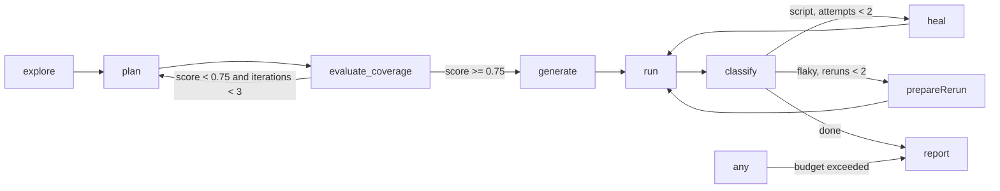

# Architecture

The diagram labels the planning step `plan` because that is what every event and decision calls it.
In the LangGraph build (`orchestrator/src/graph.ts`) the node is actually registered as `planFlows`, because LangGraph rejects a node name that collides with a state channel name and the run state has a `plan` channel (the flow list).
The `guarded("plan", ...)` wrapper keeps the logged node name as `plan` for events and decisions, so the graph wiring and the observable behavior stay consistent even though the internal node id differs.

## Split between code and the model

Deterministic code: crawling, gating detection, locator resolution, codegen, running, evidence gathering, signal weighting, the expect guard.
Claude with structured outputs: turning the site map into flows, repairing an unresolvable flow, re-targeting an expectation that is false live, extracting PRD requirements and mapping them, writing the classification rationale, choosing a replacement element in the healer.

## Exploring single-page apps

The crawler waits for the network to go idle before reading a page, so links rendered by JavaScript are seen.
Routes are keyed by pathname plus the fragment when the app routes on hashes (`/#/faq`), and `goto` accepts those keys as they are.
Navigation controls that are not anchors (buttons inside `nav`, `header` or `[role=navigation]`, `[role=link]` without an href, `data-href` and `routerlink` attributes) are probed once each: the crawler clicks the control, records the route it lands on when it stays on the origin, and reloads the page before the next probe.
Submit buttons are never probed, blocklisted labels (delete, remove, log out, clear, ...) are never pressed, and a label is probed once per crawl.

## Live assertion validation

The generator verifies every expectation on the page the flow just produced before writing it.
An expectation that is false live gets one `expect-repair` call, and its answer is kept only when it verifies live.
An element expectation may move to another element of the same role, or to an element of any role when the expectation carries text, since the text is then what is asserted.
A URL expectation may take the route the app really reached, provided it is a real path and not the bare root every URL contains.
When nothing fits, the original expectation is emitted unchanged, so the runner fails on it and the classifier gets to call the defect; hiding the failure at generation time would hide the bug.
A re-targeted expectation is recorded in run state under the flow's id (`expectations`); the plan keeps what the planner wrote, and the healer and the defect ticket verify against what the spec asserts, so a heal is never rejected for failing an expectation the generator had already replaced.
Two rules at the schema boundary keep the planner honest, and the LLM client retries with the validation message when they trip: a `url_contains` or `url_stays` value must be a path or route, and a `visible`, `not_visible` or `text_contains` expectation must name its element or the text it looks for, because a bare role ("an alert is visible") is satisfied by the app's own error message.
Expectation targets are resolved the way step targets are: the loose name match first, `exact: true` only when the loose match is ambiguous, so an emitted assertion never trips strict mode on the page it was validated against.

## Test data

Values that must not already exist in the app (a new account's email, a record's name) carry the placeholder `{{unique}}` in the plan.
The toolkit substitutes its own token when it acts live, and generated code turns the value into a template literal over a token minted when the test starts, so a spec stays re-runnable without colliding with data an earlier run created.

## Classifier weights

Signal weights follow PRD section 8.5 with two deviations.
A 5xx response during the failing step counts +0.6 toward defect (4xx +0.3) because a server error is strong evidence on its own.
A test that still fails after a rerun gets +0.2 toward defect, which is what turns a mid-band server-error failure into an escalation instead of an endless rerun loop.
Two signals cover failures on expect lines, which have no failing step.
A strict mode violation (the assertion's locator matched more than one element) counts +0.8 toward script: the locator is wrong, the app is not.
An assertion whose target element is not found is read the way a missing step target is: the classifier parses the locator out of the error, replays the whole flow to snapshot the page, and looks for a near-twin of the same role.
A test that already has a defect ticket stays escalated on every later pass; re-analysing it would only heal it again or file the same defect twice.
A test that passes after an accepted heal is reported as healed (class `script`, action `healed`), not as flaky; only a test that recovers on a plain rerun is flaky.
The runner is configured with a bounded action timeout so that a click on a missing element fails with a locator error naming the step; without it Playwright waits out the whole test timeout and reports `timedOut` with no error location, which leaves nothing for the classifier or the healer to work with.

## The heal rule

The healer may change how a test reaches an expectation, and may re-target an expectation to another element of the same role, but never what is asserted.
`guardExpects` reduces every `await expect(` line to a signature (the target's role, or `page` or `body`; the matcher; its negation; its arguments) and rejects a patch that adds, removes or alters any signature, reclassifying the failure as a defect.
So a heal may turn `expect(page.getByRole('heading', { name: 'Product catalogue' }))` into `expect(page.getByRole('heading', { name: 'Products' }))`, and only after the re-targeted expectation has been verified live, but it can never swap a `status` for the page body, drop a `not`, or change the text a matcher looks for.
A failure on an expect line is healable only when the expectation names an element; a failing URL or body-text assertion goes straight to escalation.

## The take-home suite

A run's generated specs only execute inside the pipeline: they import the runner's fixtures by a path that exists only here, and their `login()` replays steps handed in through an environment variable the orchestrator sets.
Handed to an engineer as-is, every signed-in test would sign in as nobody and fail on its first assertion.

So the report node also writes `output/<run_id>/suite/`: the same specs with their import rewritten, plus a self-contained `fixtures.ts`, a `playwright.config.ts` with no pipeline variables in it, a `package.json` pinning the Playwright version, and a README.
The specs themselves are copied from disk after healing, so what ships is what finished.

The recorded sign-in is baked into the bundle's fixtures, but the credential *values* are read from `QA_USERNAME` and `QA_PASSWORD` instead of being written out, which keeps the "credentials never touch disk" rule intact and leaves the bundle safe to commit.
A signed-in test throws a named error when those are unset, rather than submitting an empty form and failing later for an unrelated-looking reason.

`GET /runs/:id/suite.zip` zips that directory on request.
The archive is built by `suite/zip.ts`, a small deflate-or-store ZIP writer, so handing over a suite costs no archiving dependency; anything larger than a bundle of text files should use a real library instead of growing it.

## Events

Every node emits `node_start` and `node_end`.
Every branch appends a `Decision` to state and to `decisions.jsonl`.
The API replays `events.jsonl` then streams live over SSE.

The runner is a separate process with no handle on the event bus, so it reports through the filesystem.
While a test executes, the Playwright fixture streams JPEG frames from the Chromium screencast to `live/<test>/frame.jpg` and keeps a `state.json` beside it; the run node polls that directory and emits one `test_start` per test the moment its state says `running`.
Every test is recorded on video; because Playwright wipes its output directory on each invocation and this pipeline invokes it many times per run, the run node copies each recording to `traces/videos/<test>.webm` and records that path on the `test_result`.
Generation runs one Playwright invocation per flow, concurrently, so each invocation gets its own report and artifact directory under `traces/playwright/<test ids>/` (`suite` for the full run); without that, parallel generators read each other's report and wiped each other's traces mid-run.
A test quick enough to finish between two polls of the live directory is announced by the watcher's final scan, so a `test_start` always precedes its `test_result`.

## The review gate

A run started with `reviewPlan` routes from the coverage gate to a `review` node the graph is compiled to interrupt before.
`startRun` parks there, records the run as `awaiting_review`, and waits for `POST /runs/:id/review`, whose body (the possibly edited, possibly trimmed plan) is written into the checkpoint as the review node's own output before the graph resumes into the generation fan-out.
Runs that did not ask for review never route through the node, so the default pipeline stays autonomous.

## Single-test re-run

`POST /runs/:id/tests/:testId/rerun` executes one generated spec again in place, merges the fresh result into `results.json`, and appends the events to the run's log so the test's latest status moves without a new run.
The target's login steps carry its credentials and are never written to disk, so after an API restart only tests that do not sign in can be re-run; the route says so instead of failing at login.

## Milestone log

| Milestone | Command | Result |
|---|---|---|
| M1 explore + plan | `npm run qa-pilot -- run http://localhost:3005 --username demo@shop.test --password demo1234 --intent "focus on auth and checkout"` | verified 2026-09-04 (`output/fix-verify-1`): 11 pages crawled, 3 gated; 12 flows across 4 categories (3 happy, 5 negative, 3 authz, 1 error_state), none dropped |
| M2 generate + run | same run | verified: 12 of 12 flows generated, 11 of 12 passed on first run (92%); the one failure is a planner assumption mini-shop does not meet (registration does not sign the user in) and was escalated as a defect with that rationale |
| M3 heal + escalate | generate against the healthy app, then `./demo.sh rename && ./demo.sh coupon` the moment the run node starts (intent "focus on auth, checkout and the coupon code") | verified 2026-09-05 (`output/fix-verify-chaos4`): the two order flows failed on the renamed button, were classified `script`, healed to `Complete purchase` with the diff in the report and passed on rerun; the two coupon flows were classified `defect` at 0.9 with `POST /api/coupon returned 500` in evidence and ticketed once each |
| M4 coverage loop | `npm run qa-pilot -- run http://localhost:3005 --username demo@shop.test --password demo1234` | verified 2026-09-04 (`output/run-2026-09-04T17-38-19`): first plan scored 0.61 with 9 gaps and was sent back with the gap list; the second plan scored 0.93 with 4 gaps and went to generation |
| M5 UI + report | UI run | verified live on a partial run (fake LLM stops at planning); full-run screenshot pending a real API key |
| M6 demo target | mini-shop with three chaos toggles | verified: `renameCheckoutButton`, `breakCoupon`, `cosmeticChange` all work via `POST /__chaos`, toggled by `demo.sh` |

Two automated tests already exercise the scenarios M1 through M3 describe, end to end, with a fake LLM standing in for Claude:
`orchestrator/test/graph.test.ts` runs the full graph (explore, plan with a canned set of flows, coverage, generate, run, classify, report) against mini-shop, breaks the coupon endpoint, and asserts the coupon test (checkout-001) is classified `defect` with confidence >= 0.8 and that a defect ticket exists.
The 500 response is captured by the runner's network annotations and weighted by the classifier's signal function.
`orchestrator/test/heal.test.ts` renames the checkout button and asserts `healNode` patches the locator while `guardExpects` keeps every `expect()` line unchanged.
The runs behind the verified rows are kept under `output/` with their plans, generated specs, results, decisions and reports; nothing in them was hand-edited.
