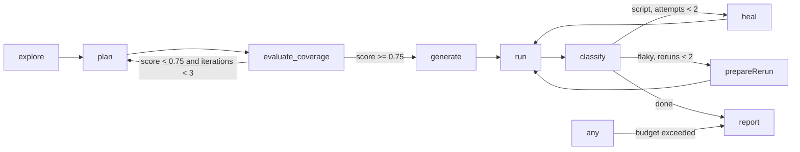

# Architecture

The diagram labels the planning step `plan` because that is what every event and decision calls it.
In the LangGraph build (`orchestrator/src/graph.ts`) the node is actually registered as `planFlows`, because LangGraph rejects a node name that collides with a state channel name and the run state has a `plan` channel (the flow list).
The `guarded("plan", ...)` wrapper keeps the logged node name as `plan` for events and decisions, so the graph wiring and the observable behavior stay consistent even though the internal node id differs.

## Split between code and the model

Deterministic code: crawling, gating detection, locator resolution, codegen, running, evidence gathering, signal weighting, the expect guard.
Claude with structured outputs: turning the site map into flows, repairing an unresolvable flow, re-targeting an expectation that is false live, extracting PRD requirements and mapping them, writing the classification rationale, choosing a replacement element in the healer.

## Exploring single-page apps

The crawler waits for the network to go idle before reading a page, so links rendered by JavaScript are seen.
Routes are keyed by pathname, plus the query when the app routes on it (`/ui?page=users`), plus the fragment when it routes on hashes (`/#/faq`), and `goto` accepts those keys as they are.
A query parameter counts as part of the route when its value is a slug; numeric and id-style parameters select a record on the same view and are dropped, and redirect, token and tracking parameters are dropped as noise, so a catalogue is one route and a login page with a `redirect_to` is one login page.
Locator resolution waits, up to the element timeout, for a client-rendered page to draw the element it is looking for; a one-shot lookup right after navigation used to fail the first step of every flow on a React app.
Controls that route without being a usable link are probed once each: anchors with no href, an empty one or `#`, `[role=link]` without an href, `data-href` and `routerlink` attributes, and any button outside a form, including submit-styled ones that have no form to submit.
The crawler clicks the control, gives the router a moment to change the URL, and records the route it lands on when it stays on the origin.
The page is put back only when the click navigated or left a dialog or menu open that would cover the next control; a click that did neither costs an Escape, since reloading after every one of a dashboard's dozens of buttons made the crawl look stuck on a single page.
Buttons inside a form belong to that form's flow and are left alone, blocklisted labels (delete, remove, log out, reset, clear, ...) are never pressed, and a label is probed once per crawl with a ceiling on probes per page and per crawl.
An icon-only control is named after its `aria-label`, `data-test`, `data-testid`, `title`, `name` or `id`, so the planner can refer to it.

## The explorer agent

The crawl is deterministic and cheap, and it stops at whatever links and probeable buttons reveal.
After it, an LLM-driven agent takes a bounded number of steps (`QA_PILOT_EXPLORE_AGENT_STEPS`, default 12, `0` disables it) on what links alone cannot reach: signing in, opening menus and tabs, walking a wizard, following the operator's intent.
Each step sends the model the current page's accessibility snapshot, the pages already known, and the actions taken so far, and it answers with one `Step` in the same schema the planner and runner use, or with `done`.
The agent acts through the same `BrowserToolkit` as every other stage, so its locators are validated the same way, and every page it lands on is added to the site map and gated the same way a crawled page is.
The model never sees credentials: it writes the literal tokens `{{USERNAME}}` and `{{PASSWORD}}` into the fields, the harness substitutes the real values right before the fill, and filled values are redacted out of the next snapshot.
A password fill followed by a submit that leaves the login page is recorded as the site map's login steps, exactly as the heuristic login would have recorded them.
Destructive labels are refused by the harness regardless of what the model asks for, and the agent is an add-on, never a gate: any failure leaves the crawled map intact.

## Getting past the login wall

A demo app is usually a login form with the whole application behind it, and a plan that only exercises the login form is a bad plan even when the login form is thoroughly tested.
When the landing page is itself the login form there is no "Log in" link to find, so the crawler treats a page with a password field as the login page.
The route a successful login lands on is seeded into the crawl queue, since nothing outside the wall links to it.
A route counts as gated when an anonymous visit is bounced to the login path or when the app answers in place with the login screen at the same URL, which is what a demo app usually does.
The planner's dry walk resolves a control that repeats across a list, such as one "Add to cart" per product, to the first one; the site map lists such a control once with its count, and the generated locator carries `.first()`.
A control named after its `data-test` attribute resolves through that attribute, which Playwright's `getByTestId` does not read.
The dry walk records the routes a flow was on after each of its own steps (`visits`), and the coverage scorer credits a route to a flow that navigated there, was seen there, or names it in its title, so a checkout flow that clicks its way through the cart covers the checkout form even though its only `goto` is the inventory page.
A route with a form or buttons that no non-authz flow exercises is a `missing_route_flow` gap and the heaviest coverage check: an authz flow proves the door is locked, it does not test the room.
Flow ids are prefixed with the area of the app they belong to ("cart-004" for the cart's authz flow, never "auth-004"), which is what the report and the UI group by.
A dry walk that throws, because a page never loaded, is retried once and then costs that flow alone; a screenshot that cannot be taken costs a picture, never a step.
An expectation whose role and name match several elements even exactly (a product's image link and title link) is verified against the first and emitted with `.first()`, for the same reason.
Tests the classifier sends back for a rerun ride through the healer with the healed ones: the graph visits the healer first, and a heal that did not take is no reason to drop a navigation timeout that only needed a second try.

## Live assertion validation

The generator verifies every expectation on the page the flow just produced before writing it.
An expectation that is false live gets one `expect-repair` call, and its answer is kept only when it verifies live.
An element expectation may move to another element of the same role, or to an element of any role when the expectation carries text, since the text is then what is asserted.
A URL expectation may take the route the app really reached, provided it is a real path and not the bare root every URL contains.
When nothing fits, the original expectation is emitted unchanged, so the runner fails on it and the classifier gets to call the defect; hiding the failure at generation time would hide the bug.
A re-targeted expectation is recorded in run state under the flow's id (`expectations`); the plan keeps what the planner wrote, and the healer and the defect ticket verify against what the spec asserts, so a heal is never rejected for failing an expectation the generator had already replaced.
Two rules at the schema boundary keep the planner honest, and the LLM client retries with the validation message when they trip: a `url_contains` or `url_stays` value must be a path or route, and a `visible`, `not_visible` or `text_contains` expectation must name its element or the text it looks for, because a bare role ("an alert is visible") is satisfied by the app's own error message.
Expectation targets are resolved the way step targets are: the loose name match first, `exact: true` only when the loose match is ambiguous, so an emitted assertion never trips strict mode on the page it was validated against.

## Test data

Values that must not already exist in the app (a new account's email, a record's name) carry the placeholder `{{unique}}` in the plan.
The toolkit substitutes its own token when it acts live, and generated code turns the value into a template literal over a token minted when the test starts, so a spec stays re-runnable without colliding with data an earlier run created.

## Classifier weights

Signal weights follow PRD section 8.5 with two deviations.
A 5xx response during the failing step counts +0.6 toward defect (4xx +0.3) because a server error is strong evidence on its own.
A test that still fails after a rerun gets +0.2 toward defect, which is what turns a mid-band server-error failure into an escalation instead of an endless rerun loop.
Two signals cover failures on expect lines, which have no failing step.
A strict mode violation (the assertion's locator matched more than one element) counts +0.8 toward script: the locator is wrong, the app is not.
An assertion whose target element is not found is read the way a missing step target is: the classifier parses the locator out of the error, replays the whole flow to snapshot the page, and looks for a near-twin of the same role.
A test that already has a defect ticket stays escalated on every later pass; re-analysing it would only heal it again or file the same defect twice.
A test that passes after an accepted heal is reported as healed (class `script`, action `healed`), not as flaky; only a test that recovers on a plain rerun is flaky.
The runner is configured with a bounded action timeout so that a click on a missing element fails with a locator error naming the step; without it Playwright waits out the whole test timeout and reports `timedOut` with no error location, which leaves nothing for the classifier or the healer to work with.

## The heal rule

The healer may change how a test reaches an expectation, and may re-target an expectation to another element of the same role, but never what is asserted.
`guardExpects` reduces every `await expect(` line to a signature (the target's role, or `page` or `body`; the matcher; its negation; its arguments) and rejects a patch that adds, removes or alters any signature, reclassifying the failure as a defect.
So a heal may turn `expect(page.getByRole('heading', { name: 'Product catalogue' }))` into `expect(page.getByRole('heading', { name: 'Products' }))`, and only after the re-targeted expectation has been verified live, but it can never swap a `status` for the page body, drop a `not`, or change the text a matcher looks for.
A failure on an expect line is healable only when the expectation names an element; a failing URL or body-text assertion goes straight to escalation.

## The take-home suite

A run's generated specs only execute inside the pipeline: they import the runner's fixtures by a path that exists only here, and their `login()` replays steps handed in through an environment variable the orchestrator sets.
Handed to an engineer as-is, every signed-in test would sign in as nobody and fail on its first assertion.

So the report node also writes `output/<run_id>/suite/`: the same specs with their import rewritten, plus a self-contained `fixtures.ts`, a `playwright.config.ts` with no pipeline variables in it, a `package.json` pinning the Playwright version, and a README.
The specs themselves are copied from disk after healing, so what ships is what finished.

The recorded sign-in is baked into the bundle's fixtures, but the credential *values* are read from `QA_USERNAME` and `QA_PASSWORD` instead of being written out, which keeps the "credentials never touch disk" rule intact and leaves the bundle safe to commit.
A signed-in test throws a named error when those are unset, rather than submitting an empty form and failing later for an unrelated-looking reason.

`GET /runs/:id/suite.zip` zips that directory on request.
The archive is built by `suite/zip.ts`, a small deflate-or-store ZIP writer, so handing over a suite costs no archiving dependency; anything larger than a bundle of text files should use a real library instead of growing it.

## Events

Every node emits `node_start` and `node_end`.
Every branch appends a `Decision` to state and to `decisions.jsonl`.
The API replays `events.jsonl` then streams live over SSE.

The runner is a separate process with no handle on the event bus, so it reports through the filesystem.
While a test executes, the Playwright fixture streams JPEG frames from the Chromium screencast to `live/<test>/frame.jpg` and keeps a `state.json` beside it; the run node polls that directory and emits one `test_start` per test the moment its state says `running`.
Every test is recorded on video; because Playwright wipes its output directory on each invocation and this pipeline invokes it many times per run, the run node copies each recording to `traces/videos/<test>.webm` and records that path on the `test_result`.
Generation runs one Playwright invocation per flow, concurrently, so each invocation gets its own report and artifact directory under `traces/playwright/<test ids>/` (`suite` for the full run); without that, parallel generators read each other's report and wiped each other's traces mid-run.
A test quick enough to finish between two polls of the live directory is announced by the watcher's final scan, so a `test_start` always precedes its `test_result`.

## The review gate

A run started with `reviewPlan` routes from the coverage gate to a `review` node the graph is compiled to interrupt before.
`startRun` parks there, records the run as `awaiting_review`, and waits for `POST /runs/:id/review`, whose body (the possibly edited, possibly trimmed plan) is written into the checkpoint as the review node's own output before the graph resumes into the generation fan-out.
Runs that did not ask for review never route through the node, so the default pipeline stays autonomous.

## Single-test re-run

`POST /runs/:id/tests/:testId/rerun` executes one generated spec again in place, merges the fresh result into `results.json`, and appends the events to the run's log so the test's latest status moves without a new run.
The target's login steps carry its credentials and are never written to disk, so after an API restart only tests that do not sign in can be re-run; the route says so instead of failing at login.

## The copilot

A copilot turn is two calls.
`POST /copilot/chats/:id/messages` resolves the run (an id named in the message, then the chat's scope, then the newest finished run for the scope's URL), builds a catalogue of that run's tests from `plan.json`, `results.json`, `defects.json`, `heal-log.json` and the classifications in `events.jsonl`, and makes one structured Claude call that returns `rerun`, `answer` or `clarify` plus test ids.
Every id is checked against the catalogue before anything is scheduled; an id the model invented is dropped, and a rerun left with nothing becomes a server-written clarification listing the run's real failures.
`POST /copilot/chats/:id/execute` runs the pending selection in one Playwright invocation through `rerunTests`, merges the results into `results.json`, and appends the outcome to the chat.

The report node writes `login-steps.json`, the recorded sign-in with `{{username}}` and `{{password}}` in place of the values, the same redaction the suite bundle performs.
When the run's login context is no longer in memory, the execute call hydrates that file with credentials sent in the request and discards them when it returns.

Copilot chats share the `chats` collection with the intake chat under `kind: "copilot"`; documents without a kind are intake chats.

### Defect tickets

A rerun never classifies.
The result stored on the chat carries each test's verdict and defect id from the pipeline run's catalogue, and the transcript offers a ticket only on a `defect` verdict; a `page.goto` timeout is an environment error by the classifier's own rules and stays one in the chat.
Trackers connect through Composio.
`POST /integrations/connect` resolves an auth config for the toolkit (an env override, else the project's existing config, else a Composio-managed one created on the spot), calls `connectedAccounts.link` with a callback on this API, stores a `pending` record holding only Composio's connected account id, and hands the browser the OAuth URL.
`GET /integrations/callback` runs under the session cookie, waits for Composio to report the account active, lists the account's Linear teams or Jira projects through `LINEAR_LIST_LINEAR_TEAMS` or `JIRA_GET_ALL_PROJECTS`, stores the destination when there is exactly one, and redirects to Settings, which offers a picker otherwise.
The `TrackerClient` adapter in `orchestrator/src/integrations/composio.ts` is the only file that knows the SDK; tool payloads are read by walking them for the first object with the fields needed, because Composio returns each tracker's own shape.
`POST /runs/:id/tests/:test/ticket` builds one provider-agnostic body from `defects.json` (or the plan flow and latest result when nothing was escalated), renders it as markdown, files it through `LINEAR_CREATE_LINEAR_ISSUE` (team, title, description, priority from severity) or `JIRA_CREATE_ISSUE` (project, `Bug` with a `Task` retry, summary, description), and records the issue in `tickets`, unique per user, run and test, so a second click answers the existing ticket instead of filing twice.
Live progress reaches the chat through the run's existing `/events/:runId` stream opened with `?follow=1`, which keeps it open past the run's `done` so the rerun's `test_start` and `test_result` events arrive; the screen filters them to events after the plan's timestamp so a replayed old result is not mistaken for this rerun's.

## Milestone log

| Milestone | Command | Result |
|---|---|---|
| M1 explore + plan | `npm run qa-pilot -- run http://localhost:3005 --username demo@shop.test --password demo1234 --intent "focus on auth and checkout"` | verified 2026-09-04 (`output/fix-verify-1`): 11 pages crawled, 3 gated; 12 flows across 4 categories (3 happy, 5 negative, 3 authz, 1 error_state), none dropped |
| M2 generate + run | same run | verified: 12 of 12 flows generated, 11 of 12 passed on first run (92%); the one failure is a planner assumption mini-shop does not meet (registration does not sign the user in) and was escalated as a defect with that rationale |
| M3 heal + escalate | generate against the healthy app, then `./demo.sh rename && ./demo.sh coupon` the moment the run node starts (intent "focus on auth, checkout and the coupon code") | verified 2026-09-05 (`output/fix-verify-chaos4`): the two order flows failed on the renamed button, were classified `script`, healed to `Complete purchase` with the diff in the report and passed on rerun; the two coupon flows were classified `defect` at 0.9 with `POST /api/coupon returned 500` in evidence and ticketed once each |
| Beyond the login wall | `npm run qa-pilot -- run https://www.saucedemo.com --username standard_user --password secret_sauce --intent "cover the product catalog, the cart and checkout end to end, not just login"` | verified 2026-09-05 (`output/run-2026-09-05T06-47-00`): the first plan kept all 12 flows across auth, catalog, cart and checkout with none dropped at the dry walk and scored 0.925; 10 of 12 passed on the first execution, the two logged-out navigation timeouts were rerun and passed, and the report closed with 12 of 12, no false defects, 4 LLM calls. The same target earlier that day dropped every catalog, cart and checkout flow as unresolvable and ended with no tests |
| M4 coverage loop | `npm run qa-pilot -- run http://localhost:3005 --username demo@shop.test --password demo1234` | verified 2026-09-04 (`output/run-2026-09-04T17-38-19`): first plan scored 0.61 with 9 gaps and was sent back with the gap list; the second plan scored 0.93 with 4 gaps and went to generation |
| M5 UI + report | UI run | verified live on a partial run (fake LLM stops at planning); full-run screenshot pending a real API key |
| M6 demo target | mini-shop with three chaos toggles | verified: `renameCheckoutButton`, `breakCoupon`, `cosmeticChange` all work via `POST /__chaos`, toggled by `demo.sh` |

Two automated tests already exercise the scenarios M1 through M3 describe, end to end, with a fake LLM standing in for Claude:
`orchestrator/test/graph.test.ts` runs the full graph (explore, plan with a canned set of flows, coverage, generate, run, classify, report) against mini-shop, breaks the coupon endpoint, and asserts the coupon test (checkout-001) is classified `defect` with confidence >= 0.8 and that a defect ticket exists.
The 500 response is captured by the runner's network annotations and weighted by the classifier's signal function.
`orchestrator/test/heal.test.ts` renames the checkout button and asserts `healNode` patches the locator while `guardExpects` keeps every `expect()` line unchanged.
The runs behind the verified rows are kept under `output/` with their plans, generated specs, results, decisions and reports; nothing in them was hand-edited.
