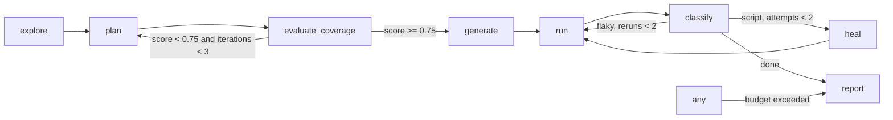

# Architecture

The diagram labels the planning step `plan` because that is what every event and decision calls it.
In the LangGraph build (`orchestrator/src/graph.ts`) the node is actually registered as `planFlows`, because LangGraph rejects a node name that collides with a state channel name and the run state has a `plan` channel (the flow list).
The `guarded("plan", ...)` wrapper keeps the logged node name as `plan` for events and decisions, so the graph wiring and the observable behavior stay consistent even though the internal node id differs.

## Split between code and the model

Deterministic code: crawling, gating detection, locator resolution, codegen, running, evidence gathering, signal weighting, the expect guard.
Claude with structured outputs: turning the site map into flows, repairing an unresolvable flow, extracting PRD requirements and mapping them, writing the classification rationale, choosing a replacement element in the healer.

## Classifier weights

Signal weights follow PRD section 8.5 with two deviations.
A 5xx response during the failing step counts +0.6 toward defect (4xx +0.3) because a server error is strong evidence on its own.
A test that still fails after a rerun gets +0.2 toward defect, which is what turns a mid-band server-error failure into an escalation instead of an endless rerun loop.

## The heal rule

The healer may change how a test reaches an expectation, never what it asserts.
`guardExpects` compares every `await expect(` line before and after a patch and rejects any difference, reclassifying the failure as a defect.

## Events

Every node emits `node_start` and `node_end`.
Every branch appends a `Decision` to state and to `decisions.jsonl`.
The API replays `events.jsonl` then streams live over SSE.

## Milestone log

| Milestone | Command | Result |
|---|---|---|
| M1 explore + plan | `npm run qa-pilot -- run http://localhost:3005 --username demo@shop.test --password demo1234` | pending: requires ANTHROPIC_API_KEY; run the command and record the result |
| M2 generate + run | `npm run qa-pilot -- run http://localhost:3005 --username demo@shop.test --password demo1234` | pending: requires ANTHROPIC_API_KEY; run the command and record the result |
| M3 heal + escalate | `./demo.sh rename && ./demo.sh coupon` then `npm run qa-pilot -- run http://localhost:3005 --username demo@shop.test --password demo1234 --run-id m3` | pending: requires ANTHROPIC_API_KEY; run the command and record the result |
| M4 coverage loop | `npm run qa-pilot -- run http://localhost:3005 --username demo@shop.test --password demo1234 --max-flows 4 --run-id m4` | pending: requires ANTHROPIC_API_KEY; run the command and record the result |
| M5 UI + report | UI run | verified: `docs/ui.png` is a screenshot of a live UI run against mini-shop with a fake LLM |
| M6 demo target | mini-shop with three chaos toggles | verified: `renameCheckoutButton`, `breakCoupon`, `cosmeticChange` all work via `POST /__chaos`, toggled by `demo.sh` |

M1 through M4 need a real `ANTHROPIC_API_KEY` in `.env` to execute; this machine only has the placeholder key from `.env.example`, so those runs have not been recorded here.
Two automated tests already exercise the scenarios M1 through M3 describe, end to end, with a fake LLM standing in for Claude:
`orchestrator/test/graph.test.ts` runs the full graph (explore, plan with a canned set of flows, coverage, generate, run, classify, report) against mini-shop, breaks the coupon endpoint, and asserts the coupon test is classified `defect` with the 500 in evidence and escalated.
`orchestrator/test/heal.test.ts` renames the checkout button and asserts `healNode` patches the locator while `guardExpects` keeps every `expect()` line unchanged.
Whoever runs M1 through M4 with a real key should fill in the Result column above with the actual flow count, categories, pass rate, heal diff, defect evidence, and the two coverage scores, and should not hand-edit the generated test files if M2 comes in below 80%.
