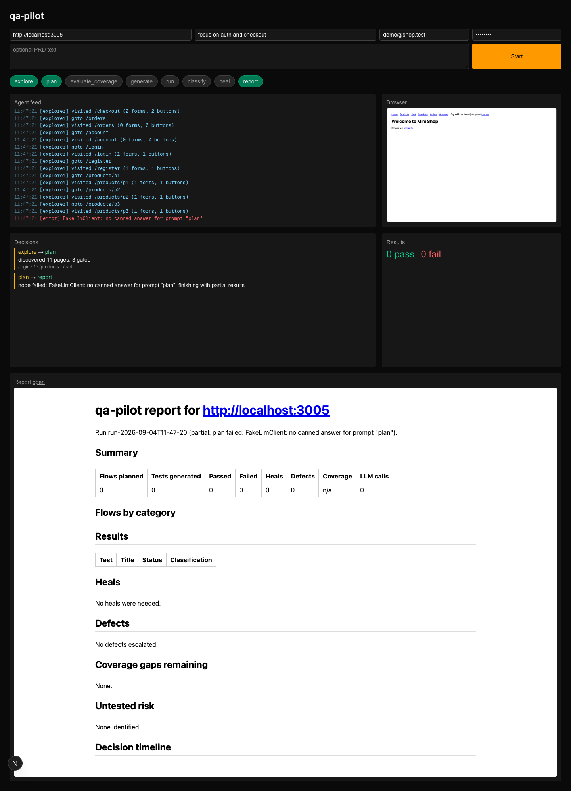

# qa-pilot

Autonomous test orchestration agent.
Give it a URL and it explores the app, plans tests, scores coverage, generates Playwright tests, runs them, heals broken scripts, escalates real defects, and writes a report.
Every orchestrator decision is streamed live to a UI.

## Quick start

Requirements: Node 22, an Anthropic API key.

```bash
npm install
npx playwright install chromium
cp .env.example .env
```

Then edit `.env` and set `ANTHROPIC_API_KEY` to a real key.

Run the three services in separate terminals:

```bash
npm run shop   # demo target on http://localhost:3005
npm run api    # orchestrator API on http://localhost:4000
npm run ui     # live UI on http://localhost:3000
```

Or run from the CLI without the UI:

```bash
npm run qa-pilot -- run http://localhost:3005 --username demo@shop.test --password demo1234 --intent "focus on auth and checkout"
```

Outputs land in `output/<run_id>/`: `plan.md`, `plan.json`, `coverage.json`, `tests/*.spec.ts`, `results.json`, `heal-log.json`, `defects.json`, `report.md`, `report.html`, `decisions.jsonl`, `events.jsonl`, `traces/` (Playwright traces, one `videos/<test>.webm` recording per test, and agent screenshots), and `live/` (the frames the runner streams while a test executes).

## The UI

Every run has three screens, reachable from the sidebar once a run is open.

- **Test runs** (`/runs/<id>`): the execution strip and summary card, then every planned test grouped by use case with its status in this run.
  The *Agent actions view* tab shows the pipeline strip, the agent feed, the branch decisions, the plan and the report.
- **Test cases** (`/runs/<id>/cases`): the same tests with their latest status, filterable by Planned, Running, Passed, Failed or Blocked, searchable, with *Run all* to re-execute them.
- **Test coverage** (`/runs/<id>/coverage`): the plan as a graph, one lane per use case fanning out to its tests, with the evaluator's remaining gaps drawn as dashed nodes in the lane they belong to, next to the score and per-check breakdown.

Clicking a test anywhere opens its detail drawer: priority, category and description, the steps as the runner executes them with the failing step marked, the result with the classifier's verdict and evidence, and a *Preview* pane that shows the browser live while the test runs and its recording afterwards, with the generated Playwright source on the *Code* tab.
*Re-run* executes that one test again in place.

The **Review** card on the start form pauses the run after the coverage gate.
The proposed tests appear in a review sheet where each can be renamed, re-prioritised or deselected; nothing is generated until *Run all* is confirmed.
It is off by default so a run stays fully autonomous.

## Demo script (5 minutes)

1. Start the three services and open the UI.
2. Paste the URL and "focus on auth and checkout" and press Start.
3. Watch the explorer crawl in the headed browser and the plan appear.
4. Watch the coverage evaluator score the plan; if below 0.75 it re-plans with the gap list.
5. Before the run node starts, run `./demo.sh rename` so the checkout button is renamed; the healer patches the locator and the diff shows in the decision log.
6. Run `./demo.sh coupon`; the classifier marks the coupon test `defect` with the 500 in evidence and escalates a ticket.
7. Open the report: coverage, heals, defects, untested risk, decision timeline.
8. `./demo.sh reset` afterwards.

A screenshot of the live UI during a fake-LLM run that stops at planning, showing the pipeline strip, agent feed, browser thumbnail, decisions, results, and report panels; a full-run screenshot is pending a real API key.



## Configuration

| Variable | Default | Meaning |
|---|---|---|
| `ANTHROPIC_API_KEY` | required | Claude API key |
| `QA_PILOT_MODEL` | `claude-opus-5` | model for every LLM call |
| `QA_PILOT_HEADLESS` | `0` | `1` runs the exploration browser headless |
| `QA_PILOT_API_PORT` | `4000` | API port |
| `QA_PILOT_OUTPUT` | `qa-pilot/output/` | where run artifacts go |

## Tests

```bash
npm test
```

Unit tests cover coverage scoring, the classifier, codegen, the healer's expect guard, and the event bus.
An integration test runs the full graph against mini-shop with a fake LLM.

## Milestone verification

See ARCHITECTURE.md for the graph and the milestone log.
